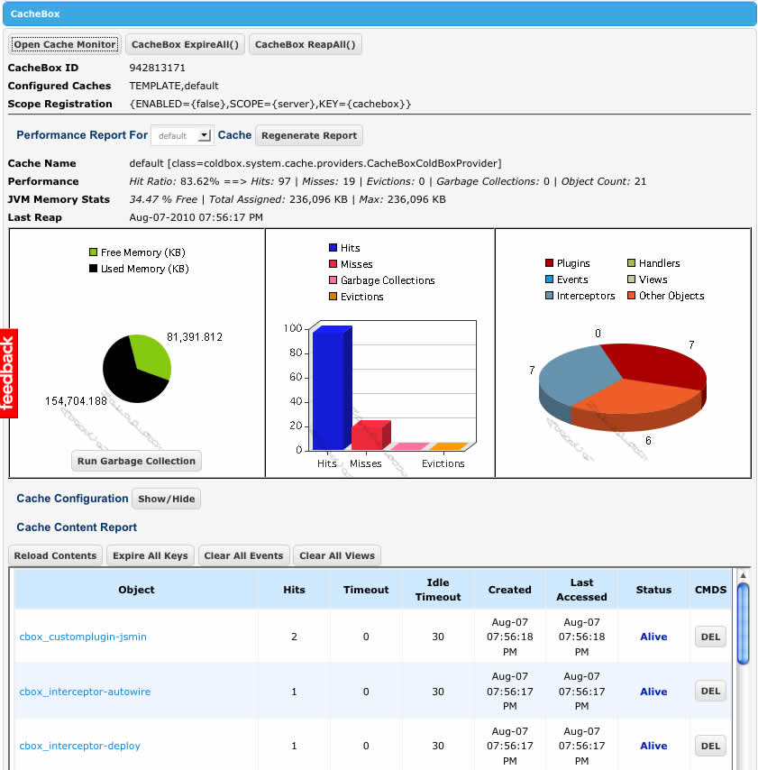

# ColdBox Debugger

As you know, ColdBox provides you (The Developer) with many great tools and visual representations of your application. The ones that are invaluable for AJAX/Remote development are the cache panel monitor and the execution profiler monitor. You can read more about these panels by [Clicking Here](http://wiki.coldbox.org/wiki/URLActions.cfm#Debugpanel).

Here is a screenshot of the Cache Monitor:

