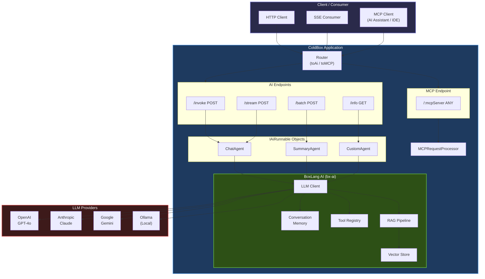
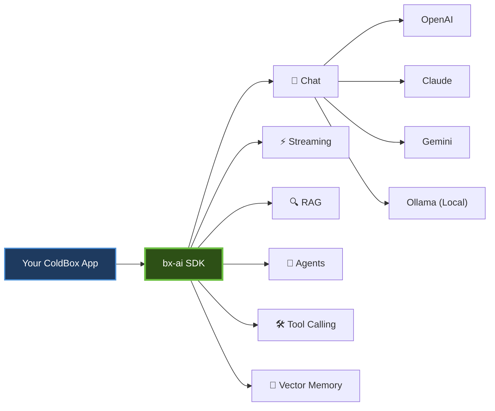
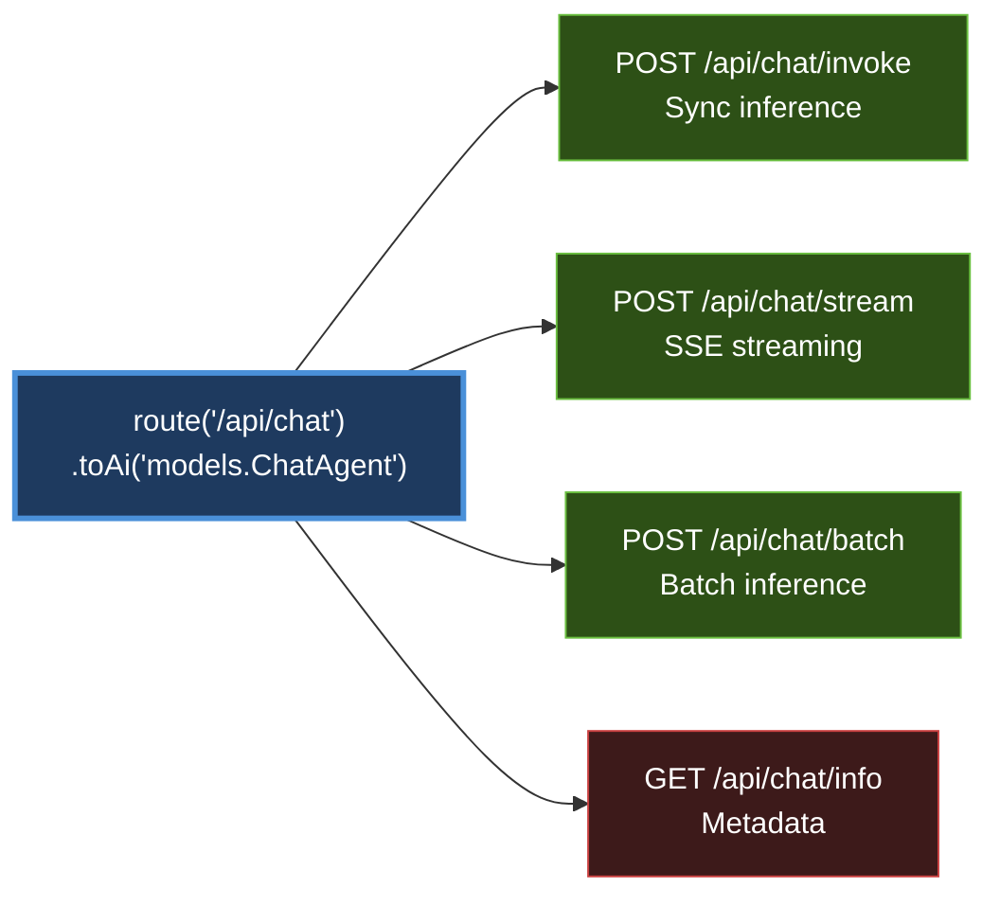
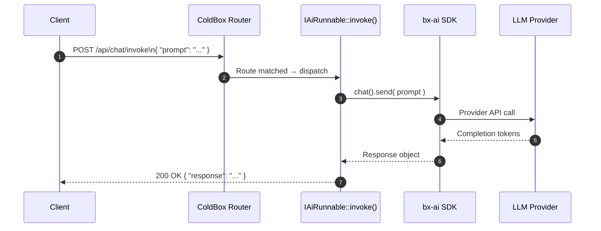
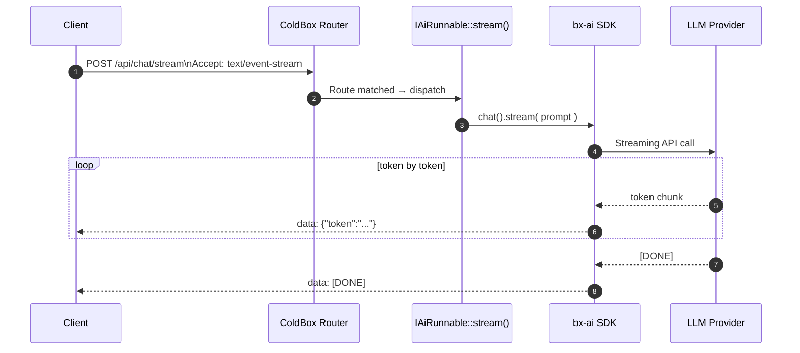

# AI

ColdBox 8.x brings first-class artificial intelligence capabilities to the platform thanks to [BoxLang](https://www.boxlang.io/) and [BoxLang AI](https://ai.boxlang.io), organized around four complementary pillars:

1. **BoxLang AI (`bx-ai`)** — a unified fluent SDK for every major LLM provider, supporting chat, streaming, RAG pipelines, tool calling, vector memory, and autonomous agents: https://ai.boxlang.io
2. **AI Routing** — first-class Router terminators (`toAi()`, `toMCP()`) that auto-generate standard HTTP endpoints for any AI runnable or MCP server, no boilerplate required
3. **ColdBox MCP Server (`cbMCP`)** — a ColdBox module that exposes your running application as a live MCP server, giving any AI client (Claude, Copilot, Cursor) real-time introspection into routing, handlers, WireBox, CacheBox, LogBox, schedulers, and more
4. **Agentic ColdBox CLI** — AI guidelines, skills, agents, and MCP servers baked into `coldbox-cli` so your AI coding assistant always knows the ColdBox ecosystem


Most AI features require **BoxLang** and the **bx-ai** module. CFML engines are not supported for AI routing or the `bx-ai` library.

```bash
# Using CommandBox
box install bx-ai
# Using OS package manager
install-bx-module bx-ai
```


---

## Platform Architecture

The diagram below shows how the three pillars fit together inside a running ColdBox application:



---

## Pillar 1 — BoxLang AI Library

The `bx-ai` module is a comprehensive LLM SDK for the JVM. Install it in your ColdBox application and you get a single, consistent API across every major AI provider.



**Key capabilities:**

| Capability | Description |
| ---------- | ----------- |
| Multi-provider chat | One API for OpenAI, Claude, Gemini, Grok, Groq, DeepSeek, Bedrock, Ollama, Cohere, and more |
| Streaming | Real-time token-by-token responses via `stream()` |
| Tool / Function calling | Let the LLM call your BoxLang functions at runtime |
| RAG pipelines | Document loaders → chunking → vector embeddings → semantic retrieval |
| Vector memory | 12+ vector store integrations (Pinecone, Chroma, pgvector, in-memory, …) |
| Conversation memory | 20+ memory types with `userId` / `conversationId` multi-tenant isolation |
| Autonomous agents | AI agents that reason, plan, and call tools over multiple turns |
| Multimodal | Images, audio, video, and documents alongside text |

→ Full details in [BoxLang AI](boxlang-ai.md)

---

## Pillar 2 — AI Routing

ColdBox Router terminators let you expose any `IAiRunnable` object — or any MCP server — as a fully-formed HTTP API **in a single line**.  This will allow you to focus on building your AI logic and not worry about the HTTP endpoint plumbing. The `IAiRunnable` interface defines three methods (`invoke()`, `stream()`, and `batch()`) that you can implement to handle different types of AI interactions, and the Router terminators will take care of routing requests to the correct method based on the HTTP verb and headers.

### toAi() — Four-endpoint expansion



### toMCP() — Model Context Protocol server

Expose your MCP servers to any MCP-compatible AI client (Claude, Copilot, Cursor) with a single terminator:

```
route( "/mcp/:mcpServer" ).toMCP();

  /mcp/code-reviewer  →  MCPRequestProcessor → "code-reviewer" server
  /mcp/data-analyst   →  MCPRequestProcessor → "data-analyst" server
  /mcp/doc-writer     →  MCPRequestProcessor → "doc-writer" server
```

### Request lifecycle for `/invoke`



### Request lifecycle for `/stream` (SSE)



→ Full details in [AI Routing](../../the-basics/routing/routing-dsl/ai-routing.md)

---

## Pillar 3 — Agentic ColdBox CLI

The `coldbox-cli` CommandBox module embeds AI context directly into your development workflow. AI coding assistants (GitHub Copilot, Cursor, Claude Code, Codex, etc.) automatically receive ColdBox-specific knowledge as **guidelines** and **skills**.

```
┌─────────────────────────────────────────────────────────────────┐
│                  Agentic ColdBox CLI                            │
│                                                                 │
│  ┌──────────────┐  ┌──────────────┐  ┌──────────────────────┐   │
│  │  Guidelines  │  │    Skills    │  │       Agents         │   │
│  │  46+ total   │  │  71+ total   │  │  Claude, Copilot,    │   │
│  │  Core on-disk│  │  On-demand   │  │  Cursor, Codex,      │   │
│  │  Modules OD  │  │  cookbooks   │  │  Gemini, OpenCode    │   │
│  └──────┬───────┘  └──────┬───────┘  └──────────┬───────────┘   │
│         │                 │                     │               │
│         └─────────────────┴──────────────┬──────┘               │
│                                          ▼                      │
│                              ┌───────────────────────────────┐  │
│                              │  MCP Servers (30+) + .mcp.json│  │
│                              │  ColdBox, ForgeBox, TestBox,  │  │
│                              │  WireBox, cbMCP live server...│  │
│                              └───────────────────────────────┘  │
└─────────────────────────────────────────────────────────────────┘
            │                               │
            ▼                               ▼
  ┌──────────────────┐          ┌────────────────────────┐
  │  AI Coding       │          │  MCP-compatible IDE    │
  │  Assistant       │          │  or Desktop Agent      │
  │  (generates      │          │  (real-time data +     │
  │  idiomatic code) │          │   tool access)         │
  └──────────────────┘          └────────────────────────┘
```

**How it works:**

1. You run `coldbox ai install` — agent config files and a `.ai/` directory are written to your project
2. Core ColdBox + language guidelines are stored in **`.ai/guidelines/core/`** and referenced via `read_file` instructions in the agent file — keeping agent files to ~250 lines
3. Module guidelines and skills are **inventoried with descriptions** and loaded on-demand — the AI asks for them only when needed
4. MCP servers are tracked in **`.mcp.json`** and expose live data (ForgeBox packages, framework docs, your running app via `cbMCP`) to compatible IDE agents

→ Full details in [Agentic ColdBox](agentic-coldbox.md)

---

## Pillar 4 — ColdBox MCP Server (cbMCP)

`cbMCP` turns your running ColdBox application into a fully-compliant MCP server. Any MCP-capable AI client can connect and get live answers about your app — no terminal, no log-diving, no code grepping required.

```
AI: "What routes does my app expose under /api?"
  → cbMCP calls list_routes() on the live RoutingService

AI: "Show me all WireBox singletons."
  → cbMCP calls get_wirebox_mappings() on the live WireBox container

AI: "Are there any ERROR log entries in the last hour?"
  → cbMCP calls get_last_error() from LogBox appenders

AI: "Run the nightly-cleanup scheduler task now."
  → cbMCP calls run_task( "AppScheduler", "nightly-cleanup" )
```

`cbMCP` ships with **10 tool classes** (50+ individual tools) covering the entire ColdBox stack, plus **4 MCP Resources** (ambient context auto-injected into AI conversations) and **4 MCP Prompts** (ready-made AI workflows in your client's prompt library).

```bash
box install bx-ai
box install cbmcp
# MCP endpoint live at: http://localhost:<port>/cbmcp
```

→ Full details in [ColdBox MCP Server](coldbox-mcp-server.md)

---

## Quick Start

### 1. Install bx-ai

```bash
# Install the BoxLang AI module into your app
box install bx-ai
```

### 2. Create an AI Runnable

Create an agent or a model pipeline:

```javascript
// models/ChatAgent.bx
// Full-featured agent (v3.0)
agent = aiAgent(
    name           : "SupportBot",
    description    : "Customer support specialist",
    instructions   : "Help customers with product questions",
    model          : aiModel( "openai" ),
    tools          : [ searchTool, ticketTool ],
    memory         : aiMemory( "cache" ),
    skills         : aiSkill( ".ai/skills" ),
    availableSkills: aiSkill( ".ai/advanced-skills" ),
    middleware     : [ new LoggingMiddleware(), new RetryMiddleware() ],
    mcpServers     : [ { url: "http://tools-server/mcp", toolNames: ["search"] } ]
)
```

### 3. Register the Route

```javascript
// config/Router.bx
function configure(){
    route( "/agents/support" ).toAi( agent )
}
```

### 4. Call It

```bash
# Synchronous inference
curl -X POST https://myapp.com/agents/support/invoke \
     -H "Content-Type: application/json" \
     -d '{"prompt":"Explain dependency injection in one sentence"}'

# Server-Sent Events stream
curl -X POST https://myapp.com/agents/support/stream \
     -H "Accept: text/event-stream" \
     -d '{"prompt":"Write a haiku about routing"}'
```

---

## Feature Coverage Matrix

| Feature | BoxLang | CFML |
| ------- | :-----: | :--: |
| `toAi()` routing terminator | ✅ | ❌ |
| `toMCP()` routing terminator | ✅ | ❌ |
| `bx-ai` LLM SDK | ✅ | ❌ |
| `cbMCP` live MCP server | ✅ | ❌ |
| Agentic CLI guidelines / skills | ✅ | ✅ |
| Agentic CLI MCP servers | ✅ | ✅ |

---

## Sections

| Page | Description |
| ---- | ----------- |
| [BoxLang AI](boxlang-ai.md) | The `bx-ai` library — LLM providers, chat, streaming, RAG, agents, tool calling, vector memory |
| [Agentic ColdBox](agentic-coldbox.md) | AI features in `coldbox-cli` — guidelines, skills, agents, and MCP servers |
| [ColdBox MCP Server](coldbox-mcp-server.md) | `cbMCP` module — live MCP server exposing 50+ introspection tools for your running app |
| [AI Routing](../../the-basics/routing/routing-dsl/ai-routing.md) | `toAi()` and `toMCP()` router terminators — full reference |
