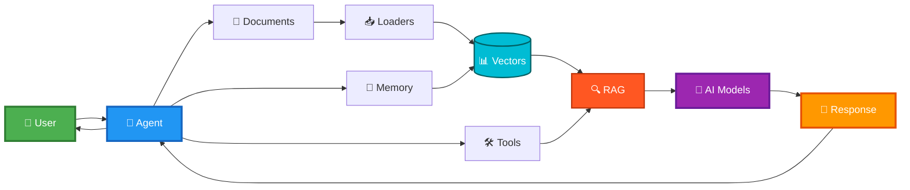

# BoxLang AI

ColdBox has deep integrations with the BoxLang AI library in order to build AI applications and services.  All you need to do is install the `bx-ai` module in your web application and you will have a powerful library for building fluent and scalable AI applications with ColdBox.

## Introduction

Welcome to the **BoxLang AI Library** - your unified gateway to integrating AI capabilities into any JVM application. This library provides an elegant, easy-to-use API for interacting with multiple AI providers, from simple chat requests to complex multi-agent systems.

### 🙋 What is BoxLang AI?

BoxLang AI is a comprehensive library that brings enterprise-grade artificial intelligence capabilities to the JVM ecosystem. Whether you're building chatbots, content generators, code assistants, RAG systems, or complex AI workflows, this module provides everything you need.



#### ✨ Key Features

* 🌐 **Multi-Provider Support**: Work with OpenAI, Claude, Gemini, Grok, Groq, DeepSeek, Ollama, and more
* 🔄 **Unified API**: One consistent interface across all providers
* 👥 **Multi-Tenant Memory**: Enterprise-grade isolation with userId and conversationId across all 20 memory types
* 🎨 **Multimodal Content**: Process images, audio, video, and documents alongside text
* 🏠 **Local AI Support**: Run models locally with Ollama for privacy and offline use
* 🔗 **AI Pipelines**: Chain operations together for complex multi-step workflows
* ⚡ **Streaming Responses**: Get real-time responses as they're generated
* 🛠️ **Tool Integration**: Enable AI to call functions and access real-time data
* 🚀 **Async Support**: Non-blocking operations for better performance
* 📝 **Template System**: Create reusable prompts with dynamic placeholders
* 🤖 **AI Agents**: Autonomous agents with memory, tools, and reasoning
* 📄 **Document Loaders**: Load and process various file formats for RAG
* 🧠 **Vector Memory**: Semantic search with 12 vector database integrations

#### 📡 Supported Providers

BoxLang supports a variety of AI providers out of the box. You can also create custom providers by following our Custom Provider Guide.

| Provider           | Type    | Best For                                                    |
| ------------------ | ------- | ----------------------------------------------------------- |
| **Bedrock**        | Cloud   | AWS enterprise, multi-model (Claude, Titan, Llama, Mistral) |
| **Claude**         | Cloud   | Long context, detailed analysis                             |
| **Cohere**         | Cloud   | Embeddings, multilingual, chat, tool calling                |
| **DeepSeek**       | Cloud   | Code generation, reasoning                                  |
| **Docker Desktop** | Local   | Docker-managed models, easy local AI                        |
| **Gemini**         | Cloud   | Google integration, multimodal                              |
| **Grok**           | Cloud   | Real-time data, Twitter integration                         |
| **Groq**           | Cloud   | Ultra-fast inference, LPU architecture                      |
| **HuggingFace**    | Cloud   | Open-source models, community-driven                        |
| **Ollama**         | Local   | Privacy, offline use, no API costs                          |
| **OpenAI**         | Cloud   | General purpose, GPT-5, etc                                 |
| **OpenRouter**     | Gateway | Access multiple models through one API                      |
| **Perplexity**     | Cloud   | Research, citations, factual answers                        |
| **Voyage**         | Cloud   | State-of-the-art embeddings, specialized for RAG            |

#### 🗃️ Supported Memory Types

BoxLang AI provides 20+ memory types for conversation history and semantic search. All memory types support multi-tenant isolation with `userId` and `conversationId`.

| Memory Type    | Vector | Best For                              | Storage           | Multi-Tenant |
| -------------- | ------ | ------------------------------------- | ----------------- | ------------ |
| **Windowed**   | ❌      | Recent N messages, simple context     | In-memory         | ✅            |
| **Summary**    | ❌      | Long conversations with summarization | In-memory         | ✅            |
| **Session**    | ❌      | Web sessions, survives page refresh   | HTTP Session      | ✅            |
| **File**       | ❌      | Persistent storage, file-based        | File System       | ✅            |
| **Cache**      | ❌      | Fast retrieval, distributed cache     | CacheBox          | ✅            |
| **JDBC**       | ❌      | Enterprise database storage           | Any JDBC DB       | ✅            |
| **BoxVector**  | ✅      | Development, prototyping              | In-memory         | ✅            |
| **Chroma**     | ✅      | Python integration, local dev         | ChromaDB          | ✅            |
| **Postgres**   | ✅      | Existing PostgreSQL infrastructure    | PostgreSQL        | ✅            |
| **MySQL**      | ✅      | Existing MySQL 9+ infrastructure      | MySQL             | ✅            |
| **OpenSearch** | ✅      | AWS integration, enterprise search    | OpenSearch        | ✅            |
| **TypeSense**  | ✅      | Fast typo-tolerant search             | TypeSense         | ✅            |
| **Pinecone**   | ✅      | Production cloud-native               | Pinecone Cloud    | ✅            |
| **Qdrant**     | ✅      | Self-hosted, high performance         | Qdrant            | ✅            |
| **Weaviate**   | ✅      | GraphQL, knowledge graphs             | Weaviate          | ✅            |
| **Milvus**     | ✅      | Enterprise, massive scale             | Milvus            | ✅            |
| **Hybrid**     | ✅      | Recent + semantic combined            | Vector + Standard | ✅            |

**📖 Learn More**: Standard Memory Guide · Vector Memory Guide

#### 📋 Supported Document Loaders

BoxLang AI provides 12 document loaders for importing content from various sources into standardized `Document` format for RAG workflows.

| Loader               | File Types         | Best For           | Features                                  |
| -------------------- | ------------------ | ------------------ | ----------------------------------------- |
| **TextLoader**       | `.txt`, `.text`    | Plain text files   | Simple text ingestion                     |
| **MarkdownLoader**   | `.md`, `.markdown` | Markdown documents | Header splitting, code removal            |
| **HTMLLoader**       | `.html`, `.htm`    | HTML pages         | Tag extraction, script/style removal      |
| **CSVLoader**        | `.csv`             | Tabular data       | Row/column modes, filtering               |
| **JSONLoader**       | `.json`            | JSON data          | Field extraction, array handling          |
| **XMLLoader**        | `.xml`             | XML documents      | XPath queries, attribute extraction       |
| **PDFLoader**        | `.pdf`             | PDF documents      | Text extraction, page splitting           |
| **LogLoader**        | `.log`             | Log files          | Pattern matching, timestamp parsing       |
| **HTTPLoader**       | URLs               | Web content        | HTTP/S, headers, authentication           |
| **FeedLoader**       | RSS/Atom           | RSS/Atom feeds     | Feed parsing, item extraction             |
| **SQLLoader**        | SQL queries        | Database records   | JDBC datasources, query execution         |
| **DirectoryLoader**  | Folders            | Batch loading      | Recursive scanning, type detection        |
| **WebCrawlerLoader** | Websites           | Web crawling       | Multi-page, depth control, link following |

**Key Features:**

* ✅ **Fluent API** - Chain configuration methods
* ✅ **Memory Integration** - Direct ingestion with `toMemory()`
* ✅ **Automatic Chunking** - Split large documents
* ✅ **Async Support** - Load documents asynchronously
* ✅ **Multi-Memory Fan-out** - Ingest to multiple vector stores
* ✅ **Transform/Filter** - Apply transformations during load

**📖 Learn More**: Document Loaders Guide · Custom Loaders

#### 🚀 Use Cases

* 💬 **Chatbots**: Build conversational interfaces with memory and context
* ✍️ **Content Generation**: Create articles, documentation, marketing copy
* 💻 **Code Assistance**: Generate, review, and explain code
* 📊 **Data Analysis**: Extract insights from text and structured data
* 📄 **Document Processing**: Analyze PDFs, contracts, and reports
* 🎥 **Media Analysis**: Process images, audio, and video content
* 🌍 **Translations**: Multi-language content translation
* 📋 **Summarization**: Condense long documents intelligently
* ❓ **Question Answering**: Build knowledge bases and FAQs with RAG
* 🔄 **Custom Workflows**: Multi-step AI processing pipelines

***

### 📖 Quick Start

#### 🎓 Getting Started

Perfect for beginners - get up and running quickly

#### 💬 Simple AI Interactions

Learn basic chat, streaming, and structured output

#### 🔗 AI Pipelines

Build complex workflows with agents, memory, and tools

#### 🤖 AI Agents

Build reusable and autonomous agents, sub-agents, and much more.

***

### 🔧 Built-In Functions (BIFs)

BoxLang AI provides a comprehensive set of BIFs for different AI operations. You can see all of our BIF reference documentation here: BIF Reference.

#### 💬 Chat & Conversation

| BIF               | Purpose                        | Return Type   | Example Use Case                         |
| ----------------- | ------------------------------ | ------------- | ---------------------------------------- |
| `aiChat()`        | Simple one-shot chat request   | String        | Quick Q\&A, content generation           |
| `aiChatAsync()`   | Non-blocking chat request      | Future        | Background processing, parallel requests |
| `aiChatRequest()` | Build structured chat requests | AiChatRequest | Complex requests with tools              |
| `aiChatStream()`  | Real-time streaming responses  | void          | Live chat, progressive output            |
| `aiService()`     | Get AI service instances       | Service       | Multi-provider management                |

#### 🏗️ Pipeline Components

| BIF             | Purpose                   | Return Type | Example Use Case                  |
| --------------- | ------------------------- | ----------- | --------------------------------- |
| `aiAgent()`     | Create AI agents          | AiAgent     | Autonomous assistants, multi-turn |
| `aiMessage()`   | Build message pipelines   | AiMessage   | Reusable prompts, templates       |
| `aiModel()`     | Create model runnables    | AiModel     | Pipeline integration              |
| `aiTransform()` | Create data transformers  | Transformer | Pipeline data processing          |
| `aiTool()`      | Define callable functions | Tool        | Real-time data, function calling  |

#### 🧠 Memory & Context

| BIF          | Purpose                              | Return Type | Example Use Case                                  |
| ------------ | ------------------------------------ | ----------- | ------------------------------------------------- |
| `aiMemory()` | Create conversation or vector memory | Memory      | Context-aware conversations, RAG, semantic search |

#### 📄 Document Processing

| BIF             | Purpose                     | Return Type  | Example Use Case         |
| --------------- | --------------------------- | ------------ | ------------------------ |
| `aiDocuments()` | Load documents from sources | Array/Loader | Document processing, RAG |

#### 🔢 Utilities

| BIF            | Purpose                                                               | Return Type  | Example Use Case                                                                   |
| -------------- | --------------------------------------------------------------------- | ------------ | ---------------------------------------------------------------------------------- |
| `aiChunk()`    | Split text into chunks                                                | Array        | Processing large documents                                                         |
| `aiEmbed()`    | Generate vector embeddings                                            | Array/Struct | Semantic search, similarity                                                        |
| `aiPopulate()` | Populate a class instance, struct, or array from JSON data or struct. | Any          | This is useful for testing, custom workflows, or working with cached AI responses. |
| `aiTokens()`   | Estimate token counts                                                 | Numeric      | Cost estimation, limits                                                            |

#### ⚙️ MCP (Model Context Protocol)

| BIF           | Purpose                     | Return Type | Example Use Case          |
| ------------- | --------------------------- | ----------- | ------------------------- |
| `MCP()`       | Connect to MCP servers      | MCPClient   | External tools, resources |
| `MCPServer()` | Create MCP server instances | MCPServer   | Expose tools to agents    |

***

### 🚀 Quick Examples

#### 💬 Simple Chat

```javascript
answer = aiChat( "What is BoxLang?" )
println( answer )
```

#### 🎨 Simple Chat with Parameters

```javascript
answer = aiChat(
    "Write a haiku about coding",
    { temperature: 0.9, model: "gpt-4" }
)
```

#### 🔗 Build a Pipeline

```javascript
pipeline = aiMessage()
    .system( "You are a helpful assistant" )
    .user( "Explain ${topic}" )
    .toDefaultModel()
    .transform( r => r.content )

result = pipeline.run( { topic: "recursion" } )
```

#### ⚡ Stream Responses

```javascript
aiChatStream(
    "Tell me a story",
    ( chunk ) => print( chunk.choices?.first()?.delta?.content ?: "" )
)
```

#### 📦 Get JSON Responses

```javascript
// Automatically parse JSON responses
user = aiChat(
    "Create a user profile with name, age, and email for Alice",
    { returnFormat: "json" }
)

println( "Name: #user.name#" )
println( "Age: #user.age#" )
println( "Email: #user.email#" )
```

#### 🛠️ Use AI Tools

```javascript
// Let AI call functions for real-time data
getWeather = aiTool(
    name: "get_weather",
    description: "Get current weather for a location",
    parameters: {
        location: { type: "string", description: "City name" }
    },
    callback: ( args ) => {
        return { temp: 72, condition: "sunny", location: args.location }
    }
)

response = aiChat(
    "What's the weather in San Francisco?",
    { tools: [ getWeather ] }
)
```

#### 🔢 Generate Embeddings

```javascript
// Create vector embeddings for semantic search
embeddings = aiEmbed([
    "BoxLang is a modern JVM language",
    "Java is a programming language",
    "Python is popular for AI"
])

// Use embeddings for similarity comparison
println( "Generated #embeddings.len()# embeddings" )
```

#### 📄 Load Documents

```javascript
// Load documents for RAG
documents = aiDocuments( source: "docs/guide.md" )

// Use with memory
memory = aiMemory( type: "vector" )
memory.addDocuments( documents )

// Query with context
response = aiChat(
    "What is covered in the guide?",
    { memory: memory }
)
```

#### 🤖 Create an Agent

```javascript
// Build an autonomous agent
agent = aiAgent()
    .name( "Research Assistant" )
    .instructions( "You help research and summarize topics" )
    .memory( aiMemory( type: "windowed", size: 10 ) )
    .tools([
        searchTool,
        summarizeTool
    ])

// Agent handles multi-turn conversations
response = agent.chat( "Research AI trends in 2025" )
```

***

### 🆘 Need Help?

#### 📚 Resources

* **📖 Full Documentation**: Explore all sections above for comprehensive guides
* **💡 Examples**: Check the `/examples` folder for runnable code samples
* **🔍 BIF Reference**: See `reference/built-in-functions/` for detailed function docs
* **📦 Module Components**: Explore `main-components/` for in-depth component guides

#### 🤝 Community & Support

* **👥 Community**: [BoxLang Community Forum](https://community.boxlang.io)
* **🐛 Issues**: [GitHub Issues](https://github.com/ortus-boxlang/bx-ai/issues)
* **💬 Discussions**: [GitHub Discussions](https://github.com/ortus-boxlang/bx-ai/discussions)
* **✉️ Email Support**: [ai@ortussolutions.com](mailto:ai@ortussolutions.com)

#### 🎓 Learning Paths

1. **🌱 Beginners**: Start with Quick Start → Basic Chatting → Examples
2. **🏗️ Builders**: Learn Pipelines → Memory → Tools
3. **🚀 Advanced**: Explore Agents → RAG → Custom Components
