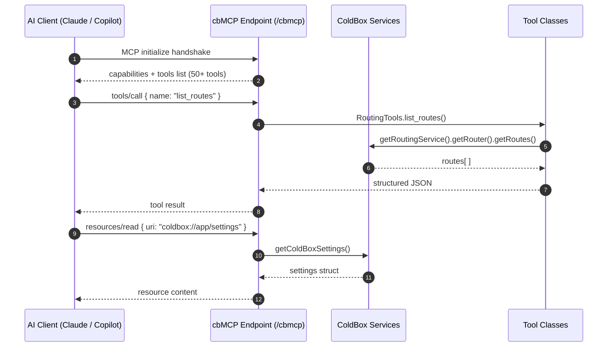
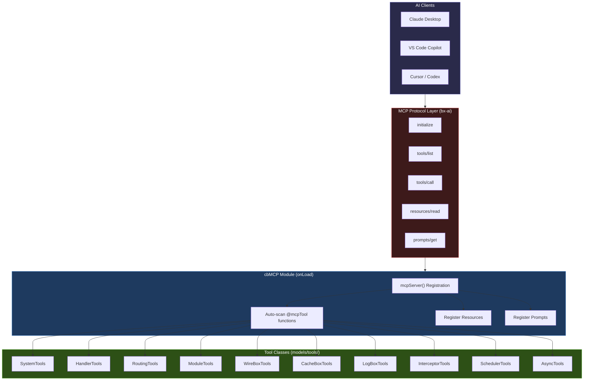

# ColdBox MCP Server (cbMCP)


`cbMCP` is a **BoxLang-only** module. It requires BoxLang 1.x, ColdBox 8+, and the `bx-ai` module.


`cbMCP` is a ColdBox module that turns your running application into a fully-compliant [Model Context Protocol (MCP)](https://modelcontextprotocol.io/) server. AI clients — Claude Desktop, VS Code Copilot, Cursor, Codex, or any MCP-capable tool — can connect and gain live, read-only introspection across the entire ColdBox platform layer: routing, handlers, modules, dependency injection, caching, logging, scheduling, and more.

```
┌──────────────────────────────────────────────────────────────────────┐
│                        Your ColdBox Application                      │
│                                                                      │
│  ┌─────────────┐  ┌─────────────────────────────────────────────┐    │
│  │  cbMCP      │  │              MCP Tool Registry              │    │
│  │  Module     │  │                                             │    │
│  │             │  │  SystemTools   HandlerTools  RoutingTools   │    │
│  │  /cbmcp     │  │  ModuleTools   WireBoxTools  CacheBoxTools  │    │
│  │  (endpoint) │  │  LogBoxTools   SchedulerTools AsyncTools    │    │
│  │             │  │  InterceptorTools                           │    │
│  └──────┬──────┘  └─────────────────────────────────────────────┘    │
│         │                                                            │
└─────────┼────────────────────────────────────────────────────────────┘
          │  HTTP / SSE (MCP protocol)
          │
    ┌─────▼──────────────────────────────────────────────┐
    │              MCP Clients                           │
    │                                                    │
    │  Claude Desktop    VS Code Copilot    Cursor IDE   │
    │  GitHub Codex      Gemini CLI         OpenCode     │
    │  Any HTTP/SSE MCP client                           │
    └────────────────────────────────────────────────────┘
```

---

## How It Works



---

## Installation

```bash
# Step 1 — BoxLang AI runtime (required dependency)
box install bx-ai

# Step 2 — cbMCP module
box install cbmcp
```

Once installed and the application boots, the MCP endpoint is **immediately live** at:

```
http://<host>:<port>/cbmcp
// If you enable SSL, it will be available at, which we recommend for secure AI client connections:
https://<host>:<port>/cbmcp
```

No routing configuration is needed — cbMCP registers its own entry point at `cbmcp` via `ModuleConfig.bx`.

---

## Connecting an AI Client

### Claude Desktop

Add the following entry to `~/Library/Application Support/Claude/claude_desktop_config.json` (macOS) or the equivalent path on Windows:

```json
// If using http insecure connection:
{
  "mcpServers": {
    "cbMCP": {
      "command": "npx",
      "args": [
        "-y",
        "@depasquale/mcp-http-stdio-bridge",
        "--url",
        "http://127.0.0.1:<port>/cbmcp"
      ]
    }
  }
}

// If you are using SSL (recommended):
{
  "mcpServers": {
    "cbMCP": {
      "type": "http",
      "url": "https://127.0.0.1:<port>/cbmcp"
    }
  }
}
```

Replace `<port>` with your application's port (e.g. `60299` for a local BoxLang dev server). The `@depasquale/mcp-http-stdio-bridge` package is installed automatically by `npx` on first use — no manual install required.

Restart Claude Desktop after saving. The `cbMCP` server will appear in the tools panel.

### VS Code / GitHub Copilot

Add to your `.vscode/mcp.json` (project-scoped) or your user-level VS Code MCP settings:

```json
{
  "servers": {
    "cbMCP": {
      "type": "http",
      "url": "https://127.0.0.1:<port>/cbmcp"
    }
  }
}
```

### Any MCP-Compatible Client (HTTP / SSE transport)

Point the client directly at the SSE endpoint:

```
https://<host>:<port>/cbmcp
```

---

## Available Tools

`cbMCP` ships with **10 tool classes**, auto-discovered at startup. Every function annotated with `@mcpTool` is surfaced to the connected AI client.

### System (`SystemTools`)

| Tool | Description |
| ---- | ----------- |
| `time_now` | Returns the server's current date/time (ISO 8601) |
| `get_coldbox_settings` | Returns all ColdBox framework settings |
| `get_runtime_info` | Engine name, version, app layout, and OS |
| `get_application_structure` | Application directory layout (handlers, models, views, etc.) |
| `get_setting( name )` | Returns a single ColdBox application setting by key |
| `reinit_app` | Reinitialises the ColdBox application |

### Handlers (`HandlerTools`)

| Tool | Description |
| ---- | ----------- |
| `get_handlers` | Lists all registered event handlers with their actions |
| `get_handler( handlerName, [moduleName] )` | Returns metadata for a specific handler |

### Routing (`RoutingTools`)

| Tool | Description |
| ---- | ----------- |
| `list_routes` | Lists all registered application routes |
| `list_module_routes` | Lists which modules have routes registered |
| `get_module_routes( moduleName )` | Returns routes registered by a specific module |
| `get_router_settings` | Returns router configuration (default route, SSL, etc.) |

### Modules (`ModuleTools`)

| Tool | Description |
| ---- | ----------- |
| `get_modules` | Returns full metadata for all registered modules |
| `get_loaded_modules` | Returns a flat list of activated module names |
| `get_module( moduleName )` | Returns metadata for a specific module |

### WireBox (`WireBoxTools`)

| Tool | Description |
| ---- | ----------- |
| `get_wirebox_mappings` | Returns all registered DI mappings |
| `has_mapping( name )` | Checks whether a mapping exists |
| `get_mapping( name )` | Returns the full mapping definition for a binding |

### CacheBox (`CacheBoxTools`)

| Tool | Description |
| ---- | ----------- |
| `get_caches` | Returns all registered cache providers with stats |
| `get_cache_names` | Returns a flat list of cache provider names |
| `get_cache_stats( cacheName )` | Returns hit/miss/size statistics for a cache |
| `get_cache_keys( cacheName )` | Lists all keys currently in a cache |
| `get_cache_size( cacheName )` | Returns the number of objects in a cache |
| `get_cache_key_metadata( cacheName, objectKey )` | Returns metadata for a single cached entry |
| `cache_key_exists( cacheName, objectKey )` | Checks whether a key exists in a cache |
| `get_store_metadata_report( cacheName )` | Returns full store metadata for all entries |
| `clear_all( cacheName )` | Clears all entries from a cache |
| `clear_item( cacheName, objectKey )` | Clears a single entry by key |
| `clear_all_events( cacheName, [async] )` | Clears all event-cached entries |
| `clear_event( cacheName, eventSnippet, [queryString] )` | Clears a specific event cache entry |
| `clear_event_multi( cacheName, eventSnippets, [queryString] )` | Clears multiple event cache entries |
| `clear_all_views( cacheName, [async] )` | Clears all view-cached entries |
| `clear_view( cacheName, viewSnippet )` | Clears a specific view cache entry |
| `clear_view_multi( cacheName, viewSnippets )` | Clears multiple view cache entries |

### LogBox (`LogBoxTools`)

| Tool | Description |
| ---- | ----------- |
| `get_logbox_info` | Returns LogBox version, ID, loggers, and appenders |
| `get_loggers` | Returns all registered logger definitions |
| `get_logger( category )` | Returns the logger definition for a category |
| `get_appenders` | Returns all registered appender definitions |
| `get_root_logger` | Returns the ROOT logger definition |
| `read_log_entries( [appenderName], [limit=100] )` | Reads the last N entries from file-based appenders |
| `get_last_error( [appenderName] )` | Finds the most recent ERROR or FATAL entry in log files |

### Interceptors (`InterceptorTools`)

| Tool | Description |
| ---- | ----------- |
| `get_interceptors` | Returns all registered interceptors |
| `get_interceptor_states` | Returns all registered interception points and their listeners |

### Schedulers (`SchedulerTools`)

| Tool | Description |
| ---- | ----------- |
| `get_schedulers` | Returns all registered application schedulers and their tasks |
| `get_scheduler( schedulerName )` | Returns metadata for a specific scheduler |
| `get_task_stats( schedulerName, taskName )` | Returns execution stats for a specific task |
| `run_task( schedulerName, taskName )` | Executes a scheduled task on demand |
| `pause_task( schedulerName, taskName )` | Pauses a scheduled task |
| `resume_task( schedulerName, taskName )` | Resumes a paused scheduled task |

### Async (`AsyncTools`)

| Tool | Description |
| ---- | ----------- |
| `get_executors` | Returns all registered async executors with their stats |
| `get_executor_names` | Returns a flat list of executor names |

---

## MCP Resources

`cbMCP` also exposes **MCP Resources** — ambient read-only context that AI clients can read at any time, without calling a tool explicitly. Resources provide background knowledge that is automatically injected into AI conversations.

| URI | Description |
| --- | ----------- |
| `coldbox://app/settings` | All active ColdBox application configuration settings |
| `coldbox://app/modules` | All currently activated modules with key metadata |
| `coldbox://app/routes` | All registered application routes |
| `coldbox://app/handlers` | All registered event handlers |

---

## MCP Prompts

`cbMCP` ships with pre-packaged **MCP Prompts** — ready-made AI workflows that appear in the client's prompt library. Select one and the AI runs it against your live application automatically.

| Prompt | Description |
| ------ | ----------- |
| `coldbox_app_overview` | Generates a comprehensive overview of the running ColdBox application |
| `debug_handler` | Diagnoses issues with a specific event handler (requires `handlerName` arg) |
| `cache_health_report` | Produces a CacheBox health report across all cache providers |
| `interceptor_audit` | Audits all registered interceptors and interception points for conflicts and ordering issues |

---

## Creating Custom Tools

You can extend cbMCP by adding your own tool classes. Create a BoxLang class anywhere in your application and annotate functions with `@AITool` and `@mcpTool`. The function's docblock becomes the tool's description visible to the AI client.

```javascript
// models/tools/MyAppTools.bx
class {

    property name="productService" inject="ProductService";

    /**
     * Get the 10 best-selling products by revenue.
     */
    @AITool
    @mcpTool
    function get_top_products() {
        return productService.getTopSellers( limit: 10 );
    }

    /**
     * Get a single product by its SKU.
     *
     * @sku The product SKU to look up (e.g. "COLD-001")
     */
    @AITool
    @mcpTool
    function get_product( required string sku ) {
        return productService.getBySKU( arguments.sku );
    }

}
```


Both `@AITool` and `@mcpTool` annotations are required. `@AITool` registers the function with the `bx-ai` tool registry; `@mcpTool` marks it for MCP protocol discovery and exposure.


Get access to the MCP server and register more tools (https://ai.ortusbooks.com/advanced/mcp-server#tool-registration) or [prompts](https://ai.ortusbooks.com/advanced/mcp-server#prompt-registration) or [resources](https://ai.ortusbooks.com/advanced/mcp-server#resource-registration)!

```javascript
// Get the cbMCP server instance from BoxLang AI
mcpServer( "cbMCP" )
    // Register a new tool class
    .registerTool(
        aiTool( "getWeather", "Get current weather for a location", ( location ) => {
            return weatherService.getCurrent( location )
        } )
        .describeArg( "location", "City name or coordinates" )
    )
    // Register an array of tools
    .registerTools( [
        aiTool( "getNews", "Get latest news headlines", ( topic ) => {
            return newsService.getHeadlines( topic )
        } ).describeArg( "topic", "News topic or category" ),
        aiTool( "getTime", "Get current server time", () => {
            return new Date().toISOString();
        } )
    ] )
    // Scan my own tools
    .scan( "models.aitools" )
    // Scan my single tool
    .scan( "my.tool.Here" )
```

---

## Architecture Deep Dive



---

## What AI Clients Can Do With It

Once connected, an AI client with `cbMCP` access can answer questions and perform tasks that previously required a developer at their terminal:

```
"What routes does my app have that match /api/users?"
  → tools/call list_routes

"Which WireBox mappings are singletons?"
  → tools/call get_wirebox_mappings

"Show me the hit rate of the `template` cache."
  → tools/call get_cache_stats { cacheName: "template" }

"Are there any ERROR entries in my logs in the last hour?"
  → tools/call get_last_error

"What scheduled tasks are registered, and when did they last run?"
  → tools/call get_schedulers

"Run the nightly-cleanup task now."
  → tools/call run_task { schedulerName: "AppScheduler", taskName: "nightly-cleanup" }
```

---

## Source & Changelog

- **GitHub**: [https://github.com/coldbox-modules/cbmcp](https://github.com/coldbox-modules/cbmcp)
- **ForgeBox**: `box install cbmcp`
