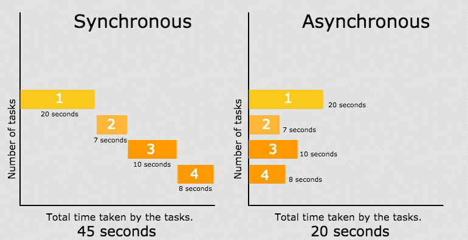
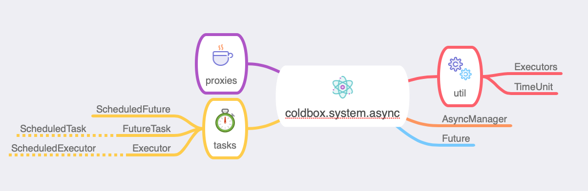
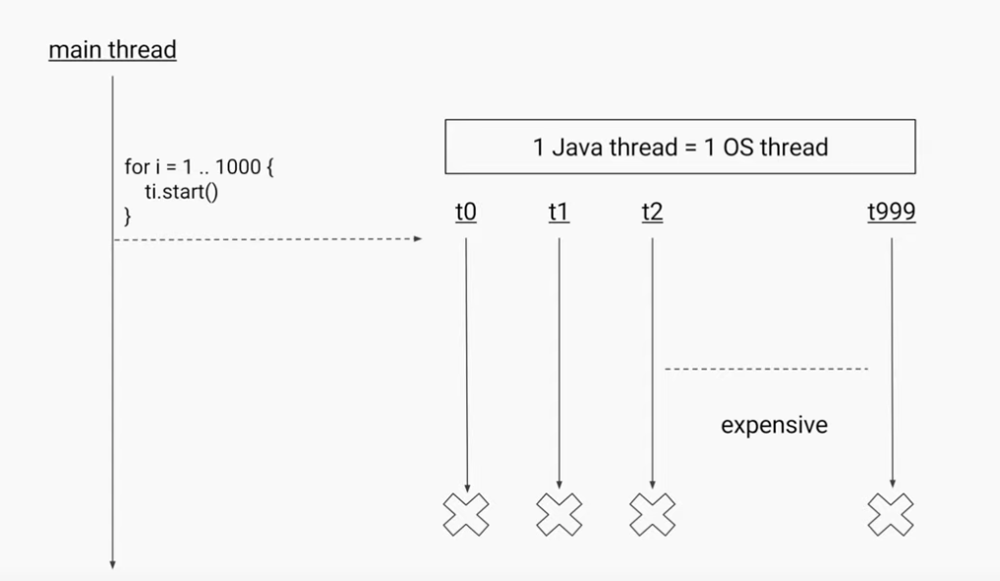

# Async Programming

## Introduction

ColdBox 6 introduces the concept of asynchronous and parallel programming using Futures and Executors for ColdFusion \(CFML\). We leverage the entire arsenal in the [JDK](https://docs.oracle.com/en/java/javase/11/docs/api/java.base/java/util/concurrent/package-summary.html) to bring you a wide array of features for your applications. From the ability to create asynchronous pipelines, to parallel work loads, work queues, and scheduled tasks.



Our async package `coldbox.system.async` is also available for all the standalone libraries: WireBox, CacheBox, and LogBox. This means that you can use the async capabilities in **ANY** ColdFusion \(CFML\) application, not only ColdBox HMVC applications.


We leverage Java `Executors`, `CompletableFutures` and much more classes from the concurrent packages in the JDK: [https://docs.oracle.com/en/java/javase/11/docs/api/java.base/java/util/concurrent/package-summary.html](https://docs.oracle.com/en/java/javase/11/docs/api/java.base/java/util/concurrent/package-summary.html)


## Sample Gallery

We have created a full sample gallery that we use in our live sessions and trainings.  It contains tons of samples you can run and learn from: [https://github.com/lmajano/to-the-future-with-cbFutures](https://github.com/lmajano/to-the-future-with-cbFutures)



## AsyncManager

We have created a manager for leveraging all the async/parallel capabilities. We lovingly call it the ColdBox `AsyncManager`. From this manager you will be able to create async pipelines, simple futures, executors and much more.



### What are ColdBox Futures?

A ColdBox future is used for async/parallel programming where you can register a task or multiple tasks that will execute in a non-blocking approach and trigger dependent computations which could also be asynchronous. This Future object can then be used to monitor the execution of the task and create rich completion/combining pipelines upon the results of such tasks. You can still use a `get()` blocking operation, but that is an over simplistic approach to async programming because you are ultimately blocking to get the result.

ColdBox futures are backed by Java's `CompletableFuture` API, so the majority of things will apply as well; even Java developers will feel at home. It will allow you to create rich pipelines for creating multiple Futures, chaining, composing and combining results.

```javascript
// Parallel Executions
async().all(
    () => hyper.post( "/somewhere" ),
    () => hyper.post( "/somewhereElse" ),
    () => hyper.post( "/another" )
).then( (results)=> logResults( results ) );

// Race Conditions, let the fastest dns resolve
var dnsServer = async().any( 
    () => dns1.resolve(),
    () => dns2.resolve()
).get();

// Process an incoming order
async().newFuture( () => orderService.getOrder() )
    .then( (order) => enrichOrder( order ) )
    .then( (order) => performPayment( order ) )
    .thenAsync( 
        (order) => dispatchOrder( order ), 
        async().getExecutor( "cpuIntensive" )
     )
    .then( (order) => sendConfirmation( order ) );

// Combine Futures
var bmi = async().newFuture( () => weightService.getWeight( rc.person ) )
    .thenCombine(
	    async().newFuture( () => heightService.getHeight( rc.person ) ),
        ( weight, height ) => {
            var heightInMeters = arguments.height/100;
            return arguments.weight / (heightInMeters * heightInMeters );
        }
    )
    .get();

// Compose Futures with exceptions
async()
    .newFuture( () => userService.getOrFail( rc.id ) )
    .thenCompose( ( user ) => creditService.getCreditRating( user ) )
    .then( (creditRating) => event.getResponse().setData( creditRating ) )
    .onException( (ex) => event.getResponse().setError( true ).setMessages( ex.toString() ) );
```


See [https://docs.oracle.com/javase/8/docs/api/java/util/concurrent/CompletableFuture.html](https://docs.oracle.com/javase/8/docs/api/java/util/concurrent/CompletableFuture.html)


#### Why Use Them?

You might be asking yourself, why should I leverage ColdBox futures instead of traditional `cfthreads` or even the CFML engine's `runAsync()`. Let's start with the first issue, using ColdBox futures instead of `cfthread`.

#### `cfthread` vs ColdBox Futures

`cfthreads` are an oversimplification approach to async computations. It allows you to spawn a thread backed by a Java Runnable and then either wait or not for it to complete. You then must use the `thread` scope or other scopes to move data around, share data, and well it can get out of hand very quickly. Here are some issues:

* Too over-simplistic
* Threads limited on creation
* Cannot be completed manually
* No concept of a completion stage pipeline
* No control of what executor runs the task
* No way to trap the exceptions and recover
* No way to do parallel computations with futures
* No way to get a result from the computation, except by using a shared scope
* You must track, name and pull information from the threads
* etc.

You get the picture. They exist, but they are not easy to deal with and the API for managing them is poor.



#### `runAsync()` vs ColdBox Futures

ColdFusion 2018 and Lucee 5 both have introduced the concept of async programming via their `runAsync()` function. Lucee also has the concept of executing collections in parallel via the `each(), map(), filter()` operations as well.  However, there is much to be desired in their implementations. Here are a list of deficiencies of their current implementations:

* Backed by a custom wrapper to `java.util.concurrent.Future` and not Completable Futures
* Simplistic error handler with no way to recover or continue executing pipelines after an exception
* No way to choose or reuse the executor to run the initial task in 
* No way to choose or reuse the executor to run the sub-sequent `then()` operations.  Lucee actually creates a new `singleThreadExecutor()` for EVERY `then()` operation.
* No way to operate on multiple futures at once
* No way to have one future win against multiple future operations
* No way to combine futures
* No way to compose futures
* No ability to schedule tasks
* No ability to run period tasks
* No ability to delay the execution of tasks
* Only works with closures, does not work on actually calling component methods
* And so much more

### What are Executors?

All of our futures execute in the server's common `ForkJoin` pool the JDK provides. However, the JDK since version 8 provides you a framework for simplifying the execution of asynchronous tasks. It can automatically provide you with a pool of threads and a simple API for assigning tasks or work loads to them. We have bridged the gap between Java and ColdFusion and now allow you to leverage all the functionality of the framework in your applications. You can create many types of executors and customized thread pools, so your work loads can use them.


Some resources:

* [https://docs.oracle.com/javase/tutorial/essential/concurrency/executors.html](https://docs.oracle.com/javase/tutorial/essential/concurrency/executors.html)
* [https://www.baeldung.com/java-executor-service-tutorial](https://www.baeldung.com/java-executor-service-tutorial)
* [https://winterbe.com/posts/2015/04/07/java8-concurrency-tutorial-thread-executor-examples/](https://winterbe.com/posts/2015/04/07/java8-concurrency-tutorial-thread-executor-examples/)

### Injection/Retrieval

The manager will be registered in WireBox as `AsyncManager@ColdBox` or can be retrieved from the ColdBox main controller: `controller.getAsyncManager()`.

```javascript
property name="async" inject="asyncManager@coldbox";

controller.getAsyncManager();
```

The super type has a new `async()` method that returns to you the instance of the `AsyncManager` so you can execute async/parallel operations as well.

```javascript
function index( event, rc, prc ){
    async().newFuture();
}
```

### 

