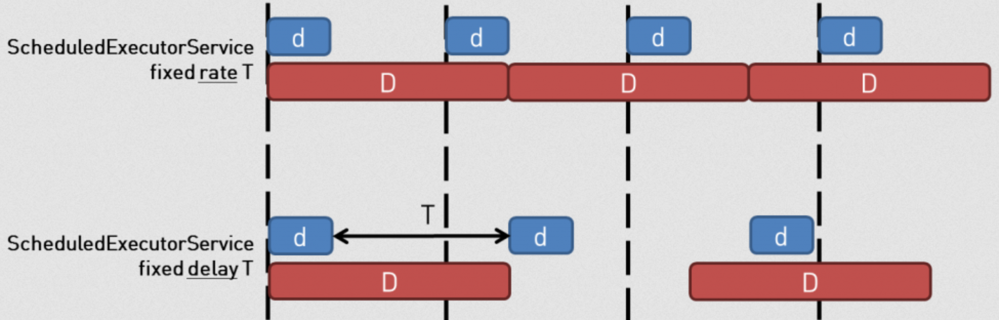
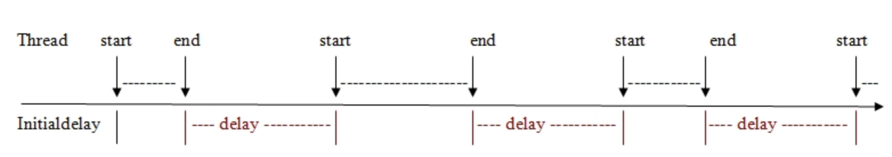

# Scheduled Tasks

## Introduction

Scheduled tasks have always been a point of soreness for many developers in _ANY_ language.  Especially choosing where to place them for execution: should it be cron? windows task scheduler? ColdFusion engine? Jenkins, Gitlab? and the list goes on and on.


The _ColdBox Scheduled Tasks_ offers a fresh, programmatic and human approach to scheduling tasks on your server and multi-server application.  It allows you to define your tasks in a portable **Scheduler** we lovingly call the `Scheduler.cfc` which not only can be used to define your tasks, but also monitor all of their life-cycles and metrics of tasks.  Since ColdBox is also hierarchical, it allows for every single ColdBox Module to also define a `Scheduler` and register their own tasks as well.  This is a revolutionary approach to scheduling tasks in an HMVC application.


The ColdBox Scheduler is built on top of the core async package Scheduler.


## Global App Scheduler

Every ColdBox application has a global scheduler created for you by convention and registered with a WireBox ID of `appScheduler@coldbox`.  However, you can have complete control of the scheduler by creating the following file: `config/Scheduler.cfc`.  This is a simple CFC with a `configure()` method where you will define your tasks and several life-cycle methods.


```javascript
component {

	/**
	 * Configure the ColdBox Scheduler
	 */
	function configure() {
		/**
		 * --------------------------------------------------------------------------
		 * Configuration Methods
		 * --------------------------------------------------------------------------
		 * From here you can set global configurations for the scheduler
		 * - setTimezone( ) : change the timezone for ALL tasks
		 * - setExecutor( executorObject ) : change the executor if needed
		 * - setCacheName( "template" ) : Change the cachename for ALL tasks
		 * - setServerFixation( true ) : Set all tasks to run on one server
		 */
		


		/**
		 * --------------------------------------------------------------------------
		 * Register Scheduled Tasks
		 * --------------------------------------------------------------------------
		 * You register tasks with the task() method and get back a ColdBoxScheduledTask object
		 * that you can use to register your tasks configurations.
		 */
			
		task( "Clear Unregistered Users" )
			.call( () => getInstance( "UserService" ).clearRecentUsers() )
			.everyDayAt( "09:00" );
			
		task( "Hearbeat" )
			.call( () => runEvent( "main.heartbeat" ) )
			.every( 5, "minutes" )
			.onFailure( ( task, exception ) => {
				getInstance( "System" ).sendBadHeartbeat( exception );
			} );
	}

	/**
	 * Called before the scheduler is going to be shutdown
	 */
	function onShutdown(){
	}

	/**
	 * Called after the scheduler has registered all schedules
	 */
	function onStartup(){
	}

	/**
	 * Called whenever ANY task fails
	 *
	 * @task The task that got executed
	 * @exception The ColdFusion exception object
	 */
	function onAnyTaskError( required task, required exception ){
	}

	/**
	 * Called whenever ANY task succeeds
	 *
	 * @task The task that got executed
	 * @result The result (if any) that the task produced
	 */
	function onAnyTaskSuccess( required task, result ){
	}

	/**
	 * Called before ANY task runs
	 *
	 * @task The task about to be executed
	 */
	function beforeAnyTask( required task ){
	}

	/**
	 * Called after ANY task runs
	 *
	 * @task The task that got executed
	 * @result The result (if any) that the task produced
	 */
	function afterAnyTask( required task, result ){
	}

}

```


### Life-Cycle Methods

Every Scheduler can create life-cycle methods and monitor the scheduled tasks:

| Method | Description |
| :--- | :--- |
| `onStartup()` | Called after the scheduler has registered all schedules |
| `onShutdown()` | Called before the scheduler is going to be shutdown |
| `onAnyTaskError(task,exception)` | Called whenever ANY task fails |
| `onAnyTaskSuccess(task,result)` | Called whenever ANY task succeeds |
| `beforeAnyTask(task)` | Called before ANY task runs |
| `afterAnyTask(task,result)` | Called after ANY task runs |

### Configuration Methods

The following methods are used to impact the operation of all scheduled tasks managed by the scheduler:

| Method | Description |
| :--- | :--- |
| `setCacheName( cacheName )` | Set the cachename to use for all registered tasks |
| `setServerFixation( boolean )` | Set the server fixation to use for all registered tasks |
| `setTimezone( timezone )` | Set the timezone to use for all registered tasks |
| `setExecutor( executor )` | Override the executor generated for the scheduler |

#### Cachename For All Tasks

By default, all tasks are fixed to use the `template` cache when doing server fixation.  You can override the cachename by a task by task basis or set the global default into the scheduler.

```javascript
setCacheName( "Redis" )
```

#### Server Fixation For All Tasks

By default, all task run on each server/container they are registered with.  However, you can also pin them on a specific server using server fixation via the `onOneServer()` method of the individual scheduled task.  However, you can also tell the scheduler to do this for ALL tasks it manages using the `setServerFixation()` method.

```javascript
setServerFixation( true )
```

#### Timezone For All Tasks

By default, all tasks run under the system default timezone which usually is UTC.  However, if you would like to change to a different execution timezone, then you can use the `setTimeZone()` method and pass in a valid timezone string: 

```javascript
setTimezone( "America/Chicago" )
```


You can find all valid time zone Id's here: [https://docs.oracle.com/en/java/javase/11/docs/api/java.base/java/time/ZoneId.html](https://docs.oracle.com/en/java/javase/11/docs/api/java.base/java/time/ZoneId.html)



Remember that some timezones utilize daylight savings time. When daylight saving time changes occur, your scheduled task may run twice or even not run at all. For this reason, we recommend avoiding timezone scheduling when possible.


#### Custom Executor

By default the scheduler will register a `scheduled` executor with a default of 20 threads for you with a name of `appScheduler@coldbox-scheduler.`  If you want to add in your own executor as per your configurations, then just call the `setExecutor()` method.

```javascript
setExecutor( 
    getAsyncManager().newScheduledExecutor( "mymymy", 50 ) 
);
```


You can find how to work with executors in our [executors](promises-async-programming/executors.md) section.


### Scheduler Properties

Every scheduler has the following injections available to you in the `variables` scope

| Object | Description |
| :--- | :--- |
| `asyncManager` | Async manager reference |
| `cachebox` | CacheBox reference |
| `cacheName` | The name of the cache for server fixation and more for all tasks |
| `controller` | ColdBox controller reference |
| `executor` | Scheduled executor |
| `log` | A pre-configured log object |
| `started` | A boolean flag indicating if the scheduler has started or not |
| `serverFixation` | The boolean flag that indicates the default for server fixation for all tasks |
| `tasks` | The collection of registered tasks |
| `timezone` | Java based timezone object |
| `util` | ColdBox utility |
| `wirebox` | WireBox reference |

### Scheduler ColdBox Methods

Every scheduler has several useful ColdBox interaction methods you can use when registering your tasks callable methods.

| Method | Description |
| :--- | :--- |
| `announce()` | Announce an interception |
| `externalView()` | Render an external view |
| `getCache()` | Get a cache from CacheBox |
| `getColdBoxSetting()` | Get a ColdBox setting |
| `getEnv()` | Retrieve a environment variable only |
| `getInstance()` | Get a instance object from WireBox |
| `getModuleConfig()` | Get a module config |
| `getModuleSettings()` | Get a module setting |
| `getRenderer()` | Get the ColdBox Renderer |
| `getSetting()` | Get an app Setting |
| `getSystemSetting()` | Retrieve a Java System property or env value by name. It looks at properties first then environment variables |
| `getSystemProperty()` | Retrieve a Java System property only |
| `layout()` | Render a layout |
| `locateDirectoryPath()` | Resolve a directory to be either relative or absolute in your application |
| `locateFilePath()` | Resolve a file to be either relative or absolute in your application |
| `runEvent()` | Run a ColdBox Event |
| `runRoute()` | Run a ColdBox Route |
| `settingExists()` | Check if a setting exists |
| `setSetting()` | Set a setting |
| `view()` | Render a view |

### Scheduler Utility Methods

Every scheduler has several utility methods:

<table>
  <thead>
    <tr>
      <th style="text-align:left">Method</th>
      <th style="text-align:left">Description</th>
    </tr>
  </thead>
  <tbody>
    <tr>
      <td style="text-align:left"><code>getRegisteredTasks()</code>
      </td>
      <td style="text-align:left">Get an ordered array of all the tasks registered in the scheduler</td>
    </tr>
    <tr>
      <td style="text-align:left"><code>getTaskRecord( name )</code>
      </td>
      <td style="text-align:left">
        <p>Get the task record structure by name:</p>
        <p><code>{ </code>
        </p>
        <p><code> name, </code>
        </p>
        <p><code> task, </code>
        </p>
        <p><code> future, </code>
        </p>
        <p><code> scheduledAt, </code>
        </p>
        <p><code> registeredAt, </code>
        </p>
        <p><code> error, </code>
        </p>
        <p><code> errorMessage, </code>
        </p>
        <p><code> stacktrace </code>
        </p>
        <p><code>}</code>
        </p>
      </td>
    </tr>
    <tr>
      <td style="text-align:left"><code>getTaskStats()</code>
      </td>
      <td style="text-align:left">Builds out a struct report for all the registered tasks in this scheduler</td>
    </tr>
    <tr>
      <td style="text-align:left"><code>hasTask( name )</code>
      </td>
      <td style="text-align:left">Check if a scheduler has a task registered by name</td>
    </tr>
    <tr>
      <td style="text-align:left"><code>hasStarted()</code>
      </td>
      <td style="text-align:left">Has the scheduler started already</td>
    </tr>
    <tr>
      <td style="text-align:left"><code>removeTask( name )</code>
      </td>
      <td style="text-align:left">Cancel a task and remove it from the scheduler</td>
    </tr>
    <tr>
      <td style="text-align:left"><code>startup()</code>
      </td>
      <td style="text-align:left">Startup the scheduler. This is called by ColdBox for you. No need to call
        it.</td>
    </tr>
    <tr>
      <td style="text-align:left"><code>shutdown()</code>
      </td>
      <td style="text-align:left">Shutdown the scheduler</td>
    </tr>
    <tr>
      <td style="text-align:left"><code>task( name )</code>
      </td>
      <td style="text-align:left">Register a new task and return back to you the task so you can build it
        out.</td>
    </tr>
  </tbody>
</table>

## Scheduling Tasks

Ok, now that we have seen all the capabilities of the scheduler, let's dive deep into scheduling tasks with the `task( name )` method.  

### Registering Tasks 

Once you call on this method, the scheduler will create a `ColdBoxScheduledTask` object for you, configure it, wire it, register it and return it to you. 

```javascript
task( "my-task" )
```

You can find the API Docs for this object here: [https://s3.amazonaws.com/apidocs.ortussolutions.com/coldbox/6.4.0/coldbox/system/web/tasks/ColdBoxScheduledTask.html](https://s3.amazonaws.com/apidocs.ortussolutions.com/coldbox/6.4.0/coldbox/system/web/tasks/ColdBoxScheduledTask.html)

### Task Closure/Lambda/Object

You register the callable event via the `call()` method on the task object.  You can register  a closure/lambda or a invokable CFC.  If you register an object, then we will call on the object's `run()` method by default, but you can change it using the `method` argument and call any public/remote method.

```javascript
// Lambda Syntax
task( "my-task" )
    .call( () => getInstance( "myService" ).runcleanup() )
    .everyHour();
    
// Closure Syntax
task( "my-task" )
    .call( function(){
        // task here
    } )
    .everyHourAt( 45 );
    
// Object with run() method
task( "my-task" )
    .call( getInstance( "MyTask" ) )
    .everyDay()
    
// Object with a custom method
task( "my-task" )
    .call( getInstance( "CacheService" ), "reapCache" )
    .everydayAt( "13:00" )
```

### Frequencies

There are many many frequency methods in ColdBox scheduled tasks that will enable the tasks in specific intervals.  Every time you see that an argument receives a `timeUnit` the available options are:

* days
* hours
* minutes
* seconds
* **milliseconds \(default\)**
* microseconds
* nanoseconds

Ok, let's go over the frequency methods:

| Frequency Method | Description |
| :--- | :--- |
| `every( period, timeunit )` | Run the task every custom period of execution |
| `spacedDelay( spacedDelay, timeunit )` | Run the task every custom period of execution but with NO overlaps |
| `everyMinute()` | Run the task every minute from the time it get's scheduled |
| `everyHour()` | Run the task every hour from the time it get's scheduled |
| `everyHourAt( minutes )` | Set the period to be hourly at a specific minute mark and 00 seconds |
| `everyDay()` | Run the task every day at midnight |
| `everyDayAt( time )` | Run the task daily with a specific time in 24 hour format: HH:mm |
| `everyWeek()` | Run the task every Sunday at midnight |
| `everyWeekOn( day, time )` | Run the task weekly on the given day of the week and time |
| `everyMonth()` | Run the task on the first day of every month at midnight |
| `everyMonthOn( day, time )` | Run the task every month on a specific day and time |
| `onFirstBusinessDayOfTheMonth( time )` | Run the task on the first Monday of every month |
| `onLastBusinessDayOfTheMonth( time )` | Run the task on the last business day of the month |
| `everyYear()` | Run the task on the first day of the year at midnight |
| `everyYearOn( month, day, time )` | Set the period to be weekly at a specific time at a specific day of the week |
| `onWeekends( time )` | Run the task on Saturday and Sunday |
| `onWeekdays( time )` | Run the task only on weekdays at a specific time. |
| `onMondays( time )` | Only on Mondays |
| `onTuesdays( time )` | Only on Tuesdays |
| `onWednesdays( time )` | Only on Wednesdays |
| `onThursdays( time )` | Only on Thursdays |
| `onFridays( time )` | Only on Fridays |
| `onSaturdays( time )` | Only on Saturdays |
| `onSundays( time )` | Only on Sundays |


All `time` arguments are defaulted to midnight \(00:00\)


### Preventing Overlaps



By default all tasks that have interval rates/periods that will execute on that interval schedule.  However, what happens if a task takes longer to execute than the period? Well, by default the task will execute even if the previous one has not executed.  If you want to prevent this behavior, then you can use the `withNoOverlaps()` method and ColdBox will register the tasks with a _fixed delay_. Meaning the intervals do not start counting until the last task has finished executing.



```javascript
task( "test" )
	.call( () => getInstance( "CacheService" ).reap() )
	.everyMinute()
	.withNoOverlaps();
```


Spaced delays are a feature of the Scheduled Executors. There is even a `spacedDelay( delay, timeUnit )` method in the Task object.


### Delaying First Execution

Every task can also have an initial delay of first execution by using the `delay()` method.

```javascript
/**
 * Set a delay in the running of the task that will be registered with this schedule
 *
 * @delay The delay that will be used before executing the task
 * @timeUnit The time unit to use, available units are: days, hours, microseconds, milliseconds, minutes, nanoseconds, and seconds. The default is milliseconds
 */
ScheduledTask function delay( numeric delay, timeUnit = "milliseconds" )
```

The `delay` is numeric and the `timeUnit` can be:

* days
* hours
* minutes
* seconds
* **milliseconds \(default\)**
* microseconds
* nanoseconds

```javascript
// Lambda Syntax
task( "my-task" )
    .call( () => getInstance( "myService" ).runcleanup() )
    .delay( "5000" )
    .everyHour();
```


Please note that the `delay` pushes the execution of the task into the future only for the first execution.


### One Off Tasks

A part from registering tasks that have specific intervals/frequencies you can also register tasks that can be executed **ONCE** **ONLY**.   These are great for warming up caches, registering yourself with control planes, setting up initial data collections and so much more. 

Basically, you don't register a frequency just the callable event.  Usually, you can also combine them with a delay of execution, if you need them to fire off after certain amount of time has passed.

```javascript
task( "build-up-cache" )
    .call( () => getInstance( "DataServices" ).buildCache() )
    .delay( 1, "minutes" );
    
task( "notify-admin-server-is-up" )
    .call( () => getInstance( "SettingService" ).notifyAppIsUp( getUtil().getServerIp() ) )
    .delay( 30, "seconds" );
    
task( "register-container" )
    .call( () => runEvent( "tasks.registerContainer" ) )
    .delay( 30, "seconds" );
```

### Life-Cycle Methods

We already saw that a scheduler has life-cycle methods, but a task can also have several useful life-cycle methods:

<table>
  <thead>
    <tr>
      <th style="text-align:left">Method</th>
      <th style="text-align:left">Description</th>
    </tr>
  </thead>
  <tbody>
    <tr>
      <td style="text-align:left"><code>after( target )</code>
      </td>
      <td style="text-align:left">
        <p>Store the closure to execute after the task executes
          <br />
        </p>
        <p><code>function( task, results )</code>
        </p>
      </td>
    </tr>
    <tr>
      <td style="text-align:left"><code>before( target )</code>
      </td>
      <td style="text-align:left">
        <p>Store the closure to execute before the task executes
          <br />
        </p>
        <p><code>function( task )</code>
        </p>
      </td>
    </tr>
    <tr>
      <td style="text-align:left"><code>onFailure( target )</code>
      </td>
      <td style="text-align:left">
        <p>Store the closure to execute if there is a failure running the task
          <br
          />
        </p>
        <p><code>function( task, exception )</code>
        </p>
      </td>
    </tr>
    <tr>
      <td style="text-align:left"><code>onSuccess( target )</code>
      </td>
      <td style="text-align:left">
        <p>Store the closure to execute if the task completes successfully
          <br />
        </p>
        <p><code>function( task, results )</code>
        </p>
      </td>
    </tr>
  </tbody>
</table>

```javascript
task( "testharness-Heartbeat" )
	.call( function() {
			if ( randRange(1, 5) eq 1 ){
				 throw( message = "I am throwing up randomly!", type="RandomThrowup" );
			}
			  writeDump( var='====> I am in a test harness test schedule!', output="console" );
		} )
		.every( "5", "seconds" )
		.before( function( task ) {
			  writeDump( var='====> Running before the task!', output="console" );
		} )
		.after( function( task, results ){
			  writeDump( var='====> Running after the task!', output="console" );
		} )
		.onFailure( function( task, exception ){
			  writeDump( var='====> test schedule just failed!! #exception.message#', output="console" );
		} )
		.onSuccess( function( task, results ){
			  writeDump( var="====> Test scheduler success : Stats: #task.getStats().toString()#", output="console" );
		} );
```

### Timezone

By default, all tasks will ask the scheduler for the timezone to run in.  However, you can override it on a task-by-task basis using the `setTimezone( timezone )` method:

```javascript
setTimezone( "America/Chicago" )
```


You can find all valid time zone Id's here: [https://docs.oracle.com/en/java/javase/11/docs/api/java.base/java/time/ZoneId.html](https://docs.oracle.com/en/java/javase/11/docs/api/java.base/java/time/ZoneId.html)



Remember that some timezones utilize daylight savings time. When daylight saving time changes occur, your scheduled task may run twice or even not run at all. For this reason, we recommend avoiding timezone scheduling when possible.


### Truth Test Constraints

There are many ways to constrain the execution of a task. However, you can register a `when()` closure that will be executed at runtime and boolean evaluated.  If `true`, then the task can run, else it is disabled.

```javascript
task( "my-task" )
    .call( () => getInstance( "securityService" ).cleanOldUsers() )
    .daily()
    .when( function(){
        // Can we run this task?
        return true;
    );
```

### Server Fixation

If you are running a cluster of your application and you register tasks they will run at their schedule in _EVERY_ server/container the application has been deployed to.  This might not be a great idea if you want only _**ONE**_ task to run no matter how many servers/containers you have deployed your application on.  For this situation you can use the `onOneServer()` method which tells ColdBox to _ONLY_ run the task once on the first server that wins the race condition.

```javascript
task( "my-task" )
    .call( () => getInstance( "securityService" ).cleanOldUsers() )
    .daily()
    .onOneServer();
```


This feature **ONLY** works when you are using a distributed cache like redis, mongo, elastic, couchbase or a JDBC CacheBox provider  in CacheBox.


#### Changing the Cache Provider

By default this feature leverages the `template` cache provider in CacheBox.  However, you can change which cache provider will be used for storing the locking and tracking entries.

```javascript
task( "my-task" )
    .call( () => getInstance( "securityService" ).cleanOldUsers() )
    .daily()
    .setCacheName( "redis" )
    .onOneServer();
```

### Environment Constraints

All ColdBox applications have a runnable environment stored in the `environment` setting.  You can use that to register a task with constraints of environment using the `onEnvironment( environment )` method.  This means that the task will **ONLY** run on those environments.  The `environment` argument can be a single string, a list of environments or an array of environments.

```javascript
task( "my-task" )
    .call( () => getInstance( "securityService" ).cleanOldUsers() )
    .daily()
    .onEnvironments( "staging" );
    
task( "my-task" )
    .call( () => getInstance( "securityService" ).cleanOldUsers() )
    .daily()
    .onEnvironments( [ "staging", "production" ] );
    
task( "my-task" )
    .call( () => getInstance( "securityService" ).cleanOldUsers() )
    .daily()
    .onEnvironments( "staging,production" );
```

### Disabling/Pausing Tasks

Every task is runnable from registration according to the frequency you set.  However, you can manually disable a task using the `disable()` method:

```javascript
task( "my-task" )
    .call( () => getInstance( "securityService" ).cleanOldUsers() )
    .daily()
    .disable();
```

Once you are ready to enable the task, you can use the `enable()` method:

```javascript
myTask.enable()
```

### Task Stats

All tasks keep track of themselves and have lovely metrics.  You can use the `getStats()` method to get a a snapshot `structure` of the stats in time.  Here is what you get in the stats structure:

| Metric | Description |
| :--- | :--- |
| `created` | The timestamp of when the task was created in memory |
| `inetHost` | The hostname of the machine this task is registered with |
| `lastRun` | The last time the task ran |
| `lastResult` | The last result the task callable produced |
| `localIp` | The ip address of the server this task is registered with |
| `neverRun` | A boolean flag indicating if the task has NEVER been ran |
| `nextRun` | When the task will run next |
| `totalFailures` | How many times the task has failed execution |
| `totalRuns` | How many times the task has run |
| `totalSuccess` | How many times the task has run and succeeded |

```javascript
/**
 * Called after ANY task runs
 *
 * @task The task that got executed
 * @result The result (if any) that the task produced
 */
function afterAnyTask( required task, result ){
	log.info( "task #task.getName()# just ran. Metrics: #task.getStats().toString()# ");
}

```

### Task Helpers

We have created some useful methods that you can use when working with asynchronous tasks:

| Method | Description |
| :--- | :--- |
| `err( var )` | Send output to the error stream |
| `getCache()` | Get the CacheBox provider assigned for server fixation |
| `getCacheName()` | Get the name of the cache region to use for server fixation |
| `getEnvironments()` | Get the assigned running environments for the task |
| `getServerFixation()` | Get the boolean flag that indicates that this task runs on all or one server |
| `hasScheduler()` | Verifies if the task is assigned a scheduler or not |
| `isDisabled()` | Verifies if the task has been disabled by bit |
| `isConstrained()` | Verifies if the task has been constrained to run by server fixation, environments, weekends, weekdays, dayOfWeek, or dayOfMonth |
| `out( var )` | Send output to the output stream |
| `setCacheName()` | Set the cache name to use for server fixation |
| `start()` | This kicks off the task into the scheduled executor manually. This method is called for you by the scheduler upon application startup or module loading. |

## Schedulers For Modules

Every module in ColdBox also has a convention of `config/Scheduler.cfc` that if detected will register that scheduler for you with a WireBox ID of `cbScheduler@{moduleName}`.  ColdBox will register the scheduler for you and also store it in the module's configuration struct with a key of `scheduler`.  ColdBox will also manage it's lifecycle and destroy it if the module is unloaded.  All the rules for schedulers apply, happy scheduling!

```bash
+ MyModule
  + config
     - Router.cfc
     - Scheduler.cfc
```

