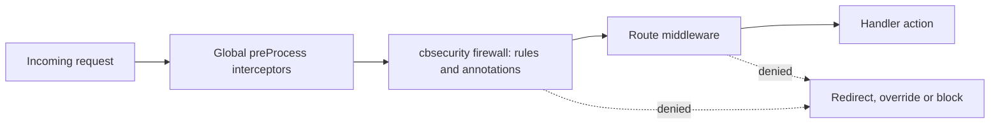

# Security

**cbsecurity** is the recommended way to secure a ColdBox application. Instead of hand-rolling login checks in handlers and interceptors, you declare who can reach what and cbsecurity enforces it before your handlers run, over sessions or JWT.

```bash
box install cbsecurity
```

📖 **Full documentation:** [coldbox-security.ortusbooks.com](https://coldbox-security.ortusbooks.com)

## Your First Secured Application

Configure the module in your `ColdBox` class. Authentication is delegated to **cbauth**, which needs a user service of your own.



```javascript
// config/ColdBox.bx
moduleSettings = {
    cbauth : { userServiceClass : "UserService" },
    cbsecurity : {
        firewall : {
            // Where to send guests and users without access
            invalidAuthenticationEvent : "main.login",
            invalidAuthorizationEvent  : "main.unauthorized",
            rules : [
                { secureList : "^admin", roles : "admin" }
            ]
        }
    }
}
```



```javascript
// config/ColdBox.cfc
moduleSettings = {
    cbauth : { userServiceClass : "UserService" },
    cbsecurity : {
        firewall : {
            // Where to send guests and users without access
            invalidAuthenticationEvent : "main.login",
            invalidAuthorizationEvent  : "main.unauthorized",
            rules : [
                { secureList : "^admin", roles : "admin" }
            ]
        }
    }
};
```




The default invalid action is a `redirect`, so always set `invalidAuthenticationEvent` and `invalidAuthorizationEvent`. Without them, a denied request throws an `InvalidAccessAction` exception.


## Three Ways to Declare Security

All three share the same validators, invalid actions, interception points and logging, so pick the one that matches where you want the rule to live.

| Approach | Declared in | Best for |
| --- | --- | --- |
| **Firewall rules** | Config, JSON, XML, a database or a model | Central, data-driven policies. |
| **Annotations** | On the handler or action | Security that travels with the code. |
| **Route middleware** | Next to the route in `config/Router` | Securing routes and groups with no rules file. |

```javascript
// 1. Firewall rule (config/ColdBox)
{ secureList : "^admin", permissions : "ADMIN" }

// 2. Annotation on an action
function delete( event, rc, prc ) secured="ADMIN" {
    userService.delete( rc.id )
}

// 3. Route middleware (config/Router)
route( "/admin" )
    .middleware( "Authorized@cbsecurity" )
    .meta( { permissions : "ADMIN" } )
    .to( "admin.index" )
```

Route middleware needs ColdBox 8.2+ and cbsecurity 3.9+. See [Route Middleware](../../the-basics/routing/routing-dsl/middleware.md) and the cbsecurity [Route Middleware guide](https://coldbox-security.ortusbooks.com/usage/route-middleware).

## How a Request Is Secured



A denied request never reaches the handler. The firewall's settings decide whether the user is redirected, sent to an override event, or blocked with a `401`.

## What You Get

| Capability | Provided by |
| --- | --- |
| Firewall, annotations and route middleware | `cbsecurity` |
| Authentication: `authenticate()`, `isLoggedIn()`, `getUser()` | `cbauth` |
| JWT access and refresh tokens | `cbsecurity` |
| CSRF tokens for forms and AJAX | `cbcsrf` |
| HTTP security response headers | `cbsecurity` |
| Firewall visualizer | `cbsecurity` |

## See Also

* [Security Best Practices](best-practices.md)
* [Route Middleware](../../the-basics/routing/routing-dsl/middleware.md)
* [HTTP Method Security](../../the-basics/event-handlers/http-method-security.md)
* [Validation](../../ecosystem/validation.md)
