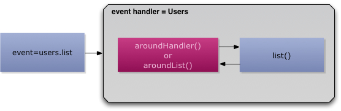

# Interception Methods

There are several simple implicit [AOP](http://en.wikipedia.org/wiki/Aspect-oriented_programming) interceptor methods, usually referred as advices, that can be declared in your event handler that the framework will use in order to execute them before/after and around an event is fired from the current handler. This is great for intercepting calls, pre/post processing, localized security, logging, RESTful conventions and much more. Yes, you got that right, [Aspect Oriented Programming](http://en.wikipedia.org/wiki/Aspect-oriented_programming) just for you and without all the complicated setup involved! If you declared them, the framework will execute them.

| Interceptor Method | Description |
| -- | -- |
| <code>preHandler</code> | Executes before any requested action (In the same handler CFC)  |
| <code>pre{action}</code> | Executes before the {action} requested ONLY |
| <code>postHandler</code> | Executes after any requested action (In the same handler CFC)  |
| <code>post{action}</code> | Executes after the {action} requested ONLY |
| <code>aroundHandler</code> | Executes around any request action (In the same handler CFC)
| <code>around{action}</code> | Executes around the {action} requested ONLY

 

