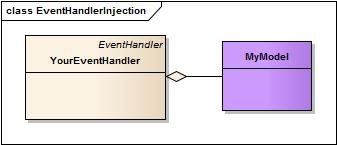

# Model Integration

We have a complete guide dedicated to Model Integration but we wanted to review a little here since event handlers need to talk to the model layer all the time. By default you can interact with your models from your event handlers in two ways:

*  Dependency Injection
*  Request model objects


ColdBox offers its own dependency injection framework, [WireBox](http://wiki.coldbox.org/wiki/WireBox.cfm), which allows you by convention to talk to your model objects. However, ColdBox also allows you to connect to [ColdSpring](http://wiki.coldbox.org/wiki/Plugins:ColdspringIntegration.cfm), [LightWire](http://wiki.coldbox.org/wiki/Plugins:LightwireIntegration.cfm) or any other custom object factory via our [IOC](http://wiki.coldbox.org/wiki/Plugins:IOC.cfm) plugin. 

###Dependency Injection



 Your event handlers can be autowired with dependencies from either WireBox, ColdSpring, or any custom object factory by means of our[ injection DSL](wiki.coldbox.org/wiki/WireBox.cfm#Injection_DSL). By autowiring dependencies into event handlers, they will become part of the life span of the event handlers and thus gain on the performance that an event handler is wired with all necessary parts upon creation. This is a huge benefit and we encourage you to use injection whenever possible. Please note that injection [aggregates](http://en.wikipedia.org/wiki/Object_composition) model objects into your event handlers. The [Injection DSL](http://wiki.coldbox.org/wiki/WireBox.cfm) can be applied to: 
 
 * cfproperties
 * constructor arguments
 * setter methods
 
It will be your choice to pick an approach, but we mostly concentrate on property injection as you will see from our examples.

> **Info**  Aggregation differs from ordinary composition in that it does not imply ownership. In composition, when the owning object is destroyed, so are the contained objects. - 'wikipedia'

###Requesting Model Objects


 The other approach to integrating with model objects is to request them and use them as [associations](http://en.wikipedia.org/wiki/Association_%28object-oriented_programming%29). From who? From either [WireBox](http://wiki.coldbox.org/wiki/WireBox.cfm) or the [IOC](http://wiki.coldbox.org/wiki/Plugins:IOC.cfm) Plugin. We would recommend requesting objects if they are transient objects or stored in some other volatile storage scope. Retreiving of objects is ok, but if you will be dealing with mostly singleton objects or objects that are created only once, you will gain much more performance by using injection. 
 
 > **Info** Association defines a relationship between classes of objects that allows one object instance to cause another to perform an action on its behalf. - 'wikipedia'
 
 ###A practical example
 
 In this practical example we will see how to integrate with our model layer via [WireBox](http://wiki.coldbox.org/wiki/WireBox.cfm), injections and also requesting the objects. Let's say that we have a service object we have built called FunkyService.cfc and by convention we will place it in our applications model folder.
 
 ```js
 + application
  + model
     + FunkyService.cfc
```
 
*FunkyService.cfc*

```js
component singleton{

	function init(){
		return this;
	}

	function add(a,b){ return a+b; }

	function getFunkyData(){
		var data = [
			{name="Luis", age="33"},
			{name="Jim", age="99"},
			{name="Alex", age="1"},
			{name="Joe", age="23"}
		];
		return data;
	}

}
```

Our funky service is not that funky after all, but it is simple. So how do we interact with it? Let's build a Funky event handler and work with it.

####Injection

```js
component{
	
	// Injection
	property name="funkyService" inject;

	function index(event,rc,prc){
			
		prc.data = funkyService.getFunkyData();

		event.renderData(data=prc.data,type="xml");
	}	


}
```

So by convention, I can create a property and annotate it with a *inject* attribute and ColdBox will look for that model object by name in the model folder, create it, persist it, wire it and return it. If you execute it, you will get something like this:

```js
<array>
	<item>
		<struct>
			<name>Luis</name>
			<age>33</age>
		</struct>
	</item>
	<item>
		<struct>
			<name>Jim</name>
			<age>99</age>
		</struct>
	</item>
	<item>
		<struct>
			<name>Alex</name>
			<age>1</age>
		</struct>
	</item>
	<item>
		<struct>
			<name>Joe</name>
			<age>23</age>
		</struct>
	</item>
</array>
```

Great! Just like that we can interact with our model layer without worrying about creating the objects, persisting them and even wiring them. That is exactly all the benefits that dependency injection and model integration bring to the table.

*Alternative wiring*

```js
// Injection using the DSL
property name="funkyService" inject="FunkyService";
// Injection using the DSL
property name="funkyService" inject="id:FunkyService";
// Injection using the DSL
property name="funkyService" inject="model:FunkyService";
```

####Requesting

Let's look at the requesting approach. We can either use the following approaches:

Via Facade Method 

```js
component{
	
	function index(event,rc,prc){
			
		prc.data = getModel("FunkyService").getFunkyData();

		event.renderData(data=prc.data,type="xml");
	}	


}
```

Directly to WireBox: 

```js
component{
	
	function index(event,rc,prc){
			
		prc.data = wirebox.getInstance("FunkyService").getFunkyData();

		event.renderData(data=prc.data,type="xml");
	}	


}
```

Both approaches do exactly the same, in all reality getModel() does a wirebox.getInstance(), it is a facade method that is easier to remember. If you run this, you will also see that it works and everything is fine and dandy. However, the biggest difference can be seen with some practical math:

```js
1000 Requests made
- Injection: 1000 handler calls + 1 model creation and wiring call = 1001 calls
- Requesting: 1000 handler calls + 1000 model retrieval + 1 model creation call = 2002 calls
```
As you can see, the best performance is due to injection as the handler object was wired and ready to roll, while the requested approach needed the dependency to be requested. Again, there are cases where you need to request objects such as transient or volatile stored objects.