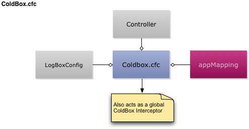
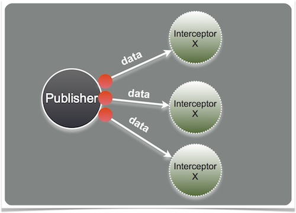

# ColdBox.cfc

The ColdBox configuration CFC is the heart of your ColdBox application. It contains the initialization variables for your application and extra information used by third-party modules and ultimately how your application boots up. In itself, it is also an event listener or [ColdBox Interceptor](configuration-directives/interceptors.md), so it can listen to life-cycle events of your application.



This CFC is instantiated by ColdBox and decorated at runtime so you can take advantage of some dependencies.

* **Controller** : Reference to the main ColdBox Controller object \(`coldbox.system.web.Controller`\)
* **AppMapping** : The location of the application on the web server
* **LogBoxConfig** : A reference to a LogBox configuration object

## Configuration Storage

Once the application starts up, a reference to the instantiated configuration CFC will be stored in the configuration settings with the key `coldboxConfig`. You can then retrieve it later in your handlers, interceptors, modules, etc.

```javascript
// retrieve it
config = getSetting( 'coldboxConfig' );

// inject it
property name="config" inject="coldbox:setting:coldboxConfig";
```

## Configuration Interceptor



Another cool concept for the Configuration CFC is that it is also registered as a [ColdBox Interceptor](../../../digging-deeper/interceptors/) once the application starts up automatically for you.  Create functions that will listen to application events:

```javascript
function preProcess( event, interceptData, buffer, rc, prc ){
    writeDump( 'I just hijacked your app!' );abort;
}
```


Note that the config CFC does not have the same variables mixed into it that a "normal" interceptor has. You can still access everything you need, but will need to get it from the `controller` in the variables scope.


```javascript
function preRender( event, interceptData, buffer, rc, prc ){
    controller.getWirebox().getInstance( 'loggerService' ).doSomething();
}
```

