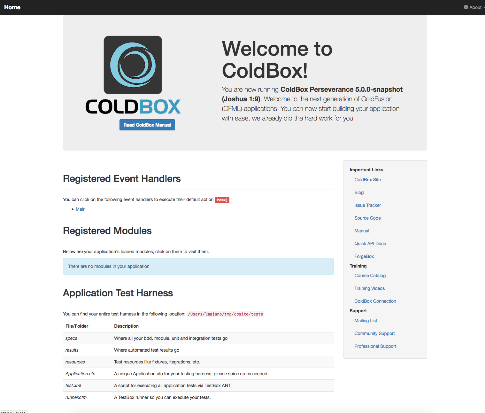

# Getting Started Guide

The ColdBox HMVC Platform is the de-facto enterprise-level HMVC framework for CFML developers. It's professionally backed, highly extensible, and productive. Getting started with ColdBox is quick and painless. The only thing you need to begin is [CommandBox](http://www.ortussolutions.com/products/commandbox), a command line tool for CFML developers.

This is a one-page introductory guide to ColdBox. If you are new to MVC or ColdBox, you can also leverage our [60 minute quick start guide](../for-newbies/60-minute-quick-start/) as well.

## IDE Tools

ColdBox has the following supported IDE Tools:

* Sublime - [https://packagecontrol.io/packages/ColdBox Platform](https://packagecontrol.io/packages/ColdBox%20Platform)
* VSCode - [https://marketplace.visualstudio.com/items?itemName=ortus-solutions.vscode-coldbox](https://marketplace.visualstudio.com/items?itemName=ortus-solutions.vscode-coldbox)
* CFBuilder - [https://www.forgebox.io/view/ColdBox-Platform-Utilities](https://www.forgebox.io/view/ColdBox-Platform-Utilities)

## Install CommandBox

You can read through our one-page [CommandBox Getting Started Guide](https://commandbox.ortusbooks.com/getting-started-guide). Or simply grab the CommandBox executable from the [download page](https://www.ortussolutions.com/products/commandbox#download) and double click it to run.

[http://www.ortussolutions.com/products/commandbox](http://www.ortussolutions.com/products/commandbox)

You should now be seeing a prompt that looks like this:


## Create A New Site

Now we're cooking with gas! Let's create a new ColdBox application. CommandBox comes with built-in commands for scaffolding out new sites as well as installing ColdBox and other libraries. We'll start by changing into an empty directory were we want our new app to live. If necessary, you can create a new folder.

```bash
CommandBox> mkdir playground --cd
```

Now let's ask CommandBox to create a new ColdBox app for us.

```bash
CommandBox> coldbox create app MyPlayground
```


**Tip:** You can find many scaffolding templates for ColdBox in our Github organization: [github.com/coldbox-templates](https://github.com/coldbox-templates)

You can also issue a `coldbox create app help` command and get help for the creation command.


### File/Folder Conventions

This command will place several new folders and files in your working directory. Let's run the `ls` command to view them.

```bash
CommandBox> ls
```

Here's a rundown of the important bits.

* **coldbox** - This is the ColdBox framework managed by CommandBox
* **config/Coldbox.cfc** - Your application configuration object
* **config/Router.cfc** - Your application URL Router
* **handlers** - Your controller layer, which in ColdBox they are called event handlers
* **layouts** - Your HTML layouts
* **models** - This holds your model CFCs 
* **modules** - This holds the CommandBox tracked modules
* **modules\_app** - This holds your app's modules
* **views** - Your HTML views will go here

## Start It Up

Now that our shiny new MVC app is ready to go, let's fire it up using the embedded server built into CommandBox. You don't need any other software installed on your PC for this to work. CommandBox has it all!

```bash
CommandBox> start --rewritesEnable
```

In a few seconds, a browser window will appear with your running application. This is a full server with access to the web administrator where you can add data sources, mappings, or adjust the server settings. Notice the handy icon added to your system tray as well. The `--rewritesEnable` flag will turn on some basic URL rewriting so we have nice, pretty URLs.


**Tip:** If you are creating an app to run on any other server than the commandbox server, you will need to manually set up URL rewriting. More info here: [/the-basics/routing/requirements](../the-basics/routing/requirements/)




## Take A Look Around

ColdBox uses easy conventions to define the controllers and views in your app. Let's open up our main app controller in your default editor to have a looksie.

```bash
CommandBox> edit handlers/main.cfc
```

At the top, you'll see a function named "index". This represents the **default action** that runs for this controller, which in ColdBox land they are referred to as event handlers.

```javascript
// Default Action
function index(event,rc,prc){
    prc.welcomeMessage = "Welcome to ColdBox!";
    event.setView("main/index");
}
```

Now let's take a look in the `main/index` view. It's located int he `views` folder.

```bash
CommandBox> edit views/main/index.cfm
```

This line of code near the top of the view is what outputs the `prc.welcomeMessage` variable we set in the controller.

```markup
<h1>#prc.welcomeMessage#</h1>
```

Try changing the value being set in the handler and refresh your browser to see the change.

```javascript
prc.welcomeMessage = "This is my new welcome message";
```

## Building On

Let's define a new event handler now. Your controllers act as event handlers to respond to requests, REST API, or remote proxies.

Pull up CommandBox again and run this command.

```bash
CommandBox> coldbox create handler helloWorld index,add,edit,list
```

That's it! You don't need to add any special configuration to declare your handler. Now we have a new handler called `helloWorld` with actions `index`, `add`, `edit`, and `list`. The command also created a test case for our handler as well as stubbed-out views for each of the actions.

Now, let's re-initialize the framework to pick up our new handler by typing `?fwreinit=1` at the end of the URL.

Let's hit this new controller we created with a URL like so. Your port number will probably be different.

> 127.0.0.1:43272/helloWorld


Normally the URL would have `index.cfm` before the `/helloWorld` bit, but our `--rewritesEnable` flag when we started the server makes this nicer URL possible.


## Install Packages

ColdBox's MVC is simple, but it's true power comes from the wide selection of modules you can install into your app to get additional functionality. You can checkout the full list of modules available on the Forgebox directory: [www.forgebox.io](https://www.forgebox.io).

> [forgebox.io/type/modules](http://forgebox.io/type/modules)

Here's some useful examples:

* **BCrypt** -- Industry-standard password hashing
* **cbdebugger** -- For debugging Coldbox apps
* **cbjavaloader** - For interacting with Java classes and libraries
* **cbMarkdown** - For writing in markdown
* **cbMessagebox** -- Display nice error/success messages
* **cborm** -- Awesome ORM Services
* **cb18n** -- For multilingual sites
* **cbt** - ColdBox templating language
* **cbValidation** - Back-end validation framework
* **qb** - Fluent query builder and schema builder
* **route-visualizer** - For visualizing your application routes

Install `cbmessagebox` from the CommandBox prompt like this:

```bash
CommandBox> install cbmessagebox
```

We can see the full list of packages by using the `list` command.

```bash
CommandBox> list
Dependency Hierarchy for myApp (0.0.0)
+-- cbmessagebox (1.0.0)
+-- coldbox (4.0.0)
```

Right now we can see that our app depends on `coldbox` and `cbmessagebox` to run. We'll use our new `cbmessagebox` module in a few minutes. But first, we'll create a simple Model CFC to round out our `MVC` app.

## Creating A Model

Models encapsulate the business logic your application. They can be services, beans, or DAOs. We'll use CommandBox to create a `GreeterService` in our new app with a `sayHello` method.

```bash
CommandBox> coldbox create model GreeterService sayHello --open
```


**Tip:** The `--open` is a nice shortcut that opens our new model in our default editor after creating it.


Let's finish implementing the `sayHello()` method by adding this return statement and save the file.

We can also add the word `singleton` to the component declaration. This will tell **WireBox** to only create one instance of our service.

```javascript
component singleton {

    function sayHello(){
        return 'Hey, you sexy thing!';
    }

}
```


What is WireBox?

WireBox is a dependency injection framework that is included with ColdBox. It will manage all object creations, persistence and assembling. You don't have to worry about using `new` or `createobject()` for CFCs anymore.


## Tie It All Together

Ok, let's open up that `helloWorld` handler we created a while back. Remember, you can hit tab while typing to auto-complete your file names.

```bash
CommandBox> edit handlers/helloWorld.cfc
```

We'll inject our `greeterService` and the `cbmessagebox` service into the handler by adding these properties to the top of `/handlers/helloWorld.cfc`.


What is this magical injection? Injection is a way to get references of other objects placed in the `variables` scope of other objects. This makes your life easier as you don't have to be creating objects manually or even knowing where they exist.


This will put the instance of our services in the `variables` scope where we can access it in our action methods.

```javascript
component {

    property name='greeterService' inject='greeterService';
    property name='messageBox' inject='@cbmessagebox';

    ...
}
```

And now in our `index` method, we'll set the output of our service into an `info` message.

```javascript
function index( event, rc, prc ){
    messageBox.info( greeterService.sayHello() );
    event.setView( "helloWorld/index" );
}
```

One final piece. Open up the default layout located in `layouts/Main.cfm` and find the `#renderView()#`. Add this line right before it to render out the message box that we set in our handler.

```markup
#getInstance( 'messagebox@cbmessageBox').renderIt()#
<div class="container">#renderView()#</div>
```

Now hit your `helloWorld` handler one final time with `?fwreinit=1` in the URL to see it all in action! \(Again, your port number will most likely be different.

> 127.0.0.1:43272/helloWorld?fwreinit=1

## What's Next?

**Congratulations**! In a matter of minutes, you have created a full MVC application. You installed a community module from ForgeBox, created a new handler/view and tied in business logic from a service model.

As easy as that was, you're just scratching the surface of what ColdBox can do for you. Continue reading this book to learn more about:

* Environment-specific configuration
* Easy SES URL routing
* Tons of 3rd party modules
* Drop-in security system
* Sweet REST web service support

### Getting Help

If you run into issues or just have questions, please jump on our [ColdBox Google Group](https://groups.google.com/forum/#!forum/coldbox) and our [Slack team](http://boxteam.herokuapp.com/) and ask away.

ColdBox is Professional Open Source under the Apache 2.0 license. We'd love to have your help with the product.

