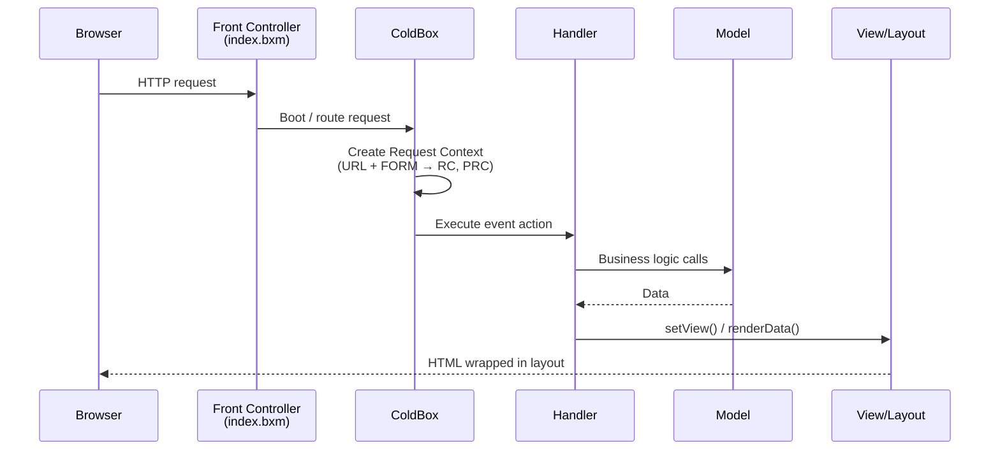

# Request Lifecycle

ColdBox uses both implicit and explicit invocation to execute events and render content. You configure your entire application from a single class — `config/ColdBox.bx` (or `.cfc` for CFML) — plus a set of folder and file conventions.

> Remember: this framework will not solve all your problems. It is a standard and a foundation to develop on. It is up to you to create GOOD code — the framework helps, but the responsibility is yours.

## The Front Controller

Every request enters through a single template — `index.bxm` (or `.cfm`) — which boots ColdBox via the `Application.bx` (or `.cfc`) bootstrap. This is the **Front Controller** pattern: one entry point that parses the request and dispatches it to the right event handler.

## The Request Context

Incoming URL, FORM, and REMOTE variables merge into a single structure — the **request collection (RC)** — stored in an object called the **Request Context**. A second collection, the **private request collection (PRC)**, cannot be affected by the outside world; use it for internal request state.

The request context is your information superhighway for the request: getting and setting values between MVC layers, request metadata, RESTful rendering, HTTP headers, and more. See [Request Context](../the-basics/request-context.md) and the [API Docs](../reference/api-documentation.md).

## A Typical Request

For `http://www.example.com/index.bxm?event=home.about`:

1. The request context is created; FORM/URL scopes populate the request collection
2. The event is determined from the `event` variable: handler **home**, action **about** (note the period separator)
3. The `about()` method runs in `handlers/home.bx` (or `.cfc`)
4. The handler may call models for business logic
5. The view set in the event renders (`views/home/about.bxm`, or `.cfm`)
6. The view's HTML is wrapped in the layout (`layouts/main.bxm`, or `.cfm`)
7. The page returns to the browser

With SES routing enabled (the default), the same request is usually `http://www.example.com/home/about` — see [Routing](../the-basics/routing/README.md).

## Beyond MVC Requests

ColdBox also dispatches:

- **Routes** — pretty URLs resolved by the [Router](../the-basics/routing/README.md) before event lookup
- **Proxy calls** — remote/SOAP-style access via the [ColdBox Proxy](../digging-deeper/coldbox-proxy/README.md)
- **Interceptions** — framework and custom events announced through the lifecycle via [Interceptors](../the-basics/interceptors/README.md)

## See Also

- [Conventions](conventions.md)
- [Configuration](configuration/README.md)
- [Event Handlers](../the-basics/event-handlers/README.md)
