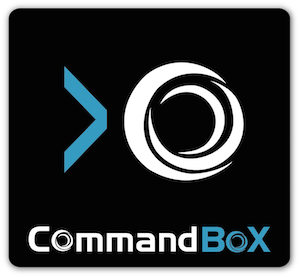

# Getting Started

Welcome to the world of ColdBox! We are excited you are taking this development journey with us.  This manual will give you all the tools and insights so you can master ColdBox.

## CommandBox CLI


The first step in our journey is to install CommandBox.  [CommandBox](http://www.ortussolutions.com/products/commandbox) is a ColdFusion (CFML) Command Line Interface (CLI), REPL, Package Manager and Embedded Server.  We will be using CommandBox for almost every excercise in this manual and it will also allow you to get up and running with ColdFusion and ColdBox in a much speedier manner.

>**Note** : However, you can use your own ColdFusion server setup as you see fit.  We use CommandBox as everything is scriptable and fast!

### Download CommandBox
You can download CommandBox from the official site: http://www.ortussolutions.com/products/commandbox#download and install in your preferred Operating System (Windows, Mac, *unix).  CommandBox comes in two flavors:

1. No Java Runtime (30mb)
2. Embedded Runtime (80mb)

So make sure you choose your desired installation path.

### HomeBrew Installation
If you use [HomeBrew](http://brew.sh) in your mac, you can run the following to install CommandBox:

```bash
brew install https://github.com/Ortus-Solutions/commandbox/raw/master/build/commandbox.rb
```

### Starting CommandBox
Once you download and expand CommandBox you will have the `box.exe` or `box` binary, which you can place in your Windows Path or *Unix `/usr/bin` folder to have it available system wide.  Then just open the binary and CommandBox will unpack itself your user's directory: `{User}/.CommandBox`.


