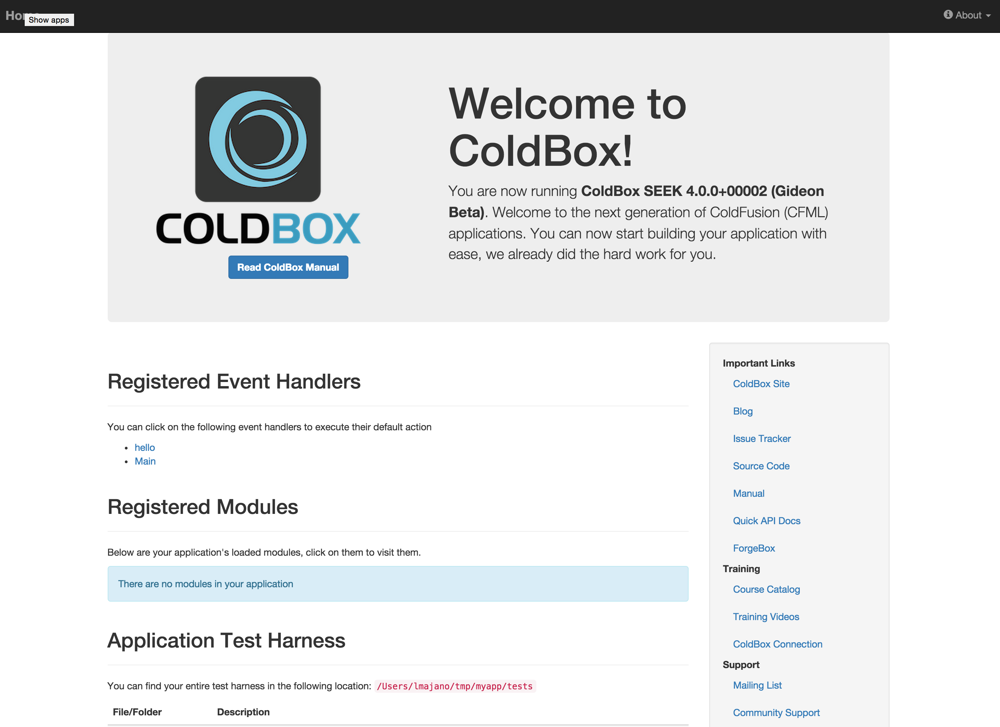

# ColdBox Getting Started Guide

The ColdBox MVC Platform is the de-facto enterprise-level MVC framework for CFML developers.  It's professionally backed, highly extensible, and productive.  Getting started with ColdBox is quick and painless.  The only thing you need to begin is [CommandBox](http://www.ortussolutions.com/products/commandbox), a command line tool for CFML developers.   

## Install CommandBox

You can read through our one-page [CommandBox Getting Started Guide](http://ortus.gitbooks.io/commandbox-documentation/content/getting_started_guide.html).   Or simply grab the CommandBox executable from the [download page](http://www.ortussolutions.com/products/commandbox#download) and double click it to run.  

http://www.ortussolutions.com/products/commandbox

You should now be seeing a prompt that looks like this:


## Create A New Site

Now we're cooking with gas!  Let's create new ColdBox site.  CommandBox comes with built-in commands for scaffolding out new sites as well as installing ColdBox and other libraries.  We'll start by changing into an empty directory were we want our new site to live.  If necessary, you can create a new folder.

```bash
CommandBox> mkdir C:\playground
CommandBox> cd C:\playground
```

Now let's ask CommandBox to create a new ColdBox site for us.  The `--installColdBox` flag will also install the latest version of the ColdBox Platform alongside our new app skeleton.

```bash
CommandBox>  
```

## Start It Up

Now that our shiny new MVC app is ready to go, let's fire it up using the embedded server built into CommandBox.  You don't need any other software installed on your PC for this to work.  CommandBox has it all!

```bash
CommandBox> start --rewritesEnable
```

In a few seconds, a browser window will appear with your running application. This is a full server with access to the web administrator where you can add data sources, mappings, or adjust the server settings. Notice the handy icon added to your system tray as well.  The `--rewritesEnable` flag will turn on some basic URL rewriting so we have nice, pretty URLs. 



## Take A Look Around

ColdBox uses easy conventions to define the controllers and views in your app.  Let's open up our main app controller in your default editor to have a looksie.

```bash
CommandBox> edit /handlers/main.cfc
```

At the top, you'll see a method named "index".  This represents the default action that runs for this controller.  

```javascript
// Default Action
function index(event,rc,prc){
	prc.welcomeMessage = "Welcome to ColdBox!";
	event.setView("main/index");
}
```

Now let's take a look in the "main/index" view.  It's located int he `views` folder.

```bash
CommandBox> edit /views/main/index.cfm
```

This line of code near the top of the view is what outputs the `prc.welcomeMessage` variable we set in the controller.

```html
<h1>#prc.welcomeMessage#</h1>
```

Try changing the value being set in the handler and refresh your browser to see the change. 

```javascript
prc.welcomeMessage = "This is my new welcome message";

```

## Building On

Let's define a new controller now.  Sometimes you'll see these called "handlers".  This is because ColdBox is an event-driven system.  Your controllers act as event handlers to respond to requests, REST API, or remote proxies.   

Pull up CommandBox again and run this command.

```bash
CommandBox> coldbox create handler helloWorld index,add,edit,list
```

That's it!  You don't need to add any specicial configuration to decalre your handler.  Now we have a new handler called `helloWorld` with actions `index`, `add`, `edit`, and `list`.   The command also created a test case for our handler as well as stubbed-out views for each of the actions.  

Now, let's re-initalize the framework to pick up our new handler by typing `?fwreinit=1` at the end of the URL.  

Let's hit this new controller we created with a URL like so.  Your port number will probalby be different.

> http://127.0.0.1:43272/helloWorld

Normally the url would have `index.cfm` before the `/hellowWorld` bit, but our `--rewritesEnable` flag when we started the server makes this nicer URL possible.

## Install Packages

ColdBox's MVC is simple, but it's true power comes from the wide selection of modules you can install into your app to get additional functionality.  You can checkout the full list of modules available on the Forgebox site.
> forgebox.io/type/modules

Here's some useful examples:

 
