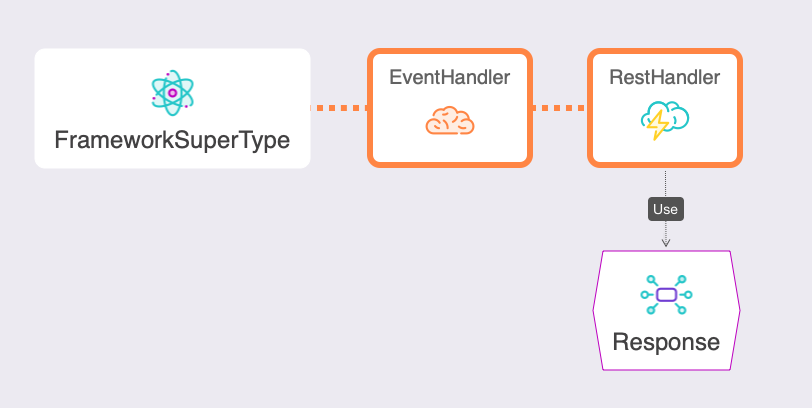
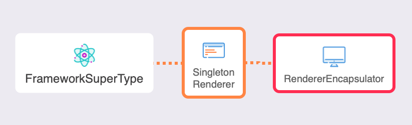

# What's New With 6.0.0

ColdBox 6.0.0 is a major release for the ColdBox HMVC platform. It has some dramatic new features as we keep pushing for more modern and sustainable approaches to web development. We break down the major areas of development below and you can also find the full release notes per library at the end.

## Engine Support


It is also yet another source code reduction due to the dropping of support for the following CFML Engines:

* Adobe ColdFusion 11
* Lucee 4.5

The info-graphic above shows you the supported engines the 6.x platform will support.

## Asynchronous Programming


We have done a tremendous amount of work to expose all the async and parallel programming constructs in ColdBox to the entire framework so developers can leverage them. There is just so much we have done on this release for concurrency, task scheduling, and parallel programming to include in one page. So visit our [Async Programming](../../digging-deeper/promises-async-programming/) section to start delving into what we are lovingly calling **cbFutures**!

### ColdBox Executors & Tasks

Thanks to our new futures approach, all major internal libraries \(WireBox, CacheBox, LogBox, MVC\) will leverage them for different tasks that require asynchronicity and scheduling. You will see a noticeble difference especially in the following areas:

* **Cache Reaping**: All cache reaping is now done via a scheduled task running on specific frequencies
* **File Appenders:** It uses an async schedule to stream log data to files instead of blocking operations for sending logs.  It will use a logging in-memory queue to stream the log data to the file. So you can potentially send 10000 log events and eventually they will be streamed to disk.

### What are ColdBox Futures?

A ColdBox future is used for async/parallel programming where you can register a task or multiple tasks that will execute in a non-blocking approach and trigger dependent computations which could also be asynchronous. This Future object can then be used to monitor the execution of the task and create rich completion/combining pipelines upon the results of such tasks. You can still use a `get()` blocking operation, but that is an over simplistic approach to async programming because you are ultimately blocking to get the result.

ColdBox futures are backed by Java's `CompletableFuture` API, so the majority of things will apply as well; even Java developers will feel at home. It will allow you to create rich pipelines for creating multiple Futures, chaining, composing and combining results.

```javascript
// Parallel Executions
async().all(
    () => hyper.post( "/somewhere" ),
    () => hyper.post( "/somewhereElse" ),
    () => hyper.post( "/another" )
).then( (results)=> logResults( results ) );

// Race Conditions, let the fastest dns resolve
var dnsServer = async().any( 
    () => dns1.resolve(),
    () => dns2.resolve()
).get();

// Process an incoming order
async().newFuture( () => orderService.getOrder() )
    .then( (order) => enrichOrder( order ) )
    .then( (order) => performPayment( order ) )
    .thenAsync( 
        (order) => dispatchOrder( order ), 
        async().getExecutor( "cpuIntensive" )
     )
    .then( (order) => sendConfirmation( order ) );

// Combine Futures
var bmi = async().newFuture( () => weightService.getWeight( rc.person ) )
    .thenCombine(
        async().newFuture( () => heightService.getHeight( rc.person ) ),
        ( weight, height ) => {
            var heightInMeters = arguments.height/100;
            return arguments.weight / (heightInMeters * heightInMeters );
        }
    )
    .get();

// Compose Futures with exceptions
async()
    .newFuture( () => userService.getOrFail( rc.id ) )
    .thenCompose( ( user ) => creditService.getCreditRating( user ) )
    .then( (creditRating) => event.getResponse().setData( creditRating ) )
    .onException( (ex) => event.getResponse().setError( true ).setMessages( ex.toString() ) );
```


See [https://docs.oracle.com/javase/8/docs/api/java/util/concurrent/CompletableFuture.html](https://docs.oracle.com/javase/8/docs/api/java/util/concurrent/CompletableFuture.html)


This new approach to creating async pipelines and parallel processing, will further create extensibility and robustness in your ColdBox applications.

## RestHandler & ColdBox Response



After many years of adding a base handler and a response object to our application templates, we finally have integrated them into the core so developers can have even more support when building RESTFul services. This new rest handler will provide you with tons of utilities and approaches to make all of your RESTFul services:

* Uniform
* Consistent
* A consistent and extensible response object
* Error handling
* Invalid Route handling
* Much more

### Base Class

New base class `coldbox.system.RestHandler` which you can inherit from or use our new `restHandler` annotation. This will give you access to our enhanced API utilities and the native response object via the request context's `getResponse()` method.

```javascript
component extends="coldbox.system.RestHandler"{

  function index( event, rc, prc ){
    event.getResponse()
      .setData( "Hello from restful Land" );
  }
}

component resthandler{

  function index( event, rc, prc ){
    event.getResponse()
      .setData( "Hello from restful Land" );
  }

}
```

You can now build all of your api’s using the native response object like the rest templates, but now from the core directly. This Rest Handler gives you the following actions out of the box:

| **Core Actions** | **Purpose** |
| :--- | :--- |
| aroundHandler\(\) | Wraps all rest actions uniformly to provide consistency and error trapping. |
| onError\(\) | An implicit error handler is provided just in case anything explodes in your restful actions. Sends an appropriate 500 error |
| onValidationException\(\) | Traps any and makes sure it sends the appropriate 400 response with the invalid data. Useful for using **cbValidation** |
| onEntityNotFoundException\(\) | Traps any or exceptions and makes sure it send an appropriate 404 response. Useful for leveraging **cborm** or **Quick** ORM |
| onInvalidHTTPMethod\(\) | Traps any invalid HTTP method security exception and sends the appropriate 405 not allowed response |
| onMissingAction\(\) | Traps any invalid actions/resource called in your application and sends the appropriate 404 response |
| onAuthenticationFailure\(\) | Traps InvalidCredentials exceptions and sends the appropriate 403 invalid credentials response. If you are using **cbSecurity** it will also verify jwt token expiration and change the error messages accordingly. |
| onAuthorizationFailure\(\) | Action that can be used when a user does not have authorization or access to your application or code. Usually you will call this manually or from a security library like **cbSecurity** or **cbGuard**. It will send a 401 not authorized response. |
| onInvalidRoute\(\) | Action that can be used as a catch all from your router so it can catch all routes that are invalid. It will send a 404 response accordingly. |
| onExpectationFailed\(\) | Utility method for when an expectation of the request fails \( e.g. an expected parameter is not provided \). This action is called manually from your own handlers and it will output a 417 response back to the user. |

### AroundHandler in Detail

The `aroundHandler`\(\) provided in the `RestHandler` will intercept all rest calls in order to provide consistency and uniformity to all your actions. It will try/catch for major known exceptions, time your requests, add extra output on development and much more. Here are a list of the features available to you:

* Exception Handling
  * Automatic trapping of the following exceptions: `InvalidCredentials, ValidationException, EntityNotFound, RecordNotFound`
  * Automatic trapping of other exceptions
  * Logging automatically the exception with extra restful metadata
  * If in a `development` environment it will respond with much more information necessary for debugging both in the response object and headers
* Development Responses
  * If you are in a `development` environment it will set the following headers for you:
    * `x-current-route`
    * `x-current-routed-url`
    * `x-current-routed-namespace`
    * `x-current-event`
* Global Headers
  * The following headers are sent in each request
    * `x-response-time` : The time the request took in CF
    * `x-cached-response` : If the request is cached via event caching

The `aroundHandler()` is also smart in detecting the following outputs from a handler:

* Handler `return` results
* Setting a view or layout to render
* Explicit `renderData()` calls

### RequestContext Additions

* `getResponse()`
  * Will get you the current `prc.response` object, if the object doesn’t exist, it will create it and set it for you
  * The core response object can be found here: `coldbox.system.web.context.Response`

### Extending The **RestHandler**

If you would like to extend or modify the behavior of the core `RestHandler` then you will have to create your own base handler that inherits from it. Then all of your concrete handlers will inherit from your very own handler.

```javascript
// BaseHandler
component extends="coldbox.system.Resthandler"{

  // Modify it here

}

// Then make your own handlers extend from it
component extends="BaseHandler"{

}
```

### Extending The **Response** Object

The response object can be found here: `coldbox.system.web.context.Response` and the rest handler constructs it by calling the request context’s `getResponse`\(\) method. The method verifies if there is a `prc.response` object and if it exists it returns it, else it creates a new one. So if you would like to use your very own, then just make sure that before the request you place your own response object in the `prc` scope.

Here is a simple example using a `preProcess()` interceptor.  Create a simple interceptor with commandbox e.g

```javascript
coldbox create interceptor name=MyInterceptor points=preProcess
```

and add the following method:

```javascript
function preProcess( event, interceptData, rc, prc ){
  prc.response = wirebox.getInstance( "MyResponseObject" );
}
```

Don't forget to register your interceptor in  `config/Coldbox.cfc:`

```javascript
		interceptors = [
			{
			class      : "interceptors.MyInterceptor",
				name       : "MyInterceptor",
				properties : {}
			}
		];
```

That’s it. Once that response object is in the `prc` scope, ColdBox will utilize it. Just make sure that your custom Response object satisfies the methods in the core one. If you want to modify the output of the response object a good place to do that would  be in the `getDataPacket()` method of your own `MyResponseObject`.  Just make sure this method will return a `struct`. 

## ColdBox Renderer Becomes a Singleton



The entire rendering mechanisms have changed in ColdBox 6 and we now support a singleton based approach to view rendering. It still allows for variable safety, but the way renderings in ColdBox 6 are done are orders of magnitude faster than pre ColdBox 6 days. If you are using applications like ContentBox or Preside CMS or applications with tons of `renderView()` calls, your applications will fly now!

## LogBox Config Path Init

If you are using LogBox in standalone mode, you can now construct it by passing the path to your LogBox configuration file or no path at all and we will construct LogBox with our new default config file to stream logs to the console.

```javascript
application.logbox = new LogBox();

application.logbox = new LogBox( "config.MyLogBox" );
```

## AnnounceInterception\(\), processState\(\) Deprecated

These methods have been deprecated in favor of our new `announce()` method.  We have also deprecated the argument `interceptData` in favor of just `data.`  

```javascript
announce( state, data );
processState( state, data );
```

## Release Notes

The full release notes per library can be found below. Just click on the library tab and explore their release notes:



#### Bugs

* \[[COLDBOX-48](https://ortussolutions.atlassian.net/browse/COLDBOX-48)\] - CacheBox creates multiple reap threads if the initial one take longer to complete than the reap frequency
* \[[COLDBOX-339](https://ortussolutions.atlassian.net/browse/COLDBOX-339)\] - Error in `AbstractFlashScope`: key does't exists due to race conditions
* \[[COLDBOX-822](https://ortussolutions.atlassian.net/browse/COLDBOX-822)\] - `InvalidEvent` is not working when set to a module event
* \[[COLDBOX-829](https://ortussolutions.atlassian.net/browse/COLDBOX-829)\] - Stopgap for Lucee bug losing `sessionCluster` application setting
* \[[COLDBOX-850](https://ortussolutions.atlassian.net/browse/COLDBOX-850)\] - XML Converter Updated invoke\(\) to correctly call method by name

#### New Features

* \[[COLDBOX-848](https://ortussolutions.atlassian.net/browse/COLDBOX-848)\] - Improve the bug reporting template for development based on whoops
* \[[COLDBOX-849](https://ortussolutions.atlassian.net/browse/COLDBOX-849)\] - Incorporate Response and RestHandler into core
* \[[COLDBOX-851](https://ortussolutions.atlassian.net/browse/COLDBOX-851)\] - All ColdBox apps get a `coldbox-tasks` scheduler executor for internal ColdBox services and scheduled tasks
* \[[COLDBOX-852](https://ortussolutions.atlassian.net/browse/COLDBOX-852)\] - Updated the default ColdBox config appender to be to console instead of the dummy one
* \[[COLDBOX-853](https://ortussolutions.atlassian.net/browse/COLDBOX-853)\] - ColdBox controller gets a reference to the AsyncManager and registers a new `AsyncManager@coldbox` wirebox mapping
* \[[COLDBOX-855](https://ortussolutions.atlassian.net/browse/COLDBOX-855)\] - Allow for the application to declare it's executors via the new `executors` configuration element
* \[[COLDBOX-856](https://ortussolutions.atlassian.net/browse/COLDBOX-856)\] - Allow for a module to declare it's executors via the new `executors` configuration element
* \[[COLDBOX-858](https://ortussolutions.atlassian.net/browse/COLDBOX-858)\] - Introduction of async/parallel  programming via cbPromises
* \[[COLDBOX-859](https://ortussolutions.atlassian.net/browse/COLDBOX-859)\] - ability to do async scheduled tasks with new async cbpromises

#### Improvements

* \[[COLDBOX-830](https://ortussolutions.atlassian.net/browse/COLDBOX-830)\] - Update cachebox flash ram to standardize on unique key discovery
* \[[COLDBOX-833](https://ortussolutions.atlassian.net/browse/COLDBOX-833)\] - Improvements to threading for interceptors and logging to avoid dumb Adobe duplicates
* \[[COLDBOX-841](https://ortussolutions.atlassian.net/browse/COLDBOX-841)\] - Change announceInterception\(\) and processState\(\) to a single method name like: emit\(\) or announce\(\)
* \[[COLDBOX-846](https://ortussolutions.atlassian.net/browse/COLDBOX-846)\] -  Use relocate and setNextEvent status codes in getStatusCode for testing integration



#### Bugs

* \[[WIREBOX-90](https://ortussolutions.atlassian.net/browse/WIREBOX-90)\] - Fix constructor injection with virtual inheritance

#### New Features

* \[[WIREBOX-91](https://ortussolutions.atlassian.net/browse/WIREBOX-91)\] - Injector's get a reference to an asyncManager and a task scheduler whether they are in ColdBox or non-ColdBox mode
* \[[WIREBOX-92](https://ortussolutions.atlassian.net/browse/WIREBOX-92)\] - New `executors` dsl so you can easily inject executors ANYWHERE

#### Improvements

* \[[WIREBOX-88](https://ortussolutions.atlassian.net/browse/WIREBOX-88)\] - Improve WireBox error on Adobe CF



#### New Features

* \[[CACHEBOX-24](https://ortussolutions.atlassian.net/browse/CACHEBOX-24)\] - CacheBox reaper : migrate to a scheduled task via cbPromises
* \[[CACHEBOX-60](https://ortussolutions.atlassian.net/browse/CACHEBOX-60)\] - CacheFactory gets a reference to an asyncManager and a task scheduler whether they are in ColdBox or non-ColdBox mode



#### Bugs

* \[[LOGBOX-38](https://ortussolutions.atlassian.net/browse/LOGBOX-38)\] - `Rotate` property is defined but never used

#### New Features

* \[[LOGBOX-5](https://ortussolutions.atlassian.net/browse/LOGBOX-5)\] - Allow config path as string in LogBox init \(standalone\)
* \[[LOGBOX-11](https://ortussolutions.atlassian.net/browse/LOGBOX-11)\] - Allow standard appenders to be configured by name \(instead of full path\)
* \[[LOGBOX-36](https://ortussolutions.atlassian.net/browse/LOGBOX-36)\] - Added an `err()` to abstract appenders for reporting to the error streams
* \[[LOGBOX-42](https://ortussolutions.atlassian.net/browse/LOGBOX-42)\] - All appenders get a reference to the running LogBox instance
* \[[LOGBOX-44](https://ortussolutions.atlassian.net/browse/LOGBOX-44)\] - Rolling appender now uses the new async schedulers to stream data to files

#### Improvements

* \[[LOGBOX-37](https://ortussolutions.atlassian.net/browse/LOGBOX-37)\] - Improvements to threading for logging to avoid dumb Adobe duplicates
* \[[LOGBOX-41](https://ortussolutions.atlassian.net/browse/LOGBOX-41)\] - refactoring of internal utility closures to udfs to avoid ACF memory leaks: CF-420487



