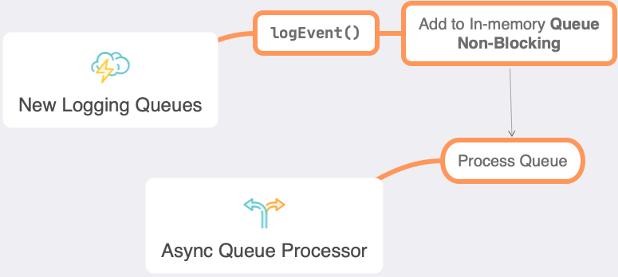
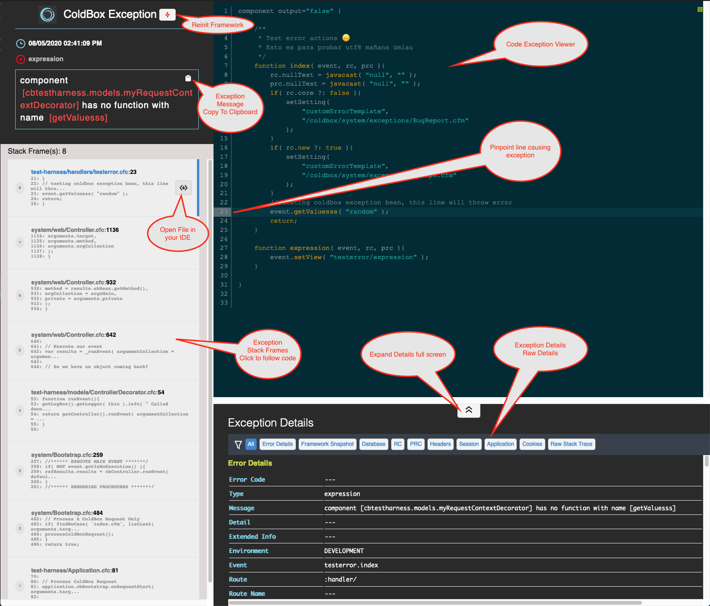
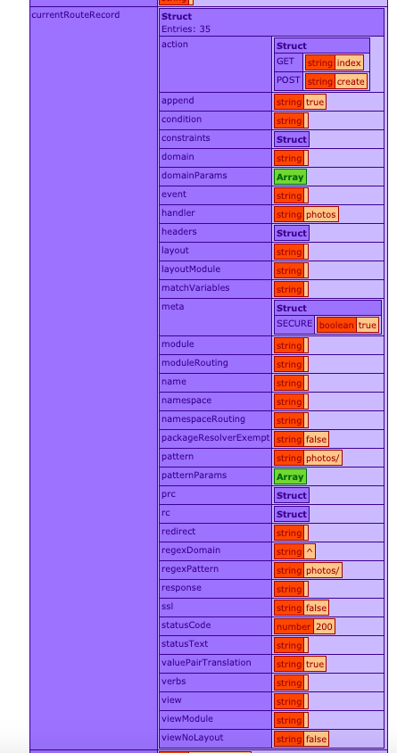

# What's New With 6.0.0

ColdBox 6.0.0 is a major release for the ColdBox HMVC platform. It has some dramatic new features as we keep pushing for more modern and sustainable approaches to web development. We break down the major areas of development below and you can also find the full release notes per library at the end.

## Engine Support


It is also yet another source code reduction due to the dropping of support for the following CFML Engines:

* Adobe ColdFusion 11
* Lucee 4.5

The info-graphic above shows you the supported engines the 6.x platform will support.

## Asynchronous Programming


We have done a tremendous amount of work to expose all the async and parallel programming constructs in ColdBox to the entire framework so developers can leverage them. There is just so much we have done on this release for concurrency, task scheduling, and parallel programming to include in one page. So visit our [Async Programming](../../digging-deeper/promises-async-programming/) section to start delving into what we are lovingly calling **cbFutures**!

### ColdBox Executors & Tasks

Thanks to our new futures approach, all major internal libraries \(WireBox, CacheBox, LogBox, MVC\) will leverage them for different tasks that require asynchronicity and scheduling. You will see a noticeble difference especially in the following areas:

* **Cache Reaping**: All cache reaping is now done via a scheduled task running on specific frequencies
* **File Appenders:** It uses an async schedule to stream log data to files instead of blocking operations for sending logs.  It will use a logging in-memory queue to stream the log data to the file. So you can potentially send 10000 log events and eventually they will be streamed to disk.

### What are ColdBox Futures?

A ColdBox future is used for async/parallel programming where you can register a task or multiple tasks that will execute in a non-blocking approach and trigger dependent computations which could also be asynchronous. This Future object can then be used to monitor the execution of the task and create rich completion/combining pipelines upon the results of such tasks. You can still use a `get()` blocking operation, but that is an over simplistic approach to async programming because you are ultimately blocking to get the result.

ColdBox futures are backed by Java's `CompletableFuture` API, so the majority of things will apply as well; even Java developers will feel at home. It will allow you to create rich pipelines for creating multiple Futures, chaining, composing and combining results.

```javascript
// Parallel Executions
async().all(
    () => hyper.post( "/somewhere" ),
    () => hyper.post( "/somewhereElse" ),
    () => hyper.post( "/another" )
).then( (results)=> logResults( results ) );

// Race Conditions, let the fastest dns resolve
var dnsServer = async().any( 
    () => dns1.resolve(),
    () => dns2.resolve()
).get();

// Process an incoming order
async().newFuture( () => orderService.getOrder() )
    .then( (order) => enrichOrder( order ) )
    .then( (order) => performPayment( order ) )
    .thenAsync( 
        (order) => dispatchOrder( order ), 
        async().getExecutor( "cpuIntensive" )
     )
    .then( (order) => sendConfirmation( order ) );

// Combine Futures
var bmi = async().newFuture( () => weightService.getWeight( rc.person ) )
    .thenCombine(
        async().newFuture( () => heightService.getHeight( rc.person ) ),
        ( weight, height ) => {
            var heightInMeters = arguments.height/100;
            return arguments.weight / (heightInMeters * heightInMeters );
        }
    )
    .get();

// Compose Futures with exceptions
async()
    .newFuture( () => userService.getOrFail( rc.id ) )
    .thenCompose( ( user ) => creditService.getCreditRating( user ) )
    .then( (creditRating) => event.getResponse().setData( creditRating ) )
    .onException( (ex) => event.getResponse().setError( true ).setMessages( ex.toString() ) );
```


See [https://docs.oracle.com/javase/8/docs/api/java/util/concurrent/CompletableFuture.html](https://docs.oracle.com/javase/8/docs/api/java/util/concurrent/CompletableFuture.html)


This new approach to creating async pipelines and parallel processing, will further create extensibility and robustness in your ColdBox applications.

### `coldbox-tasks` Global Executor

ColdBox apps by default register a `coldbox-tasks` fixed executor \(20 threads - IO bound\) that is used internally for cleanups, tasks, and schedules.  However, any module or application can leverage it for scheduling tasks or workers.

```javascript
asyncManager.getExecutor( "coldbox-tasks" )
```

### CacheBox Executors

CacheBox has been refactored to leverage the async facilities in ColdBox to schedule cache reaps instead of a request initiating the reaps.  This brings a lot more stability and consistency to the reaping of caches as they all execute within the new ColdBox `coldbox-tasks` schedule task executor.

If you are in CacheBox standalone mode, then the task scheduler will be called `cachebox-tasks`.

## Logging Enhancements

LogBox has been entirely rewritten in script and a more fluent programming approach. It has also been revamped to leverage the scheduling executors and async programming aspects of our async package.  All loggers now sport logging via an async queue and it is completely non-blocking.  If you do heavy logging, the performance will be substantial.



The `ModuleService` and all internal ColdBox services have deeper logging constructs and more information logging to understand what happens inside of the core.

## Whoops! Modern Exception Handling



Thanks to Eric Peterson, we have included **Whoops** as part of our core exception handling template.  All the new application templates come pre-configured with whoops as part of the `development` custom error template.


```javascript
function development() {
    coldbox.exceptionEditor = "vscode";
    // coldbox.customErrorTemplate = "/coldbox/system/exceptions/BugReport.cfm"; // static bug reports
    coldbox.customErrorTemplate = "/coldbox/system/exceptions/Whoops.cfm"; // interactive bug report
}
```



**Warning:** Make sure you DO NOT choose this template on production as it can expose code.  We do our best to use environment detection to **NEVER** render it in production, but things can always happen. So always use it within the `development` method.


This exception template will help you visualize and navigate your exceptions so you can fix those pesky bugs 🐞. You can even configure it to open the files directly into your favorite IDE using the `coldbox.exceptionEditor` setting:


```javascript
function development() {
    coldbox.exceptionEditor = "vscode";
}
```


Valid Exception Editors are:

* `vscode` \(**Default**\)
* `vscode-insiders`
* `sublime`
* `textmate`
* `emacs`
* `macvim`
* `idea`
* `atom`
* `espresso`




## RestHandler & ColdBox Response


After many years of adding a base handler and a response object to our application templates, we finally have integrated them into the core so developers can have even more support when building RESTFul services. This new rest handler will provide you with tons of utilities and approaches to make all of your RESTFul services:

* Uniform
* Consistent
* A consistent and extensible response object
* Error handling
* Invalid Route handling
* Much more

### Base Class

New base class `coldbox.system.RestHandler` which you can inherit from or use our new `restHandler` annotation. This will give you access to our enhanced API utilities and the native response object via the request context's `getResponse()` method.

```javascript
component extends="coldbox.system.RestHandler"{

  function index( event, rc, prc ){
    event.getResponse()
      .setData( "Hello from restful Land" );
  }
}

component resthandler{

  function index( event, rc, prc ){
    event.getResponse()
      .setData( "Hello from restful Land" );
  }

}
```

You can now build all of your api’s using the native response object like the rest templates, but now from the core directly. This Rest Handler gives you the following actions out of the box:

| **Core Actions** | **Purpose** |
| :--- | :--- |
| aroundHandler\(\) | Wraps all rest actions uniformly to provide consistency and error trapping. |
| onError\(\) | An implicit error handler is provided just in case anything explodes in your restful actions. Sends an appropriate 500 error |
| onValidationException\(\) | Traps any and makes sure it sends the appropriate 400 response with the invalid data. Useful for using **cbValidation** |
| onEntityNotFoundException\(\) | Traps any or exceptions and makes sure it send an appropriate 404 response. Useful for leveraging **cborm** or **Quick** ORM |
| onInvalidHTTPMethod\(\) | Traps any invalid HTTP method security exception and sends the appropriate 405 not allowed response |
| onMissingAction\(\) | Traps any invalid actions/resource called in your application and sends the appropriate 404 response |
| onAuthenticationFailure\(\) | Traps InvalidCredentials exceptions and sends the appropriate 403 invalid credentials response. If you are using **cbSecurity** it will also verify jwt token expiration and change the error messages accordingly. |
| onAuthorizationFailure\(\) | Action that can be used when a user does not have authorization or access to your application or code. Usually you will call this manually or from a security library like **cbSecurity** or **cbGuard**. It will send a 401 not authorized response. |
| onInvalidRoute\(\) | Action that can be used as a catch all from your router so it can catch all routes that are invalid. It will send a 404 response accordingly. |
| onExpectationFailed\(\) | Utility method for when an expectation of the request fails \( e.g. an expected parameter is not provided \). This action is called manually from your own handlers and it will output a 417 response back to the user. |

### AroundHandler in Detail

The `aroundHandler`\(\) provided in the `RestHandler` will intercept all rest calls in order to provide consistency and uniformity to all your actions. It will try/catch for major known exceptions, time your requests, add extra output on development and much more. Here are a list of the features available to you:

* Exception Handling
  * Automatic trapping of the following exceptions: `InvalidCredentials, ValidationException, EntityNotFound, RecordNotFound`
  * Automatic trapping of other exceptions
  * Logging automatically the exception with extra restful metadata
  * If in a `development` environment it will respond with much more information necessary for debugging both in the response object and headers
* Development Responses
  * If you are in a `development` environment it will set the following headers for you:
    * `x-current-route`
    * `x-current-routed-url`
    * `x-current-routed-namespace`
    * `x-current-event`
* Global Headers
  * The following headers are sent in each request
    * `x-response-time` : The time the request took in CF
    * `x-cached-response` : If the request is cached via event caching

The `aroundHandler()` is also smart in detecting the following outputs from a handler:

* Handler `return` results
* Setting a view or layout to render
* Explicit `renderData()` calls

### RequestContext Additions

* `getResponse()`
  * Will get you the current `prc.response` object, if the object doesn’t exist, it will create it and set it for you
  * The core response object can be found here: `coldbox.system.web.context.Response`

### Extending The **RestHandler**

If you would like to extend or modify the behavior of the core `RestHandler` then you will have to create your own base handler that inherits from it. Then all of your concrete handlers will inherit from your very own handler.

```javascript
// BaseHandler
component extends="coldbox.system.Resthandler"{

  // Modify it here

}

// Then make your own handlers extend from it
component extends="BaseHandler"{

}
```

### Extending The **Response** Object

The response object can be found here: `coldbox.system.web.context.Response` and the rest handler constructs it by calling the request context’s `getResponse`\(\) method. The method verifies if there is a `prc.response` object and if it exists it returns it, else it creates a new one. So if you would like to use your very own, then just make sure that before the request you place your own response object in the `prc` scope.

Here is a simple example using a `preProcess()` interceptor.  Create a simple interceptor with commandbox e.g

```javascript
coldbox create interceptor name=MyInterceptor points=preProcess
```

and add the following method:

```javascript
function preProcess( event, interceptData, rc, prc ){
  prc.response = wirebox.getInstance( "MyResponseObject" );
}
```

Don't forget to register your interceptor in  `config/Coldbox.cfc:`

```javascript
		interceptors = [
			{
			class      : "interceptors.MyInterceptor",
				name       : "MyInterceptor",
				properties : {}
			}
		];
```

That’s it. Once that response object is in the `prc` scope, ColdBox will utilize it. Just make sure that your custom Response object satisfies the methods in the core one. If you want to modify the output of the response object a good place to do that would  be in the `getDataPacket()` method of your own `MyResponseObject`.  Just make sure this method will return a `struct`. 

## Functional If's using `when()`

Our super type now includes a new `when()` method that will allow you to build functional statements within your handlers.  Here is the signature of this functional helper:

```javascript
/**
 * Functional construct for if statements
 *
 * @target The boolean evaluator, this can be a boolean value
 * @success The closure/lambda to execute if the boolean value is true
 * @failure The closure/lambda to execute if the boolean value is false
 *
 * @return Returns the super type for chaining
 */
function when( required boolean target, required success, failure )
```

The `target` is a boolean and can be an expression that evaluates to a boolean.  If the `target` is **true**, then the `success` closure will be executed for you, if not, the `failure` closure will be executed.

```javascript
function save( event, rc, prc ){
    var oUser = populateModel( "User" );
    
    when( hasAccess(), () => oUser.setRole( rc.role ) );

}
```

## ColdBox Renderer Becomes a Singleton


The entire rendering mechanisms have changed in ColdBox 6 and we now support a singleton based approach to view rendering. It still allows for variable safety, but the way renderings in ColdBox 6 are done are orders of magnitude faster than pre ColdBox 6 days. If you are using applications like ContentBox or Preside CMS or applications with tons of `renderView()` calls, your applications will fly now!

## Custom ReinitKey

Thanks to a community pull request you now have the ability to chose the reinit key instead of the default of `fwReinit`.  This is useful for security purposes.

```javascript
coldbox.reinitKey = "cbReinit";
```

Then you can use it in the request: `http://localhost/index.cfm?cbReinit=true`

## LogBox Config Path Init

If you are using LogBox in standalone mode, you can now construct it by passing the path to your LogBox configuration file or no path at all and we will construct LogBox with our new default config file to stream logs to the console.

```javascript
application.logbox = new LogBox();

application.logbox = new LogBox( "config.MyLogBox" );
```

## AnnounceInterception\(\), processState\(\) Deprecated

These methods have been deprecated in favor of our new `announce()` method.  We have also deprecated the argument `interceptData` in favor of just `data.`  

```javascript
// New consistent method
announce( state, data );

// Usage
announce( "myCustomEvent", { data = this } );
```

## New `listen()` method to register one-off closures

Have you ever wanted to dynamically listen to events but not create CFC to enclose the method? Well, now you can use the new `listen()` method which accepts a closure/udf so you can listen to ColdBox interceptions. Here is the method signature:

```javascript
/**
 * Register a closure listener as an interceptor on a specific point
 *
 * @target The closure/lambda to register
 * @point The interception point to register the listener to
 */
void function listen( required target, required point )
```

This allows you to easily register dynamic closures/udfs whenever you like so they can listen to events:

```javascript
// Within a handler/interceptor/layouts/view
listen( function(){
    log.info( "executing from closure listener");
}, "preProcess" );

listen( () => log.info( "executing from closure listener"), "preProcess" );

// Within models (Injecting the interceptor service or controller)
controller
    .getInterceptorService()
    .listen( function(){
        log.info( "executing from closure listener");
    }, "preProcess" );
```

## New Interception: `onColdBoxShutdown()`

We have created a new interception point that is fired before ColdBox is shutdown completely. This can come from a reinit or an application expiration. This is a great place to shutdown custom executors, or messaging queues like RabbitMQ.

```javascript
function onColdBoxShutdown(){
    myRabbitMQChannel.close();
}
```

## Routing Enhancements

We have done several enhancements to the entire routing capabilities in ColdBox apart from several bug fixes.

### `buildLink()` Ease of Use

We have also re-arranged the arguments so you can easily build links with query strings using positional arguments instead of name-value pairs:

```javascript
string function buildLink(
    to,
    queryString       = "",
    boolean translate = true,
    boolean ssl,
    baseURL     = ""
);

<a href="#event.buildLink( 'main.list', 'userid=4' )#">My Link</a>
```

### `buildLink()` Named Route Support

The request context method `event.buildLink()` has been now added named route support.  The `event.route()` method was introduced to do named routing with a `name` and `params` argument.  Now, you can also use this approach but via the `to` argument in the `buildLink()` method by just passing a struct.

```javascript
// Using the route() method
event.route( "contactUs", { id : 3 } )

// Using the buildLink() method and the to struct arg
event.buildLink( { name : "contactUs", params : { id : 3 } } )
```

### Route Metadata

You can now add custom metadata to specific route or resourceful routes by using the `meta()` method or the `meta` argument.  This is simply a struct of name value pairs you can add into the route record.


```java
route( "/render/:format" )
	.meta( { secure : false } )
	.to( "actionRendering.index" );

// Resources
	resources(
		resource: "photos",
		meta    : { secure : true }
	);
```


Now, how good is adding the metadata if you can't get it.  So you can get the current route's metadata via the new request context method: `getCurrentRouteMeta()` method:

```javascript
if( event.getCurrentRouteMeta().secure ){
  // secure it.
}
```

### Route Record

We have also added the method `getCurrentRouteRecord()` to the request context so you can get the struct definition of the route record of the currently routed route. Below is a sample screenshot of the record:



### Dynamic Routing Redirection

The `toRedirect()` method has been enhanced to accept a closure as the `target` of relocation.  This closure will received the parsed parameters, the incoming route record and the event object. You can now determine dynamically where the relocation will go.

```javascript
( route, params, event ) => "/new/route" 

function( route, params, event ){ return "/new/route"; }
```

This is great if you need to actually parse the incoming route and do a dynamic relocation.

```javascript
route( "/old/api/users/:id" )
    .toRedirect( ( route, params, event ) => { return "/api/v1/users/#params.id#" } )
```

Happy Redirecting!

## Release Notes

The full release notes per library can be found below. Just click on the library tab and explore their release notes:



### Bugs

* \[[COLDBOX-48](https://ortussolutions.atlassian.net/browse/COLDBOX-48)\] - CacheBox creates multiple reap threads if the initial one take longer to complete than the reap frequency
* \[[COLDBOX-339](https://ortussolutions.atlassian.net/browse/COLDBOX-339)\] - Error in AbstractFlashScope: key does't exists due to race conditions
* \[[COLDBOX-822](https://ortussolutions.atlassian.net/browse/COLDBOX-822)\] - InvalidEvent is not working when set to a module event
* \[[COLDBOX-829](https://ortussolutions.atlassian.net/browse/COLDBOX-829)\] - Stopgap for Lucee bug losing sessionCluster application setting
* \[[COLDBOX-832](https://ortussolutions.atlassian.net/browse/COLDBOX-832)\] - toResponse\(\) silently fails on incorrect data types
* \[[COLDBOX-837](https://ortussolutions.atlassian.net/browse/COLDBOX-837)\] - Unable to manually call invalid event method without producing error
* \[[COLDBOX-839](https://ortussolutions.atlassian.net/browse/COLDBOX-839)\] - Router method and argument name discrepancy
* \[[COLDBOX-845](https://ortussolutions.atlassian.net/browse/COLDBOX-845)\] - Capture request before announcing onRequestCapture
* \[[COLDBOX-850](https://ortussolutions.atlassian.net/browse/COLDBOX-850)\] - XML Converter Updated invoke\(\) to correctly call method by name
* \[[COLDBOX-857](https://ortussolutions.atlassian.net/browse/COLDBOX-857)\] - ElixirPath does not take in account of module root
* \[[COLDBOX-861](https://ortussolutions.atlassian.net/browse/COLDBOX-861)\] - Self-autowire fails for applications with context root configured in ColdBox Proxy
* \[[COLDBOX-862](https://ortussolutions.atlassian.net/browse/COLDBOX-862)\] - when passing custom cfml executors to futures it blows up as the native executor is not set
* \[[COLDBOX-873](https://ortussolutions.atlassian.net/browse/COLDBOX-873)\] - NullPointerException in ScheduledExecutor \(Lucee 5.3.4.80\)
* \[[COLDBOX-875](https://ortussolutions.atlassian.net/browse/COLDBOX-875)\] - PopulateFromQuery : Gracefully handle out of index rownumber in populateFromQuery \#450
* \[[COLDBOX-878](https://ortussolutions.atlassian.net/browse/COLDBOX-878)\] - ColdBox 6 blows up if models directory doesn't exist
* \[[COLDBOX-879](https://ortussolutions.atlassian.net/browse/COLDBOX-879)\] - Reinit-Password-Check does not use the new "reinitKey"-Setting
* \[[COLDBOX-880](https://ortussolutions.atlassian.net/browse/COLDBOX-880)\] - ViewHelpers not working in CB-6 RC
* \[[COLDBOX-885](https://ortussolutions.atlassian.net/browse/COLDBOX-885)\] - Pagination not showing from rest response
* \[[COLDBOX-889](https://ortussolutions.atlassian.net/browse/COLDBOX-889)\] - RendererEncapsulator passes view-variables to "next" rendered view
* \[[COLDBOX-891](https://ortussolutions.atlassian.net/browse/COLDBOX-891)\] - Whoops breaking on some exceptions
* \[[COLDBOX-897](https://ortussolutions.atlassian.net/browse/COLDBOX-897)\] - Template cache eventSnippets don't match module events or event suffixes
* \[[COLDBOX-899](https://ortussolutions.atlassian.net/browse/COLDBOX-899)\] - queryString argument ignored when using event in \`BaseTestCase\#execute\`
* \[[COLDBOX-903](https://ortussolutions.atlassian.net/browse/COLDBOX-903)\] - Renderer.ViewNotSetException when renderLayout used in request
* \[[COLDBOX-911](https://ortussolutions.atlassian.net/browse/COLDBOX-911)\] - Garbled text in Whoops error screen - utf8 encoding

### New Features

* \[[COLDBOX-268](https://ortussolutions.atlassian.net/browse/COLDBOX-268)\] - Async Workers
* \[[COLDBOX-749](https://ortussolutions.atlassian.net/browse/COLDBOX-749)\] - Performance: make renderer a singleton
* \[[COLDBOX-848](https://ortussolutions.atlassian.net/browse/COLDBOX-848)\] - Improve the bug reporting template for development based on whoops
* \[[COLDBOX-849](https://ortussolutions.atlassian.net/browse/COLDBOX-849)\] - Incorporate Response and RestHandler into core
* \[[COLDBOX-851](https://ortussolutions.atlassian.net/browse/COLDBOX-851)\] - All ColdBox apps get a \`coldbox-tasks\` scheduler executor for internal ColdBox services and scheduled tasks
* \[[COLDBOX-852](https://ortussolutions.atlassian.net/browse/COLDBOX-852)\] - Updated the default ColdBox config appender to be to console instead of the dummy one
* \[[COLDBOX-853](https://ortussolutions.atlassian.net/browse/COLDBOX-853)\] - ColdBox controller gets a reference to the AsyncManager and registers a new \`AsyncManager@coldbox\` wirebox mapping
* \[[COLDBOX-855](https://ortussolutions.atlassian.net/browse/COLDBOX-855)\] - Allow for the application to declare it's executors via the new \`executors\` configuration element
* \[[COLDBOX-856](https://ortussolutions.atlassian.net/browse/COLDBOX-856)\] - Allow for a module to declare it's executors via the new \`executors\` configuration element
* \[[COLDBOX-858](https://ortussolutions.atlassian.net/browse/COLDBOX-858)\] - Introduction of async/parallel programming via cbPromises
* \[[COLDBOX-859](https://ortussolutions.atlassian.net/browse/COLDBOX-859)\] - ability to do async scheduled tasks with new async cbpromises
* \[[COLDBOX-860](https://ortussolutions.atlassian.net/browse/COLDBOX-860)\] - Convert proxy to script and optimize it
* \[[COLDBOX-863](https://ortussolutions.atlassian.net/browse/COLDBOX-863)\] - Add setting to define reinit key vs. hard-coded fwreinit: reinitKey
* \[[COLDBOX-864](https://ortussolutions.atlassian.net/browse/COLDBOX-864)\] - jsonPayloadToRC now defaults to true
* \[[COLDBOX-865](https://ortussolutions.atlassian.net/browse/COLDBOX-865)\] - autoMapModels defaults to true now
* \[[COLDBOX-868](https://ortussolutions.atlassian.net/browse/COLDBOX-868)\] - RequestContext Add urlMatches to match current urls
* \[[COLDBOX-869](https://ortussolutions.atlassian.net/browse/COLDBOX-869)\] - Response, SuperType =&gt; New functional if construct when\( boolean, success, failure \)
* \[[COLDBOX-871](https://ortussolutions.atlassian.net/browse/COLDBOX-871)\] - Removed fwsetting argument from getSetting\(\) in favor of a new function: getColdBoxSetting\(\)
* \[[COLDBOX-874](https://ortussolutions.atlassian.net/browse/COLDBOX-874)\] - BaseTestCase new method getHandlerResults\(\) to easy get the handler results, also injected into test request contexts
* \[[COLDBOX-876](https://ortussolutions.atlassian.net/browse/COLDBOX-876)\] - New dsl coldbox:coldboxSettings alias to coldbox:fwSettings
* \[[COLDBOX-877](https://ortussolutions.atlassian.net/browse/COLDBOX-877)\] - New dsl coldbox:asyncManager to get the async manager
* \[[COLDBOX-887](https://ortussolutions.atlassian.net/browse/COLDBOX-887)\] - Elixir manifest support for module and app roots via discovery
* \[[COLDBOX-894](https://ortussolutions.atlassian.net/browse/COLDBOX-894)\] - New listen\(\) super type and interceptor service method to register one-off closures on specific interception points
* \[[COLDBOX-905](https://ortussolutions.atlassian.net/browse/COLDBOX-905)\] - The buildLink\( to \) argument can now be a struct to support named routes : { name, params }
* \[[COLDBOX-906](https://ortussolutions.atlassian.net/browse/COLDBOX-906)\] - Move queryString as the second argument for buildLink\(\) so you can use it with psoitional params
* \[[COLDBOX-907](https://ortussolutions.atlassian.net/browse/COLDBOX-907)\] - New context method: getCurrentRouteRecord\(\) which gives you the full routed route record
* \[[COLDBOX-908](https://ortussolutions.atlassian.net/browse/COLDBOX-908)\] - New context method: getCurrentRouteMeta\(\) which gives you the routed route metadata if any
* \[[COLDBOX-909](https://ortussolutions.atlassian.net/browse/COLDBOX-909)\] - New router method: meta\(\) that you can use to store metadata for a specific route
* \[[COLDBOX-910](https://ortussolutions.atlassian.net/browse/COLDBOX-910)\] - Every route record can now store a struct of metadata alongside of it using the \`meta\` key
* \[[COLDBOX-912](https://ortussolutions.atlassian.net/browse/COLDBOX-912)\] - Allow toRedirect\(\) to accept a closure which receives the matched route, you can process and then return the redirect location
* \[[COLDBOX-915](https://ortussolutions.atlassian.net/browse/COLDBOX-915)\] - New onColdBoxShutdown interception point fired when the entire framework app is going down

### Tasks

* \[[COLDBOX-866](https://ortussolutions.atlassian.net/browse/COLDBOX-866)\] - onInvalidEvent is now removed in favor of invalidEventHandler, this was deprecated in 5.x
* \[[COLDBOX-867](https://ortussolutions.atlassian.net/browse/COLDBOX-867)\] - Removed interceptors.SES as it was deprecated in 5
* \[[COLDBOX-870](https://ortussolutions.atlassian.net/browse/COLDBOX-870)\] - setnextEvent removed as it was deprecated in 5
* \[[COLDBOX-872](https://ortussolutions.atlassian.net/browse/COLDBOX-872)\] - getModel\(\) is now fully deprecated and removed in fvor of getInstance\(\)
* \[[COLDBOX-886](https://ortussolutions.atlassian.net/browse/COLDBOX-886)\] - elixir version 2 support removed
* \[[COLDBOX-900](https://ortussolutions.atlassian.net/browse/COLDBOX-900)\] - \`request\` and associated integration test methods are not in the official docs

### Improvement

* \[[COLDBOX-830](https://ortussolutions.atlassian.net/browse/COLDBOX-830)\] - Update cachebox flash ram to standardize on unique key discovery
* \[[COLDBOX-833](https://ortussolutions.atlassian.net/browse/COLDBOX-833)\] - Improvements to threading for interceptors and logging to avoid dumb Adobe duplicates
* \[[COLDBOX-841](https://ortussolutions.atlassian.net/browse/COLDBOX-841)\] - Change announceInterception\(\) and processState\(\) to a single method name like: announce\(\)
* \[[COLDBOX-846](https://ortussolutions.atlassian.net/browse/COLDBOX-846)\] - Use relocate and setNextEvent status codes in getStatusCode for testing integration
* \[[COLDBOX-882](https://ortussolutions.atlassian.net/browse/COLDBOX-882)\] - Deprecate interceptData in favor of just data
* \[[COLDBOX-892](https://ortussolutions.atlassian.net/browse/COLDBOX-892)\] - Please add an easily accessible "fwreinit" button to whoops...
* \[[COLDBOX-895](https://ortussolutions.atlassian.net/browse/COLDBOX-895)\] - migrating usage of cgi.http\_host to cgi.server\_name due to inconsistencies with proxy requests that affects caching and many other features
* \[[COLDBOX-904](https://ortussolutions.atlassian.net/browse/COLDBOX-904)\] - Interceptor Buffer Methods Removed
* \[[COLDBOX-916](https://ortussolutions.atlassian.net/browse/COLDBOX-916)\] - Better module registration/activation logging to identify location and version



### Bugs

* \[[WIREBOX-90](https://ortussolutions.atlassian.net/browse/WIREBOX-90)\] - Fix constructor injection with virtual inheritance

### New Features

* \[[WIREBOX-91](https://ortussolutions.atlassian.net/browse/WIREBOX-91)\] - Injector's get a reference to an asyncManager and a task scheduler whether they are in ColdBox or non-ColdBox mode
* \[[WIREBOX-92](https://ortussolutions.atlassian.net/browse/WIREBOX-92)\] - New \`executors\` dsl so you can easily inject executors ANYWEHRE
* \[[WIREBOX-97](https://ortussolutions.atlassian.net/browse/WIREBOX-97)\] - New dsl coldbox:coldboxSetting:{setting} alias to coldbox:fwSetting:{setting}

### Improvements

* \[[WIREBOX-88](https://ortussolutions.atlassian.net/browse/WIREBOX-88)\] - Improve WireBox error on Adobe CF
* \[[WIREBOX-93](https://ortussolutions.atlassian.net/browse/WIREBOX-93)\] - Rename WireBox provider get\(\) to $get\(\) to avoid conflicts with provided classes
* \[[WIREBOX-94](https://ortussolutions.atlassian.net/browse/WIREBOX-94)\] - getInstance\(\) now accepts either dsl or name via the first argument and initArguments as second argument



### Bugs

* \[[CACHEBOX-59](https://ortussolutions.atlassian.net/browse/CACHEBOX-59)\] - Announced Events in the set\(\) of the cacheBoxProvider
* \[[CACHEBOX-63](https://ortussolutions.atlassian.net/browse/CACHEBOX-63)\] - cfthread-20506;variable \[ATTRIBUES\] doesn't exist;lucee.runtime.exp.ExpressionException: variable \[ATTRIBUES\] doesn't exist

### New Features

* \[[CACHEBOX-24](https://ortussolutions.atlassian.net/browse/CACHEBOX-24)\] - CacheBox reaper : migrate to a scheduled task via cbPromises
* \[[CACHEBOX-60](https://ortussolutions.atlassian.net/browse/CACHEBOX-60)\] - CacheFactory gets a reference to an asyncManager and a task scheduler whether they are in ColdBox or non-ColdBox mode

### Improvements

* \[[CACHEBOX-64](https://ortussolutions.atlassian.net/browse/CACHEBOX-64)\] - Migrations to script and more fluent programming



### Bugs

* \[[LOGBOX-35](https://ortussolutions.atlassian.net/browse/LOGBOX-35)\] - FileAppender: if logging happens in a thread, queue never gets processed and, potentially, you run out of heap space
* \[[LOGBOX-38](https://ortussolutions.atlassian.net/browse/LOGBOX-38)\] - Rotate property is defined but never used
* \[[LOGBOX-45](https://ortussolutions.atlassian.net/browse/LOGBOX-45)\] - Work around for adobe bug CF-4204874 where closures are holding on to tak contexts
* \[[LOGBOX-50](https://ortussolutions.atlassian.net/browse/LOGBOX-50)\] - Rolling file appender inserting tabs on first line

### New Features

* \[[LOGBOX-5](https://ortussolutions.atlassian.net/browse/LOGBOX-5)\] - Allow config path as string in LogBox init \(standalone\)
* \[[LOGBOX-11](https://ortussolutions.atlassian.net/browse/LOGBOX-11)\] - Allow standard appenders to be configured by name \(instead of full path\)
* \[[LOGBOX-36](https://ortussolutions.atlassian.net/browse/LOGBOX-36)\] - Added an \`err\(\)\` to abstract appenders for reporting to the error streams
* \[[LOGBOX-42](https://ortussolutions.atlassian.net/browse/LOGBOX-42)\] - All appenders get a reference to the running LogBox instance
* \[[LOGBOX-43](https://ortussolutions.atlassian.net/browse/LOGBOX-43)\] - LogBox has a scheduler executor and the asyncmanager attached to it for standalone and ColdBox mode.
* \[[LOGBOX-44](https://ortussolutions.atlassian.net/browse/LOGBOX-44)\] - Rolling appender now uses the new async schedulers to stream data to files
* \[[LOGBOX-46](https://ortussolutions.atlassian.net/browse/LOGBOX-46)\] - Update ConsoleAppender to use TaskScheduler
* \[[LOGBOX-47](https://ortussolutions.atlassian.net/browse/LOGBOX-47)\] - AbstractAppender log listener and queueing facilities are now available for all appenders
* \[[LOGBOX-48](https://ortussolutions.atlassian.net/browse/LOGBOX-48)\] - DB Appender now uses a queueing approach to sending log messages
* \[[LOGBOX-49](https://ortussolutions.atlassian.net/browse/LOGBOX-49)\] - Rolling File Appender now uses the async scheduler for log rotation checks

### Improvements

* \[[LOGBOX-37](https://ortussolutions.atlassian.net/browse/LOGBOX-37)\] - Improvements to threading for logging to avoid dumb Adobe duplicates
* \[[LOGBOX-41](https://ortussolutions.atlassian.net/browse/LOGBOX-41)\] - refactoring of internal utility closures to udfs to avoid ACF memory leaks: CF-4204874
* \[[LOGBOX-51](https://ortussolutions.atlassian.net/browse/LOGBOX-51)\] - Migrations to script and more fluent programming



