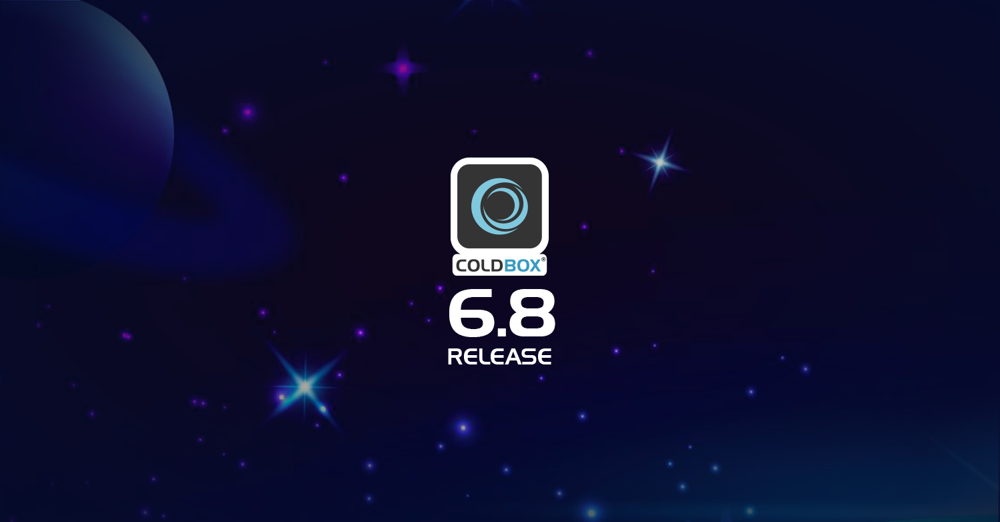

# What's New With 6.8.0

## Release Notes



### Bug

[COLDBOX-1134](https://ortussolutions.atlassian.net/browse/COLDBOX-1134) Router closure responses not marshalling complex content to json

[COLDBOX-1132](https://ortussolutions.atlassian.net/browse/COLDBOX-1132) New virtual app was always starting up the virtual coldbox app instead of checking if it was running already

### Improvement

[COLDBOX-1131](https://ortussolutions.atlassian.net/browse/COLDBOX-1131) Updated Missing Action Response Code to 404 instead of 405

[COLDBOX-1127](https://ortussolutions.atlassian.net/browse/COLDBOX-1127) All core async proxies should send exceptions to the error log

### New Feature

[COLDBOX-1130](https://ortussolutions.atlassian.net/browse/COLDBOX-1130) New `config/ColdBox.cfc` global injections: `webMapping`, `coldboxVersion`

[COLDBOX-1126](https://ortussolutions.atlassian.net/browse/COLDBOX-1126) Funnel all out and err logging on a ColdBox Scheduled Task to LogBox

### Task

[COLDBOX-1135](https://ortussolutions.atlassian.net/browse/COLDBOX-1135) Remove `HandlerTestCase` as it is no longer in usage.


