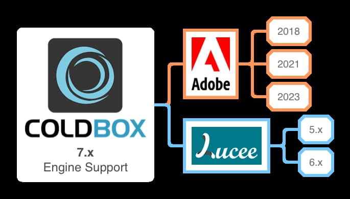

# What's New With 7.0.0

ColdBox 7.0.0 is a major release for the ColdBox HMVC platform. It has some dramatic new features as we keep pushing for more modern and sustainable approaches to web development and tons of bug fixes and improvements.

We break down the major areas of development below, and you can also find the full release notes per library at the end.

## Engine Support

<figure><figcaption><p>ColdBox v7 Engine Support</p></figcaption></figure>

This release drops support for Adobe 2016 and adds support for Adobe 2023 and Lucee 6 (Beta).  Please note that there are still issues with Adobe 2023 as it is still in Beta.

## User Identifier Providers

In previous versions of ColdBox, it would auto-detect unique request identifiers for usage in Flash Ram, storages, etc following this schema:

1. If we have `session` enabled, use the `jessionId` or `session` URL Token
2. If we have cookies enabled, use the `cfid/cftoken`
3. If we have in the `URL` the `cfid/cftoken`
4. Create a unique request-based tracking identifier: `cbUserTrackingId`

However, you can now decide what will be the unique identifier for requests by providing it via a `coldbox.identifierProvider` as a closure/lambda in your `config/Coldbox.cfc`

```javascript
coldbox : {
    ...
    
    identifierProvider : () => {
        // My own logic to provide a unique tracking id
        return myTrackingID
    }
    
    ...

}
```

If this closure exists, ColdBox will use the return value as the unique identifier.  A new method has also been added to the ColdBox Controller so you can retrieve this value:

```javascript
controller.getUserSessionIdentifier()
```

The supertype as well so all handlers/layouts/views/interceptors can get the user identifier:

```javascript
function getUserSessionIdentifier()
```

## Logging Enhancements

### JSON Pretty Output

All logging messages in LogBox are now inspected for simplicity or complexity.  If any extra argument is a complex variable, then LogBox will now serialize the output to JSON, and it will prettify it.  This will allow for your log messages in your console to now look pretty!

```json
[INFO ] 2023-04-26 15:48:47 coldbox.system.EventHandler Executing index action | ExtraInfo: {
	"ARCS":[
		1,
		2,
		3,
		4
	],
	"TEST":"Message goes here",
	"NAME":"Test",
	"WHEN":"April,
	26 2023 15:48:47 +0000"
}
```

### Exception Improvements

If exception objects are being sent to any logger, LogBox will detect it and pretty print it back to the console instead of dumping a massive exception object.

```log
[ERROR] 2023-04-26 16:10:25 coldbox.system.EventHandler Raw Exception ==> component [cbtestharness.models.myRequestContextDecorator] has no  function with name [getValuesss] | ExtraInfo:
ErrorType = expression
Message = component [cbtestharness.models.myRequestContextDecorator] has no  function with name [getValuesss]
StackTrace = lucee.runtime.exp.ExpressionException: component [cbtestharness.models.myRequestContextDecorator] has no  function with name [getValuesss]
TagContext =  ID: ??; LINE: 23; TEMPLATE: /Users/lmajano/Sites/projects/coldbox-platform/test-harness/handlers/testerror.cfc
 ID: ??; LINE: 1257; TEMPLATE: /Users/lmajano/Sites/projects/coldbox-platform/system/web/Controller.cfc
 ID: ??; LINE: 1006; TEMPLATE: /Users/lmajano/Sites/projects/coldbox-platform/system/web/Controller.cfc
 ID: ??; LINE: 713; TEMPLATE: /Users/lmajano/Sites/projects/coldbox-platform/system/web/Controller.cfc
 ID: ??; LINE: 71; TEMPLATE: /Users/lmajano/Sites/projects/coldbox-platform/test-harness/models/ControllerDecorator.cfc
 ID: ??; LINE: 290; TEMPLATE: /Users/lmajano/Sites/projects/coldbox-platform/system/Bootstrap.cfc
 ID: ??; LINE: 506; TEMPLATE: /Users/lmajano/Sites/projects/coldbox-platform/system/Bootstrap.cfc
 ID: ??; LINE: 90; TEMPLATE: /Users/lmajano/Sites/projects/coldbox-platform/test-harness/Application.cfc

ExtraInfo = ""
```

### Closure Logging

In previous versions, you had to use the `canxxxx` method to determine if you can log at a certain level:

```javascript
if( log.canInfo() ){
    log.info( "This is a log message", data );
}

if( log.canDebug() ){
    log.debug( "This is a debug message", data );
}
```

In ColdBox 7, you can use a one-liner by leveraging a lambda function:

```javascript
log.info( () => "This is a log message", data )
log.debug( () => "This is a debug message", data )
```


## Release Notes

The full release notes per library can be found below. Just click on the library tab and explore their release notes:



### Bug

[COLDBOX-1079](https://ortussolutions.atlassian.net/browse/COLDBOX-1079) Router resources doesn't seem to respect group() closures

[COLDBOX-1100](https://ortussolutions.atlassian.net/browse/COLDBOX-1100) Event Caching Does Not Preserve HTTP Response Codes

[COLDBOX-1133](https://ortussolutions.atlassian.net/browse/COLDBOX-1133) \`getFullURL\` encodes the query string when it should not.

[COLDBOX-1136](https://ortussolutions.atlassian.net/browse/COLDBOX-1136) Scoping lookup bug in Lucee affects route()

[COLDBOX-1138](https://ortussolutions.atlassian.net/browse/COLDBOX-1138) Event Cache Response Has Status Code of 0 (or Null)

[COLDBOX-1139](https://ortussolutions.atlassian.net/browse/COLDBOX-1139) make event caching cache keys lower cased to avoid case issues when clearing keys

[COLDBOX-1143](https://ortussolutions.atlassian.net/browse/COLDBOX-1143) render inline PDF (CB 6.8.1) throws a 500 error

[COLDBOX-1145](https://ortussolutions.atlassian.net/browse/COLDBOX-1145) RestHandler OnError() Exception not checking for empty \`exception\` blocks which would cause another exception on development ONLY

[COLDBOX-1146](https://ortussolutions.atlassian.net/browse/COLDBOX-1146) BiConsumer proxy was making both arguments required, when they can be null so execution fails

[COLDBOX-1149](https://ortussolutions.atlassian.net/browse/COLDBOX-1149) Woops and Adobe CF needs a double check if session/client is defined even if sessionManagement/clientManagement is defined

[COLDBOX-1150](https://ortussolutions.atlassian.net/browse/COLDBOX-1150) virtual app controller scoping is missing on ocassion due to this.load|unload flags

[COLDBOX-1151](https://ortussolutions.atlassian.net/browse/COLDBOX-1151) Integration Tests do not support NoRender()

[COLDBOX-1153](https://ortussolutions.atlassian.net/browse/COLDBOX-1153) RestHandler.cfc missing exception information on InvalidCredentials & TokenInvalidException

[COLDBOX-1154](https://ortussolutions.atlassian.net/browse/COLDBOX-1154) Invalid DateFormat Mask in Whoops.cfm

[COLDBOX-1173](https://ortussolutions.atlassian.net/browse/COLDBOX-1173) Update the Router.cfc to look at not only the cgi host but the forwarded hosts

[COLDBOX-1175](https://ortussolutions.atlassian.net/browse/COLDBOX-1175) calling function "view" from within function which has an argument named "view" causes error.

[COLDBOX-1176](https://ortussolutions.atlassian.net/browse/COLDBOX-1176) viewLocations struct does not exist in function renderer.layout() on line 684 if nolayout = true

[COLDBOX-1191](https://ortussolutions.atlassian.net/browse/COLDBOX-1191) Attempts to use \`getHTMLBaseURL()\` inside of Async Task Fail on ACF

[COLDBOX-1193](https://ortussolutions.atlassian.net/browse/COLDBOX-1193) Missing java casting on arrayRange() method ont the asyncmanager

[COLDBOX-1194](https://ortussolutions.atlassian.net/browse/COLDBOX-1194) Ensure modules are applied to routing action structs when necessary #243

[COLDBOX-1196](https://ortussolutions.atlassian.net/browse/COLDBOX-1196) Render collections items and counter variables are not thread safe since we migrated to a singleton renderer

[COLDBOX-1202](https://ortussolutions.atlassian.net/browse/COLDBOX-1202) urlMatches in the request context does not account for the path to be larger than the requested uri

[COLDBOX-1204](https://ortussolutions.atlassian.net/browse/COLDBOX-1204) Overridden events in preProcess interceptions assume event cache configuration of original request

[COLDBOX-1211](https://ortussolutions.atlassian.net/browse/COLDBOX-1211) Base Model and Interceptor Tests where overriding application.wirebox in integration tests

[COLDBOX-1213](https://ortussolutions.atlassian.net/browse/COLDBOX-1213) Var scoping issue on \`includeUDF\` in the super type

### Improvement

[COLDBOX-1029](https://ortussolutions.atlassian.net/browse/COLDBOX-1029) ModuleAwareness : Wirebox Injector Lookup Should Check Current Module First

[COLDBOX-1155](https://ortussolutions.atlassian.net/browse/COLDBOX-1155) Implement abort logic onAuthenticationFailure on RESTHandler

[COLDBOX-1157](https://ortussolutions.atlassian.net/browse/COLDBOX-1157) Reuse existing controller in getMockRequestContext()

[COLDBOX-1159](https://ortussolutions.atlassian.net/browse/COLDBOX-1159) JSON Serialization in \`forAttribute\` Does Not Support ACF Prefixing

[COLDBOX-1171](https://ortussolutions.atlassian.net/browse/COLDBOX-1171) Do not allow injection of the same applicatio helper on the same target

[COLDBOX-1177](https://ortussolutions.atlassian.net/browse/COLDBOX-1177) Please add more debugging info to REST handler

[COLDBOX-1184](https://ortussolutions.atlassian.net/browse/COLDBOX-1184) When whoops error template defaults to public for non-dev, the messaging is very confusing

[COLDBOX-1185](https://ortussolutions.atlassian.net/browse/COLDBOX-1185) ColdBox DebugMode with inDebugMode() helper

[COLDBOX-1190](https://ortussolutions.atlassian.net/browse/COLDBOX-1190) Reworking of several rest handler exception methods so they log the issues instead of announcing \`onException\` events and announce their appropriate events , onAuthenticationFailure, onAuthorizationFailure, onValidationException, onEntityNotFoundException

[COLDBOX-1195](https://ortussolutions.atlassian.net/browse/COLDBOX-1195) ColdBox Proxy should ignore the routing service captures to avoid redirects or returns

[COLDBOX-1210](https://ortussolutions.atlassian.net/browse/COLDBOX-1210) encapsulate route finding by name to the actual router itself

[COLDBOX-1214](https://ortussolutions.atlassian.net/browse/COLDBOX-1214) Compatibility layer for env methods in the Util object: getSystemSetting(), getSystemProperty(), getEnv()

### New Feature

[COLDBOX-1022](https://ortussolutions.atlassian.net/browse/COLDBOX-1022) Allow for Flash RAM to use a third party provided tracking variable via the new setting identifierProvider

[COLDBOX-1039](https://ortussolutions.atlassian.net/browse/COLDBOX-1039) Allow unregistering closure listeners

[COLDBOX-1077](https://ortussolutions.atlassian.net/browse/COLDBOX-1077) Provide ability for handlers/interceptors/etc. to have inherent self-knowledge of the module they live in for modulesettings/moduleConfig injections

[COLDBOX-1137](https://ortussolutions.atlassian.net/browse/COLDBOX-1137) Allow passing interception point first in interceptor listen() method

[COLDBOX-1140](https://ortussolutions.atlassian.net/browse/COLDBOX-1140) Whoops updates galore! SQL Syntax highlighting, json formatting and highlighting, and more

[COLDBOX-1141](https://ortussolutions.atlassian.net/browse/COLDBOX-1141) New Flow delegate helpers for functional usage everywhere in ColdBox land

[COLDBOX-1142](https://ortussolutions.atlassian.net/browse/COLDBOX-1142) New convention for module setting overrides: config/{moduleName}.cfc

[COLDBOX-1147](https://ortussolutions.atlassian.net/browse/COLDBOX-1147) PostLayoutRender and PostViewRender now pass which view/layout path was used to render

[COLDBOX-1148](https://ortussolutions.atlassian.net/browse/COLDBOX-1148) postEvent now get's new interceptData: ehBean, handler and data results

[COLDBOX-1152](https://ortussolutions.atlassian.net/browse/COLDBOX-1152) this.unloadColdBox is false now as the default thanks to the virtual test app

[COLDBOX-1158](https://ortussolutions.atlassian.net/browse/COLDBOX-1158) New \`back()\` function in super type that you can use to redirect back to your referer or a fallback

[COLDBOX-1161](https://ortussolutions.atlassian.net/browse/COLDBOX-1161) new toJson() helper in the Util class which is delegated in many locations around the framework to add struct based query serialization and no dubm security prefixes

[COLDBOX-1162](https://ortussolutions.atlassian.net/browse/COLDBOX-1162) Add in functionality to exclude patterns via router's findRoute()

[COLDBOX-1164](https://ortussolutions.atlassian.net/browse/COLDBOX-1164) New convention for coldfusion tags: includes/tags. Every ColdBox app will register that location as a repository for custom tags for your application

[COLDBOX-1165](https://ortussolutions.atlassian.net/browse/COLDBOX-1165) New convention for modules for storing and using coldfusion tags: \`/tags\`

[COLDBOX-1166](https://ortussolutions.atlassian.net/browse/COLDBOX-1166) Lazy loading and persistence of engine helper to assist in continued performance and initial load speed

[COLDBOX-1167](https://ortussolutions.atlassian.net/browse/COLDBOX-1167) New core delegates for smaller building blocks, which leverages the \`@coreDelegates\` namespace

[COLDBOX-1168](https://ortussolutions.atlassian.net/browse/COLDBOX-1168) New coldbox based delegates mapped with \`@cbDelegates\`

[COLDBOX-1172](https://ortussolutions.atlassian.net/browse/COLDBOX-1172) core json utils now include a prettyJson() and a toPrettyJson() utilities

[COLDBOX-1174](https://ortussolutions.atlassian.net/browse/COLDBOX-1174) New getEnv() method on the base test class to get access to the env delegate for inquiring for env and java properties

[COLDBOX-1178](https://ortussolutions.atlassian.net/browse/COLDBOX-1178) ChronoUnit becomes the official cb Date Time Helper to assist with date/time conversions and formatting

[COLDBOX-1179](https://ortussolutions.atlassian.net/browse/COLDBOX-1179) New super type methods: getDateTimeHelper() getIsoTime() to assist with recurrent iso time conversions in modern APIs and responses

[COLDBOX-1186](https://ortussolutions.atlassian.net/browse/COLDBOX-1186) Add three environment location helpers in the controller and supertype: isProduction(), isDevelopment(), isTesting()

[COLDBOX-1188](https://ortussolutions.atlassian.net/browse/COLDBOX-1188) Request Context setRequestTimeout() method encapsulation, so you can control the time limit of a request

[COLDBOX-1189](https://ortussolutions.atlassian.net/browse/COLDBOX-1189) setRequestTimeout() mock in testing Request Context so handlers cannot override testing timeouts

[COLDBOX-1192](https://ortussolutions.atlassian.net/browse/COLDBOX-1192) Module Inception Isolation - every module has it's own injector that matches the module hierarchy

[COLDBOX-1197](https://ortussolutions.atlassian.net/browse/COLDBOX-1197) All rendering methods now accept a \`viewVariables\` argument that allows you to add variables into the view's \`variables\` scope

[COLDBOX-1199](https://ortussolutions.atlassian.net/browse/COLDBOX-1199) New request context method: \`routeIs( name ):boolean\` that evaluates if the passed name is the same as the current route

[COLDBOX-1200](https://ortussolutions.atlassian.net/browse/COLDBOX-1200) request context \`getFullUrl()\` renamed to \`getUrl()\`

[COLDBOX-1201](https://ortussolutions.atlassian.net/browse/COLDBOX-1201) request context \`getFullPath()\` renamed to \`getPath()\`

[COLDBOX-1205](https://ortussolutions.atlassian.net/browse/COLDBOX-1205) request context \`event.getUrl( withQuery:true )\` new argument \`withQuery\` to allow adding the query string or not

[COLDBOX-1206](https://ortussolutions.atlassian.net/browse/COLDBOX-1206) request context \`event.getPath( withQuery:true )\` new argument \`withQuery\` to allow adding the query string or not

[COLDBOX-1207](https://ortussolutions.atlassian.net/browse/COLDBOX-1207) New request context methods: \`getPathSegments():array, getPathSegment( index, defaultValue ):string\` so you can segment the incoming url path

[COLDBOX-1208](https://ortussolutions.atlassian.net/browse/COLDBOX-1208) Add \`persist\` and \`persistStruct\` to the \`back()\` method in the supertype

[COLDBOX-1209](https://ortussolutions.atlassian.net/browse/COLDBOX-1209) Add route names to resourceful routes according to conventions

[COLDBOX-1215](https://ortussolutions.atlassian.net/browse/COLDBOX-1215) this.moduleInjector enables modular injector hiearchy. By default it is false until ColdBox 8

[COLDBOX-1216](https://ortussolutions.atlassian.net/browse/COLDBOX-1216) New super type method: \`getRootWireBox()\` to get an instance of the root wirebox in the application

### Task

[COLDBOX-1160](https://ortussolutions.atlassian.net/browse/COLDBOX-1160) COMPAT: jsonQueryFormat has been removed in preference to "struct".

[COLDBOX-1169](https://ortussolutions.atlassian.net/browse/COLDBOX-1169) routes.cfm Support Removal

[COLDBOX-1170](https://ortussolutions.atlassian.net/browse/COLDBOX-1170) populateModel deprecated - refactored to just populate() in the supertype methods

[COLDBOX-1187](https://ortussolutions.atlassian.net/browse/COLDBOX-1187) Removal of uniqueUrls boolean indicator for URL routing, since Pretty URLs are now the standard. This rerouting feature needs to be removed.



### Improvement

[WIREBOX-133](https://ortussolutions.atlassian.net/browse/WIREBOX-133) BeanPopulator renamed to ObjectPopulator to be consistent with naming

### Bug

[WIREBOX-132](https://ortussolutions.atlassian.net/browse/WIREBOX-132) WireBox caches Singletons even if their autowired dependencies throw exceptions.

### New Feature

[WIREBOX-89](https://ortussolutions.atlassian.net/browse/WIREBOX-89) Wirebox - add onInjectorMissingDependency event

[WIREBOX-130](https://ortussolutions.atlassian.net/browse/WIREBOX-130) Ability to remove specific objects from wirebox injector singleton's and request scopes via a \`clear( key )\` method

[WIREBOX-131](https://ortussolutions.atlassian.net/browse/WIREBOX-131) Object Delegators

[WIREBOX-134](https://ortussolutions.atlassian.net/browse/WIREBOX-134) Object Populator is now created by the Injector and it is now a singleton

[WIREBOX-135](https://ortussolutions.atlassian.net/browse/WIREBOX-135) Object populator now caches orm entity maps, so they are ONLy loaded once and population with orm objects accelerates tremendously

[WIREBOX-136](https://ortussolutions.atlassian.net/browse/WIREBOX-136) object populator cache relational metadata for faster population of the same objects

[WIREBOX-137](https://ortussolutions.atlassian.net/browse/WIREBOX-137) New \`this.population\` marker for controlling mas population of objects. It can include an \`include\` and and \`exclude\` list.

[WIREBOX-138](https://ortussolutions.atlassian.net/browse/WIREBOX-138) Lazy Properties

[WIREBOX-139](https://ortussolutions.atlassian.net/browse/WIREBOX-139) Property Observers

[WIREBOX-140](https://ortussolutions.atlassian.net/browse/WIREBOX-140) Transient request cache for injections and delegations

[WIREBOX-141](https://ortussolutions.atlassian.net/browse/WIREBOX-141) New config setting transientInjectionCache to enable or disable globally, default is true

[WIREBOX-142](https://ortussolutions.atlassian.net/browse/WIREBOX-142) You can now instantiate an Injector with the \`binder\` argument being the config structure instead of creating a binder

[WIREBOX-143](https://ortussolutions.atlassian.net/browse/WIREBOX-143) New injection DSL for ColdBox Root Injector \`coldbox:rootWireBox\`

[WIREBOX-144](https://ortussolutions.atlassian.net/browse/WIREBOX-144) Injectors can now track the root injector by having a root reference via \`getRoot(), hasRoot()\` methods

[WIREBOX-145](https://ortussolutions.atlassian.net/browse/WIREBOX-145) New DSL for wirebox only root injectors: \`wirebox:root\`



### Bug

* [CACHEBOX-83](https://ortussolutions.atlassian.net/browse/CACHEBOX-83) Intermittent Exception from MetadataIndexer



### Improvement

[LOGBOX-67](https://ortussolutions.atlassian.net/browse/LOGBOX-67) Come up with better default serialization for exception objects on LogEvents

### New Feature

[LOGBOX-61](https://ortussolutions.atlassian.net/browse/LOGBOX-61) Allow for closure for all logging messages in the logger, this way, we can verify the logging level automatically.

[LOGBOX-69](https://ortussolutions.atlassian.net/browse/LOGBOX-69) LogEvents in JSON are now prettified


