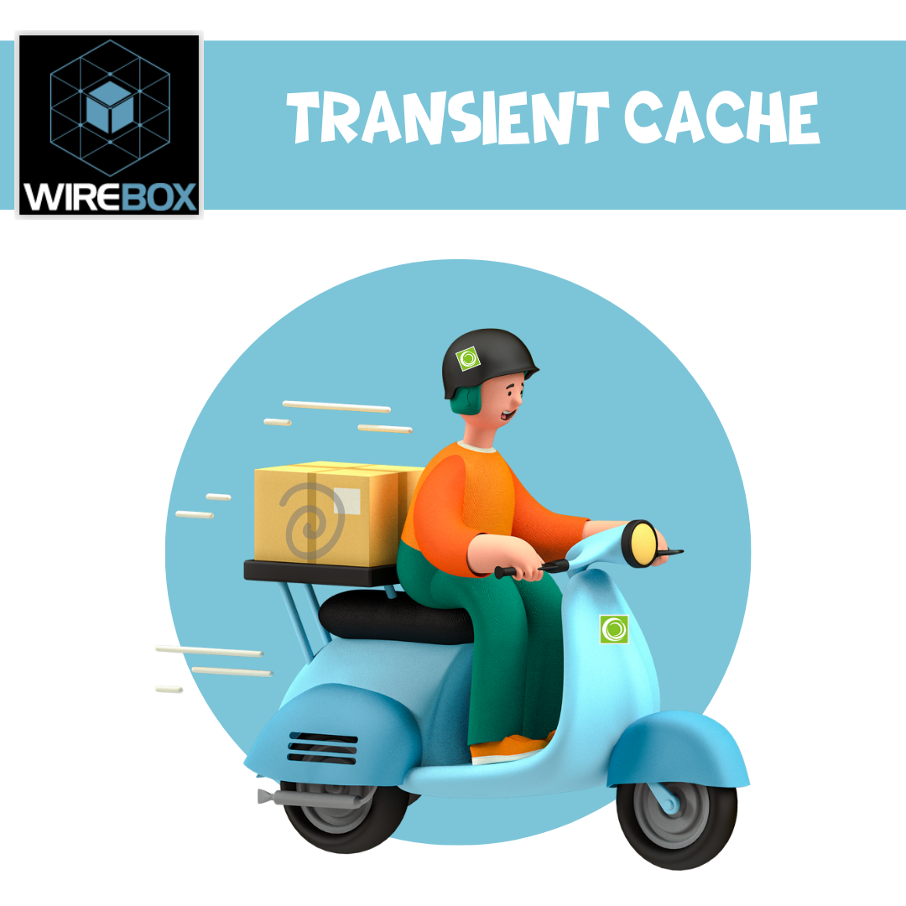
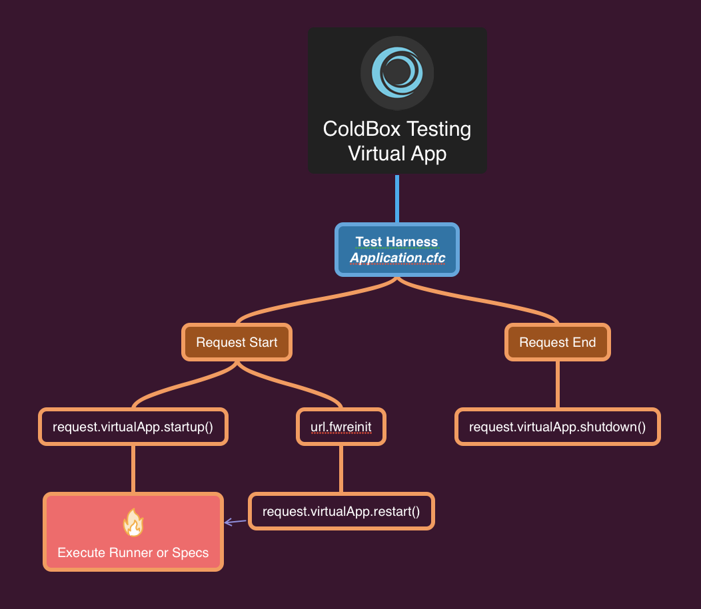

# What's New With 7.0.0

ColdBox 7.0.0 is a major release for the ColdBox HMVC platform. It has some dramatic new features as we keep pushing for more modern and sustainable approaches to web development and tons of bug fixes and improvements.

We break down the major areas of development below, and you can also find the [full release notes](whats-new-with-7.0.0/release-notes.md) per library at the end.

## Engine Support

<figure><figcaption><p>ColdBox v7 Engine Support</p></figcaption></figure>

This release drops support for Adobe 2016 and adds support for Adobe 2023 and Lucee 6 (Beta).  Please note that there are still issues with Adobe 2023 as it is still in Beta.

## ColdBox CLI

```
 ██████╗ ██████╗ ██╗     ██████╗ ██████╗  ██████╗ ██╗  ██╗      ██████╗██╗     ██╗
██╔════╝██╔═══██╗██║     ██╔══██╗██╔══██╗██╔═══██╗╚██╗██╔╝     ██╔════╝██║     ██║
██║     ██║   ██║██║     ██║  ██║██████╔╝██║   ██║ ╚███╔╝█████╗██║     ██║     ██║
██║     ██║   ██║██║     ██║  ██║██╔══██╗██║   ██║ ██╔██╗╚════╝██║     ██║     ██║
╚██████╗╚██████╔╝███████╗██████╔╝██████╔╝╚██████╔╝██╔╝ ██╗     ╚██████╗███████╗██║
 ╚═════╝ ╚═════╝ ╚══════╝╚═════╝ ╚═════╝  ╚═════╝ ╚═╝  ╚═╝      ╚═════╝╚══════╝╚═╝
                                                                                  
```

We now have an official CLI for ColdBox, which lives outside CommandBox.  It will always be included with CommandBox, but it now has its own life cycles, and it will support each major version of ColdBox as well.

```bash
install coldbox-cli
coldbox --help
```

The new CLI has all the previous goodness but now also v7 support and many other great features like migration creation, API testing, and more.  You can find the source for the CLI here: [https://github.com/coldbox/coldbox-cli](https://github.com/coldbox/coldbox-cli)



## Application Templates

All the application templates have been updated in our ColdBox Templates Org: [https://github.com/coldbox-templates](https://github.com/coldbox-templates).  They have been updated to support our LTS strategy, so now we can have templates based on each major iteration of ColdBox.


github.com/coldbox-templates


Here is a listing of the latest supported templates:

| Template              | Slug          | Description                                                                               |
| --------------------- | ------------- | ----------------------------------------------------------------------------------------- |
| Default               | `default`     | The default ColdBox application template                                                  |
| Elixir                | `elixir`      | The `default` template with ColdBox elixir support for asset pipelines                    |
| Modern (experimental) | `modern`      | A fresh new approach to ColdBox applications that are non-root based.  Still experimental |
| Rest                  | `rest`        | A base REST API using ColdBox                                                             |
| Rest HMVC             | `rest-hmvc`   | An HMVC REST API using modules                                                            |
| Super Simple          | `supersimple` | Barebones conventions baby!                                                               |


## WireBox Updates

```
 __          ___          ____
 \ \        / (_)        |  _ \
  \ \  /\  / / _ _ __ ___| |_) | _____  __
   \ \/  \/ / | | '__/ _ \  _ < / _ \ \/ /
    \  /\  /  | | | |  __/ |_) | (_) >  <
     \/  \/   |_|_|  \___|____/ \___/_/\_\
```

WireBox has gotten tons of love in this release, with several additions, bug fixes, and improvements.

### Transient Request Cache

<figure><figcaption><p>Fly with me!</p></figcaption></figure>

This feature is one of the most impactful for applications that leverage DI on transient objects, especially ORM-related applications.  WireBox will now, by **default**, cache the signatures of the injections and delegations for you, so they are only done once per instance type.  This addition has brought speed improvements of over 585% in Lucee and Adobe ColdFusion.  You read that right, 585% performance increases.  This is really a game changer for ORM-heavy applications that use DI and delegations. Go try it; **you don't have to do a thing. Install and run it!**

If this is not for you or there are issues in your system because of it, we have a setting for it to turn it off.  Open the `WireBox.cfc` binder and add it as a config item.

```cfscript
// Config DSL
wirebox : {
    transientInjectionCache : false
}

// Binder Call
binder.transientInjectionCache( false )
```

You can also disable the cache on a per-CFC basis by using the `transientCache=false` annotation in your component declaration:

```cfscript
component transientCache=false{

}
```

#### Known Issues

Even though the transient cache can help tremendously with performance, there is a price to pay.  All the injections and delegations will be cached on a per-cfc definition basis.  Thus, if you are injecting transients, those transients will become singletons.  Therefore you have two options to alleviate this side effect:

1. Disable the cache entirely (The heavy-handed approach)
2. Disable the cache on that specific entity via the `transientCache` annotation (The surgical approach)
3. Add the transient injection as a `provider` [injection](https://wirebox.ortusbooks.com/advanced-topics/providers) (The ninja approach)
4. Add the property as a [lazy property](https://wirebox.ortusbooks.com/advanced-topics/lazy-properties) and add a builder that will construct it when called (The Jedi approach)

```cfscript
component name="Transient" transientCache="false"{
    
   // This will become a singleton
   property name="transient2" inject="t2";
   // Provider injection
   property name="transient2" inject="provider:t2";
   // Lazy property
   property name="transient2" lazy;
   
   function buildTransient2(){
    return variables.wirebox.getInstance( "t2" );
   }
}
```

### `WireBox Delegators`

WireBox supports the concept of [object delegation](https://en.wikipedia.org/wiki/Delegation\_\(object-oriented\_programming\)) in a simple, expressive DSL.  You can now add a `delegate` annotation to injections or use the `delegates` annotations to components to inject and absorb the object's methods into yourself.

```cfscript
// Inject and use as a delegate
property name="memory" inject delegate

// Delegate Component
component name="computer" delegates="Memory"{
}
```

In object-oriented programming, an object delegator is a programming technique where an object delegates some of its responsibilities to another object. The delegating object passes the responsibility for handling a particular task to the delegate object. This allows the delegating object to focus on its core responsibilities while the delegate object handles the delegated task.

Basically, a way to inject/proxy calls from one object to the other and avoid the [overuse of inheritance](https://en.wikipedia.org/wiki/Composition\_over\_inheritance), and avoid runtime mixins. WireBox provides a set of rules for method lookup and dispatching that will allow you to provide delegation easily in your CFML applications.  This feature is similar to [traits](https://www.php.net/manual/en/language.oop5.traits.php) in PHP or [object delegators](https://www.baeldung.com/kotlin/delegation-pattern) in Kotlin.

You can use it to encapsulate behavior on **small**, **focused**, and **testable** classes that can be brought in as traits into ANY component without abusing inheritance. In contrast, object delegation is a more flexible approach that allows objects to delegate tasks to any other object, regardless of its class hierarchy.  Finally, object delegation can help to improve code performance by allowing objects to use specialized delegate objects for specific tasks.

<figure><figcaption></figcaption></figure>

Let's look at an example of how we would use delegation without this feature:

```cfscript
  component name="Memory"{
  
  function init(){
    return reset()
  }
  
  function reset(){
    variables.data = []
    return this;
  }
  
  function read( index ){
    return variables.data[ arguments.index ]
  }
  
  function write( data ){
    variables.data.append( arguments.data )
  }
  
}
  
```

Now let's look at the computer

```cfscript
component name="computer"{

    // Inject a memory object via WireBox
    property name="memory" inject;
    
    // read delegator proxy method
    function read( index ){
        return variables.memory.read( argumentCollection = arguments )
    }
    
    // write delegator proxy method
    function write( data ){
        return variables.memory.read( argumentCollection = arguments )
    }

}
```

`As you can see, in the traditional approach we must type and inject and know every detail of the delegated methods.  Now let's delegalize it via WireBox:`

```cfscript
component name="computer"{
  // Inject and use as a delegate
  property name="memory" inject delegate

}

computer = getInstance( "Computer" )
computer.read( index )
computer.write( data )
```

Or use the shorthand notation via the `delegates` annotation of components:

```cfscript
component name="computer" delegates="Memory"{

   // code

}

computer = getInstance( "Computer" )
computer.read( index )
computer.write( data )
```

You can also do prefixes, suffixes, method includes, excludes, and even add as many delegates as you want:

```cfscript
component name="computer"
	delegates=">Memory, <Disk=read,sleep"
}

component name="computer"{

   property name="authorizable." 
	inject="provider:Authorizable@cbsecurity"
	delegate;

}
```

Read more about delegates here: [https://wirebox.ortusbooks.com/usage/wirebox-delegators](https://wirebox.ortusbooks.com/usage/wirebox-delegators)



### `Core Delegates`

Now that we have seen what delegators are, WireBox offers core delegators to your application via the `@coreDelegates` namespace

* **Async** - This delegate is useful to interact with the AsyncManager and the most used functionality for asynchronous programming
* **DateTime** - Leverage the date time helper
* **Env** - Talk to environment variables
* **Flow** - Several fluent flow methods
* **JsonUtil** - JSON utilities
* **StringUtil** - String utilities
* **Population** - Population utilities


API Docs


So let's say you have a service that needs to populate objects and work with the system environment:

```javascript
component 
    delegates="population@coreDelegates, Env@coreDelegates"{
}
```

### `WireBox Property Observers`

WireBox supports the concepts of component property observers. Meaning that you can define a function that will be called for you when the `setter` for that property has been called and thus observe the property changes.

You will accomplish this by tagging a property with an annotation called `observed` then by convention, it will look for a function called: `{propertyName}Observer` by convention. This function will receive three arguments:

* `newValue` : The value is set into the property
* `oldValue` : The old value of the property, including null
* `property` : The name of the property

```javascript
component{

  property name="data" observed;
  
  /**
   * Observer for data changes.  Anytime data is set, it will be called
     	 *
   * @new The new value
   * @old The old value
   * @property The name of the property observed
   */
  function dataObserver( newValue, oldValue, property ){
  	// Execute after data is set
  }

}
```


If you don’t like the convention and want to name the function as you see fit, then you can place the value of the observed annotation as the function's name to call.


`property name="data" observed="myObserver"`


Read more here: [https://wirebox.ortusbooks.com/advanced-topics/property-observers](https://wirebox.ortusbooks.com/advanced-topics/property-observers)



### `WireBox Lazy Properties`

WireBox supports the concept of marking properties in your components as `lazy`. This will allow the property to be constructed **ONCE** when requested _**ONLY** (lazy loaded)_. This way, you can take advantage of the construction of the property being lazy-loaded.

Internally, we will generate a _getter_ method for you that will make sure to construct your property via a builder function you will provide, lock the request (by default), store it in the `variables` scope, and return it to you.

> **Note**: With lazy properties, you must use the _getter_ **only** to retrieve the property

<pre class="language-jsx"><code class="lang-jsx">component{
	
  // Lazy property: Constructed by convention via the buildUtil() method
  property name="util" <a data-footnote-ref href="#user-content-fn-1">lazy</a>;
  
  /**
   * Build a util object lazyily.
   * The first time you call it, it will lock, build it, and store it by convention as 'variables.util'
   */
  function buildUtil(){
   return new coldbox.system.core.util.Util();
  }

}
</code></pre>

Read more about Lazy Properties here: [https://wirebox.ortusbooks.com/advanced-topics/lazy-properties](https://wirebox.ortusbooks.com/advanced-topics/lazy-properties)



### `onInjectorMissingDependency` event

A new event called `onInjectorMissingDependency` is now registered in Wirebox. It will be called whenever a dependency cannot be located. The `data` sent into the event will contain:

* name - The name of the requested dependency
* **initArguments** - The `init` arguments, if passed
* **targetObject** - The target object that requested the dependency
* **injector** - The injector in use building the dependency

If you return in the `data` struct an element called, `instance` we will return that as the dependency, else the normal exception will be thrown.

```javascript
// Simple listener example
listen( "onInjectorMissingDependency", (data,event,rc,prc)=>{
    if( data.name == "OldLegacyOne" ){
        data.instance = myNewObject();
    }
});
```

### Population Enhancements

* The object populator now caches ORM entity maps, so they are only loaded once, and the population with ORM objects accelerates tremendously.
* The object populator caches relational metadata for a faster population of the same type of  objects

#### Mass Population Config: `this.population`

This new convention allows for objects to encapsulate the way the mass population of data is treated. This way, you don’t have to scrub or pass include excludes lists via population arguments; it can all be nicely encapsulated in the targeted objects:

```javascript
this.population = {
    include : [ "firstName", "lastName", "username", "role" ],
    exclude : [ "id", "password", "lastLogin" ]
};
```

The populator will look for a `this.population` struct with the following keys:

* `include` : an array of property names to allow population **ONLY**
* `exclude` : an array of property names to **NEVER** allow population

The population methods also get a new argument called: `ignoreTargetLists` which defaults to false, meaning it inspects the objects for these population markers.  If you pass it as `true` then the markers will be ignored.  This is great for the population of objects from queries or an array of structs or mementos that **YOU** have control of.

```javascript
populateFromStruct(
    target : userService.newUser(),
    memento : record,
    ignoreTargetLists : true
}
```

### Inline Configuration

You can now instantiate an Injector with the `binder` argument being the config structure instead of creating a binder. This will allow you to create injectors and pass the configuration structure as well:

```javascript
injector  = new coldbox.system.ioc.Injector({
	"scopeRegistration" : {
		"enabled" : false
	},
	"transientInjectionCache" : true
});
```

### Injector Names

Each injector can now have a human-friendly name via the `name` property

```cfscript
injector.getName()
injector.setName( "AwesomeInjector" )
```

### Clear Objects From Scopes

You can also now use a `clear( key )` method in ALL scopes so you can remove a-la-carte objects from any supported scope.

### Root Injector

In a ColdBox or WireBox context, there will always be a `root` injector in a hierarchy.  This root injector can have children, and all of these children can have a direct link to its root via a `hasRoot() and getRoot()` methods.

#### Methods

* `hasRoot()`
* `getRoot()`
* `setRoot()`

#### Injection DSL

There are also injection DSLs for retrieving the root injector:

```cfscript
property name="root" inject="wirebox:root"
property name="root" inject="coldbox:rootWireBox"
```

## Module Updates

### Config Object Override

In ColdBox 7, you can now store the module configurations outside of the `config/Coldbox.cfc`. Especially in an application with many modules and many configs, the `modulesettings` would get really unruly and long.  Now you can bring separation.  This new convention will allow module override configurations to exist as their own configuration file within the application’s config folder.

```bash
config/modules/{moduleName}.cfc
```

The configuration CFC will have one `configure()` method that is expected to return a struct of configuration settings as you did before in the `moduleSettings`

```javascript
component{

    function configure(){
        return {
            key : value
        };
    }

}
```

#### Injections

Just like a `ModuleConfig` this configuration override also gets many injections:

```
* controller
* coldboxVersion
* appMapping
* moduleMapping
* modulePath
* logBox
* log
* wirebox
* binder
* cachebox
* getJavaSystem
* getSystemSetting
* getSystemProperty
* getEnv
* appRouter
* router
```

#### Env Support

This module configuration object will also inherit the `ModuleConfig.cfc` behavior that if you create methods with the same name as the **environment** you are on, it will execute it for you as well.

```javascript
function development( original ){
   // add overides to the original struct
}
```

Then you can change the `original` struct as you see fit for that environment.

### Module Injectors

We have an experimental feature in ColdBox 7 to enable per-module injectors.  This will create a hierarchy of injections and dependency lookups for modules.  This is in preparation for future capabilities to allow for multi-named modules in an application.  In order to activate this feature you need to use the `this.moduleInjector = true` in your `ModuleConfig.cfc`

```cfscript
this.moduleInjector = true
```

Once enabled, please note that your module injector will have a unique name, and a link to the parent and root injectors and will ONLY know about itself and its children.  Everything will be encapsulated under itself.  No more global dependencies, we are now in module-only dependencies.  This means each module must declare its dependencies beforehand.

#### ModuleConfig Injections

If the module injector is enabled, you will also get different injections in your `ModuleConfig`

| Injection     | Description                                       |
| ------------- | ------------------------------------------------- |
| `binder`      | The root injector binder                          |
| `rootWireBox` | The root injector or global injector.             |
| `wirebox`     | This is now a reference to the module's injector. |

#### Root Helpers

The supertype also has methods to interact with the root and module injector `getRootWireBox()` and `getWireBox() for the module injector.`

```cfscript
getRootWireBox().getInstance( "GlobalModel" )
```

#### Injection Awareness

Every module also can inject/use its `models` without the need to namespace them. &#x20;

```cfscript
// Before, using the @contacts address
property name="contactService" inject="contactService@contacts";

// If using module injectors
property name="contactService" inject="contactService";
```


The injector will look into the `models` of the module first and then it's children.  Parent lookups are not guaranteed yet.



Please note that this is still experimental and there could be issues of not finding models or DSLs.


### Config/Settings Awareness

You can now use the `{this}` placeholder in injections for module configurations-settings, and ColdBox will automatically replace it with the current module it's being injected in:

```javascript
property name="mySettings" inject="coldbox:moduleSettings:{this}"
property name="myConfig" inject="coldbox:moduleConfig:{this}"
```

This is a great way to keep your injections clean without adhering to the module name.

## Interceptor `listen()` Order

You can now use `listen( closure, point )` or `listen( point, closure)` when registering closure interception points.

```javascript
listen( ()=> log.info( "executed" ), "preProcess" )
// or
listen( "preProcess", ()=> log.info( "executed" ) )
```

## ColdBox Delegates

Since WireBox introduced delegates, we have taken advantage of this great reusable feature throughout ColdBox.  We have also created several delegates for your convenience that can be used via its name and the `@cbDelegates` namespace:

| Delegate      | Purpose                                                   |
| ------------- | --------------------------------------------------------- |
| `AppModes`    | Methods to let you know in which tier you are on and more |
| `Interceptor` | Announce interceptions                                    |
| `Locators`    | Locate files and/or directories                           |
| `Population`  | Populate objects                                          |
| `Rendering`   | Render views and layouts                                  |
| `Settings`    | Interact with ColdBox/Module Settings                     |

Let's say you have a security service that needs to get settings, announce events and render views:

```cfscript
component name="SecurityService"
    delegates="settings@cbDelegates, rendering@cbDelegates, interceptor@cbDelegates"{
    
    function login(){
        if( getSetting( "logEnabled" ) ){
            ... 
            
            var viewInfo = view( "security/logdata" );
            
        }
        
        ...
        
        announce( "onLogin" );
    }

}
```

Here you can find more information about the CBDelegates: [https://s3.amazonaws.com/apidocs.ortussolutions.com/coldbox/7.0.0/coldbox/system/web/delegates/package-summary.html](https://s3.amazonaws.com/apidocs.ortussolutions.com/coldbox/7.0.0/coldbox/system/web/delegates/package-summary.html)


API Docs CBDelegates


## User Identifier Providers

In previous versions of ColdBox, it would auto-detect unique request identifiers for usage in Flash Ram, storages, etc., following this schema:

1. If we have `session` enabled, use the `jessionId` or `session` URL Token
2. If we have cookies enabled, use the `cfid/cftoken`
3. If we have in the `URL` the `cfid/cftoken`
4. Create a unique request-based tracking identifier: `cbUserTrackingId`

However, you can now decide what will be the unique identifier for requests, flash RAM, etc by providing it via a `coldbox.identifierProvider` as a closure/lambda in your `config/Coldbox.cfc`

```javascript
coldbox : {
    ...
    
    identifierProvider : () => {
        // My own logic to provide a unique tracking id
        return myTrackingID
    }
    
    ...

}
```

If this closure exists, ColdBox will use the return value as the unique identifier.  A new method has also been added to the ColdBox Controller so you can retrieve this value:

```javascript
controller.getUserSessionIdentifier()
```

The supertype as well so all handlers/layouts/views/interceptors can get the user identifier:

```javascript
function getUserSessionIdentifier()
```

## App Mode Helpers

ColdBox 7 introduces opinionated helpers to the `FrameworkSuperType` so you can determine if you are in three modes: production, development, and testing by looking at the `environment` setting:

```javascript
function isProduction()
function isDevelopment()
function isTesting()
```

| Mode                      | Environment              |
| ------------------------- | ------------------------ |
| `inProduction() == true`  | `production`             |
| `inTesting() == true`     | `testing`                |
| `inDevelopment() == true` | `development` or `local` |


You can also find these methods in the `controller` object.


These super-type methods delegate to the ColdBox Controller.  So that means that if you needed to change their behavior, you could do so via a [Controller Decorator.](../../digging-deeper/controller-decorator.md) &#x20;

You can also use them via our new `AppModes@cbDelegates` delegate in any model:

```javascript
component delegate="AppModes@cbDelegates"{}
```

## Resource Route Names

When you register resourceful routes now, they will get assigned a name so you can use it for validation via `routeIs()` or for route link creation via `route()`

| Verb        | Route              | Event           | Route Name       |
| ----------- | ------------------ | --------------- | ---------------- |
| `GET`       | `/photos`          | `photos.index`  | `photos`         |
| `GET`       | `/photos/new`      | `photos.new`    | `photos.new`     |
| `POST`      | `/photos`          | `photos.create` | `photos`         |
| `GET`       | `/photos/:id`      | `photos.show`   | `photos.process` |
| `GET`       | `/photos/:id/edit` | `photos.edit`   | `photos.edit`    |
| `PUT/PATCH` | `/photos/:id`      | `photos.update` | `photos.process` |
| `DELETE`    | `/photos/:id`      | `photos.delete` | `photos.process` |

## Baby got `back()!`

The framework super type now sports a `back()` function so you can use it to redirect back to the referer in a request.

```javascript
function save( event, rc, prc ){
    ... save your work
    
    // Go back to where you came from
    back();
}
```

`Here is the method signature:`

```javascript
/**
 * Redirect back to the previous URL via the referrer header, else use the fallback
 *
 * @fallback      The fallback event or uri if the referrer is empty, defaults to `/`
 * @persist       What request collection keys to persist in flash ram
 * @persistStruct A structure key-value pairs to persist in flash ram
 */
function back( fallback = "/", persist, struct persistStruct )
```

## `RequestContext` Routing/Pathing Enhancements

The RequestContext has a few new methods to assist you when working with routes, paths, and URLs.

| Method                                  | Purpose                                                                                     |
| --------------------------------------- | ------------------------------------------------------------------------------------------- |
| `routeIs( name ):boolean`               | Verify if the passed `name` is the current route                                            |
| `getUrl( withQuery:boolean )`           | Returns the entire URL, including the protocol, host, mapping, path info, and query string. |
| `getPath( withQuery:boolean )`          | Return the relative path of the current request.                                            |
| `getPathSegments():array`               | Get all of the URL path segments from the requested path.                                   |
| `getPathSegment( index, defaultValue )` | Get a single path segment by position                                                       |

## Native DateHelper

The `FrameworkSuperType` now has a `getDateTimeHelper(), getIsoTime()` methods to get access to the ColdBox `coldbox.system.async.time.DateTimeHelper` to assist you with all your date/time/timezone needs and generate an **iso8601** formatted string from the incoming date/time.

```javascript
getDateTimeHelper().toLocalDateTime( now(), "Americas/Central" )
getDateTimeHelper().getSystemTimezone()
getDateTimeHelper().parse( "2018-05-11T13:35:11Z" )
getIsoTime()
```

You can also use the new date time helper as a delegate in your models:

```javascript
component delegate="DateTime@coreDelegates"{

}
```


Check out the API Docs for the latest methods in the helper

[https://s3.amazonaws.com/apidocs.ortussolutions.com/coldbox/7.0.0/coldbox/system/async/time/DateTimeHelper.html](https://s3.amazonaws.com/apidocs.ortussolutions.com/coldbox/7.0.0/coldbox/system/async/time/DateTimeHelper.html)


## View `variables` Scope Variables

You can now influence any view by injecting your own variables into a view's `variables` scope using our new argument: `viewVariables`.  This is great for module developers that want native objects or data to exist in a view's `varaibles` scope.

```javascript
view( view : "widget/messagebox", viewVariables : { wire : cbwire } 

view( view : "widget/client", viewVariables : { client : thisClient } )
```

Then you can use the `wire` and `client` objects in your views natively:

```html
<cfif client.isLoaded()>
    <h1>#client.getFullName()#</h1>
</cfif>
```

## Whoops! Upgrades

Whoops got even more love:

* SQL Syntax Highlighting
* JSON Pretty Printing
* JSON highlighting
* Debug Mode to show source code
* Production detection to avoid showing source code
* Rendering performance improvements

<figure><figcaption><p>SQL Hightlighting</p></figcaption></figure>

<figure><figcaption><p>JSON Pretty Print + Highlights</p></figcaption></figure>


## RESTFul Exception Responses

The RESTFul handlers have been updated to present more useful debugging when exceptions are detected in any call to any resource.  You will now get the following new items in the response:

* `environment`
  * A snapshot of the current routes, URLs and event
* `exception`
  * A stack frame, detail, and type

```json
{
  "data": {
    "environment": {
      "currentRoutedUrl": "restfulHandler/anError/",
      "timestamp": "2023-04-26T20:21:05Z",
      "currentRoute": ":handler/:action/",
      "currentEvent": "restfulHandler.anError"
    },
    "exception": {
      "stack": [
        "/Users/lmajano/Sites/projects/coldbox-platform/system/web/context/RequestContext.cfc:1625",
        "/Users/lmajano/Sites/projects/coldbox-platform/test-harness/handlers/restfulHandler.cfc:42",
        "/Users/lmajano/Sites/projects/coldbox-platform/system/RestHandler.cfc:58",
        "/Users/lmajano/Sites/projects/coldbox-platform/system/web/Controller.cfc:998",
        "/Users/lmajano/Sites/projects/coldbox-platform/system/web/Controller.cfc:713",
        "/Users/lmajano/Sites/projects/coldbox-platform/test-harness/models/ControllerDecorator.cfc:71",
        "/Users/lmajano/Sites/projects/coldbox-platform/system/Bootstrap.cfc:290",
        "/Users/lmajano/Sites/projects/coldbox-platform/system/Bootstrap.cfc:506",
        "/Users/lmajano/Sites/projects/coldbox-platform/test-harness/Application.cfc:90"
      ],
      "detail": "The type you sent dddd is not a valid rendering type. Valid types are JSON,JSONP,JSONT,XML,WDDX,TEXT,PLAIN,PDF",
      "type": "RequestContext.InvalidRenderTypeException",
      "extendedInfo": ""
    }
  },
  "error": true,
  "pagination": {
    "totalPages": 1,
    "maxRows": 0,
    "offset": 0,
    "page": 1,
    "totalRecords": 0
  },
  "messages": [
    "An exception ocurred: Invalid rendering type"
  ]
}
```

## ColdBox `DebugMode`

ColdBox now has a global `debugMode` setting, which is used internally for presenting sources in Whoops and extra debugging parameters in our RESTFul handler.  However, it can also be used by module developers or developers to dictate if your application is in debug mode or not.  This is just a fancy way to say we trust the user doing the requests.


&#x20;The default value is **false**


```
coldbox : {
    ...
    
    debugMode : true
    
    ...

}
```

You also have a `inDebugMode()` method in the main ColdBox Controller and the `FrameworkSuperType that will let you know if you are in that mode or not.`

```javascript
boolean function inDebugMode()

// Debug mode report
if( inDebugMode() ){
    include "BugReport.cfm";
}
```

You can also use the `AppModes@cbDelegates` delegate to get access to the `inDebugMode` and other methods in your **models**:

```javascript
component delegates="AppModes@cbDelegates"{

    ...
    if( inDebugMode() ){
    
    }
    ...

}
```

## Testing Enhancements

### Unload ColdBox is now false

All integration tests now won't unload ColdBox after execution.  Basically, the `this.unloadColdBox = false` is now the default.  This is to increase performance where each request run tries only to load the ColdBox virtual app once.

### Environment Detection Method

All test bundles now get a `getEnv()` method to retrieve our environment delegate so you can get env settings and properties:

```javascript
getEnv().getSystemSetting()
getEnv().getSystemProperty()
getEnv().getEnv()
```


## LogBox Updates

```
$$\                          $$$$$$$\                      
$$ |                         $$  __$$\                     
$$ |      $$$$$$\   $$$$$$\  $$ |  $$ | $$$$$$\  $$\   $$\ 
$$ |     $$  __$$\ $$  __$$\ $$$$$$$\ |$$  __$$\ \$$\ $$  |
$$ |     $$ /  $$ |$$ /  $$ |$$  __$$\ $$ /  $$ | \$$$$  / 
$$ |     $$ |  $$ |$$ |  $$ |$$ |  $$ |$$ |  $$ | $$  $$<  
$$$$$$$$\\$$$$$$  |\$$$$$$$ |$$$$$$$  |\$$$$$$  |$$  /\$$\ 
\________|\______/  \____$$ |\_______/  \______/ \__/  \__|
                   $$\   $$ |                              
                   \$$$$$$  |                              
                    \______/                               
```

### JSON Pretty Output

All logging messages in LogBox are now inspected for simplicity or complexity.  If any extra argument is a complex variable, then LogBox will now serialize the output to JSON, and it will prettify it.  This will allow for your log messages in your console to now look pretty!

```json
[INFO ] 2023-04-26 15:48:47 coldbox.system.EventHandler Executing index action | ExtraInfo: {
	"ARCS":[
		1,
		2,
		3,
		4
	],
	"TEST":"Message goes here",
	"NAME":"Test",
	"WHEN":"April,
	26 2023 15:48:47 +0000"
}
```

### Exception Improvements

If exception objects are being sent to any logger, LogBox will detect it and pretty print it back to the console instead of dumping a massive exception object.

```log
[ERROR] 2023-04-26 16:10:25 coldbox.system.EventHandler Raw Exception ==> component [cbtestharness.models.myRequestContextDecorator] has no  function with name [getValuesss] | ExtraInfo:
ErrorType = expression
Message = component [cbtestharness.models.myRequestContextDecorator] has no  function with name [getValuesss]
StackTrace = lucee.runtime.exp.ExpressionException: component [cbtestharness.models.myRequestContextDecorator] has no  function with name [getValuesss]
TagContext =  ID: ??; LINE: 23; TEMPLATE: /Users/lmajano/Sites/projects/coldbox-platform/test-harness/handlers/testerror.cfc
 ID: ??; LINE: 1257; TEMPLATE: /Users/lmajano/Sites/projects/coldbox-platform/system/web/Controller.cfc
 ID: ??; LINE: 1006; TEMPLATE: /Users/lmajano/Sites/projects/coldbox-platform/system/web/Controller.cfc
 ID: ??; LINE: 713; TEMPLATE: /Users/lmajano/Sites/projects/coldbox-platform/system/web/Controller.cfc
 ID: ??; LINE: 71; TEMPLATE: /Users/lmajano/Sites/projects/coldbox-platform/test-harness/models/ControllerDecorator.cfc
 ID: ??; LINE: 290; TEMPLATE: /Users/lmajano/Sites/projects/coldbox-platform/system/Bootstrap.cfc
 ID: ??; LINE: 506; TEMPLATE: /Users/lmajano/Sites/projects/coldbox-platform/system/Bootstrap.cfc
 ID: ??; LINE: 90; TEMPLATE: /Users/lmajano/Sites/projects/coldbox-platform/test-harness/Application.cfc

ExtraInfo = ""
```

### Closure Logging

In previous versions, you had to use the `canxxxx` method to determine if you can log at a certain level:

```javascript
if( log.canInfo() ){
    log.info( "This is a log message", data );
}

if( log.canDebug() ){
    log.debug( "This is a debug message", data );
}
```

In ColdBox 7, you can use a one-liner by leveraging a lambda function:

```javascript
log.info( () => "This is a log message", data )
log.debug( () => "This is a debug message", data )
```

### Integration Testing Request Timeout

The RequestContext now has a `setRequestTimeout()` function that can provide timeouts in your application, and when in testing mode, it will mock the request timeout.  This is essential to encapsulate this setting as if you have requested timeout settings in your app; they will override the ones in testing.

```javascript
event.setRequestTimeout( 5 ) // 5 seconds
```

## Release Notes

You can find the [release notes](whats-new-with-7.0.0.md#release-notes) on the page below:


[release-notes.md](whats-new-with-7.0.0/release-notes.md)



[^1]: 
