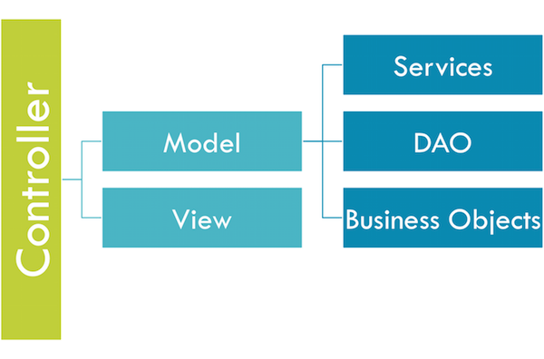

# Coding: Solo Style



Now that we have seen all the theory and stuff, let's get down to business and do some examples. We will start with the full coding approach with **no** ORM and then spice it up with ORM, so you can see how awesome ORM can be. The examples will not show the entire application being built, but enought to get you started with the process of modeling everything. Here is a layout of what we will build:

```js
+ handlers 
  + contacts.cfc
+ model
  + ContactService.cfc
  + ContactDAO.cfc
  + Contact.cfc
```

I will create a DAO for this small example, so we can showcase how to talk to multiple objects.  You can start a new application with CommandBox if you like:

```
mkdir solo
cd solo
coldbox create app name=solo skeleton=AdvancedScript --installColdBox
server start --rewritesEnable
```