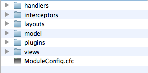

# Module Layout

So in order to create a module, you must first create a nicely named directory within the modules conventions directory. For example, let's build a simple *hello world* module. Create a folder called helloworld in the modules directory. This unique name is used in order to store the module settings and the basic entry points to the module using NON-SES URLs. So please remember that our preference and best practice is to ALWAYS use SES or URL Mappings in your applications.

The layout of a ColdBox Module can be almost all of it be optional except for one file: *ModuleConfig.cfc*. This is a simple CFC that boots up your module and tells the host application how your module is loaded, unloaded and behaves. Below are all the possible combinations of a module layout, you will notice that it is EXACTLY the same as a ColdBox application.

```js
+Modules
  + {ModuleName - Unique}
    + ModuleConfig.cfc (The module configuration object Mandatory)
    + handlers (optional)
    + layouts  (optional)
    + views    (optional)
    + plugins  (optional)
    + interceptors (optional)
    + model    (optional)
```

As you can see, the only mandatory resources for a module is the directory name in which it lives and a ModuleConfig.cfc. The module developer can choose to implement a simple module or a very complex module. All folders are optional and only what is used will be loaded, but they must follow the [ColdBox directory conventions](http://wiki.coldbox.org/wiki/DirectoryStructure-Conventions.cfmhttp://). Not only are modules reusable and extensible, but you can easily create a module with dual functionality: A standalone application or a module. This is true reusability and flexibility. I don't know about you, but this is really exciting (Geek Alert!).

