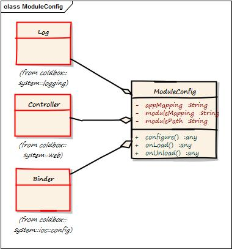

# The Decorated Variables

 At runtime, the configuration object will be created by ColdBox and decorated with the following private properties (available in the variables scope): 
 
 
 |Property|Description|
 |--|--|
 |appMapping |The *appMapping* setting of the current host application|
 |binder|The [WireBox](http://wiki.coldbox.org/wiki/WireBox.cfm) configuration binder object|
 |cachebox|A reference to [CacheBox](http://wiki.coldbox.org/wiki/CacheBox.cfm)|
 |controller|A reference to the application's ColdBox Controller (*coldbox.system.web.Controller*)|
 |log|A pre-configured LogBox Logger object for this specific class object (*coldbox.system.logging.Logger*)|
 |logBox|A Reference to [LogBox](http://wiki.coldbox.org/wiki/LogBox.cfm)|
 |moduleMapping|The *moduleMapping* settig of the current module. This is the path needed in order to instantiate CFCs in the module. Similar to the *appMapping* setting.|
 |modulePath|The absolute path to the current loading module|
 |wirebox|A Reference to [WireBox](http://wiki.coldbox.org/wiki/WireBox.cfm)|
 
 You can use any of these private variables to create module settings, load CFCs, add binder mappings, etc.