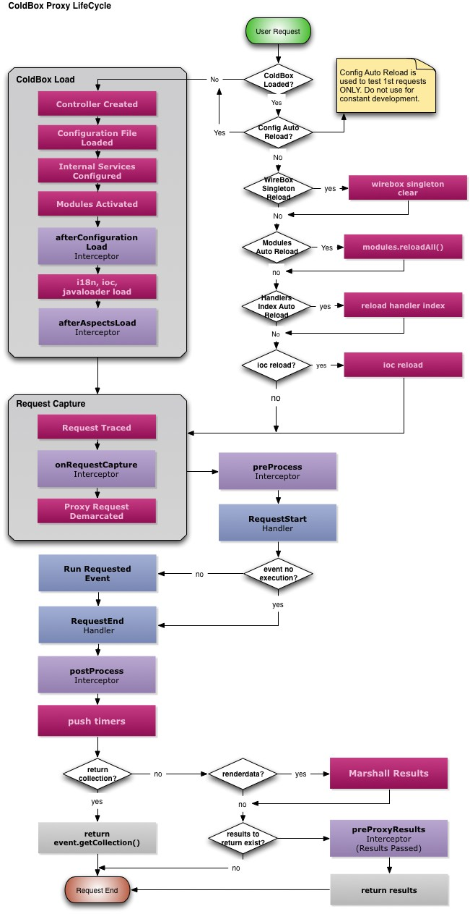

# Proxy Lifecycle

##The ColdBox Proxy Lifecycle

Please note that the remote execution lifecycle occurs once you execute a [ColdBoxProxy's](http://wiki.coldbox.org/wiki/ColdBoxProxy.cfm) process() method only:

