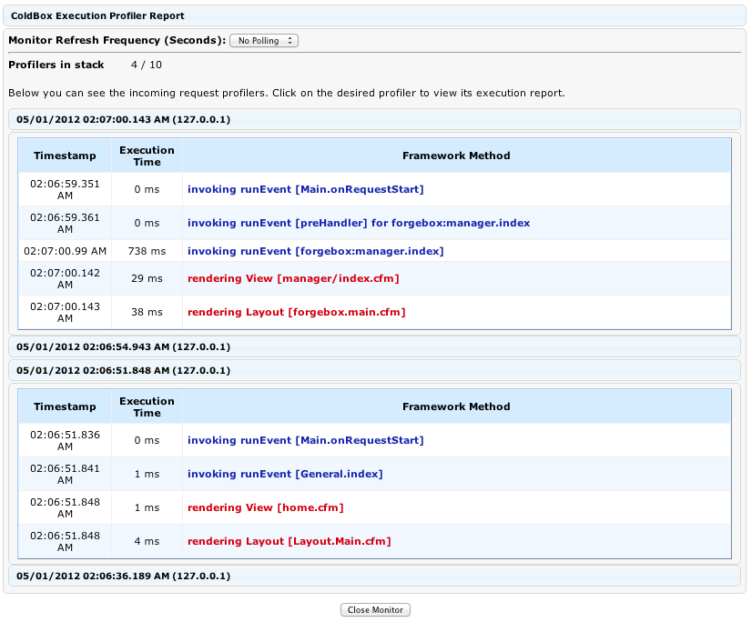

# Execution Profiler Monitor

This monitor will keep a stack of the latest X requests and their execution profiles that is all configurable via the [ConfigurationCFC](http://wiki.coldbox.org/wiki/ConfigurationCFC.cfm). This monitor can be kept side by side with your remote application or any front-end and give you execution profiles about your event model and show you event tracers. By default the request profiler is turned off, so you will have to turn it on via the new Debugger Settings in your configuration file. You can also choose the max number of requests to persist execution profiles for, so you can keep track of any amount of requests.

> **Important** The execution tracers and profilers will ONLY be logged if the user making the calls is in Debug Mode. To learn how to enter into debug mode, please review the configuration guide and the URL actions guide. 