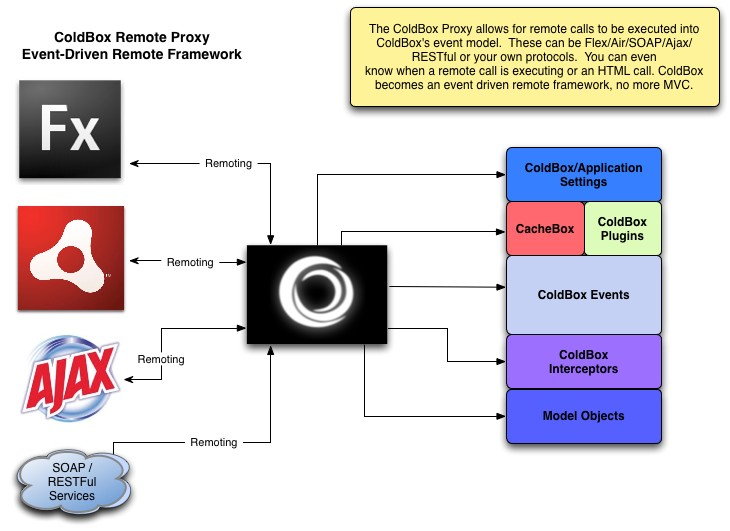

# ColdBox Proxy

The ColdBox proxy enables remote applications or technologies like Flex, AIR, SOAP WebServices, ColdFusion RESTful Webservices to communicate with ColdBox and provide an event driven model framework for those applications or for it to act as an enhanced service layer. 

> The one key feature here, is that ColdBox morphs into a remote event-driven framework and no longer an MVC framework that produces HTML.

We not only give you the ability to do remote calls but also to monitor them. ColdBox has an execution monitor that can help you debug and analyze remote calls if you are in debug mode. This allows you to know what happens on asynchrounous calls from Flex/Air/SOAP, etc. The remote functionality of the framework enables you to actually create any amount of front ends using the same reusable ColdBox and model code. The code is the same, you create event handlers, you interact with a request collection, with core and custom plugins, but you don't set views or layouts because the framework is now a remote framework for your model. So what do you do, well, return data, arrays, xml, value objects. Anything, right from within the event handlers or setup a configuration setting that tells the framework to always return the request collection. You can also just create remote proxies to your service components (if using a service layers approach), so you can go directly to any object factory to request for services, interact with them and return results. The ColdBox proxy gives you flexibility in all aspects.

