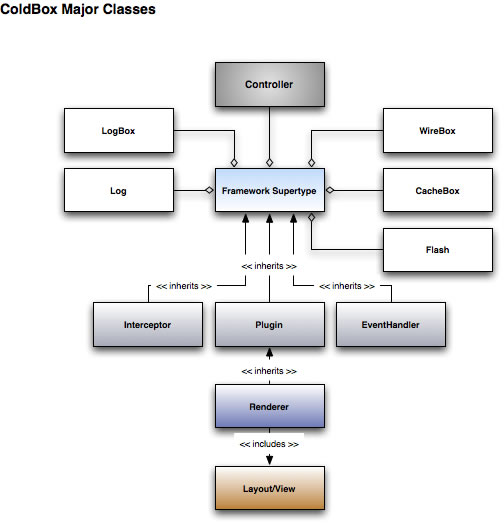

# Super Tupe Usage Methods



 The following usage methods are available in all handlers, plugins and interceptors thanks to our Framework Super Type and will be used so you can retrieve, populate and validate model objects. 
 
 ```js
 getModel([any name], [any dsl], [any<struct> initArguments={}])

public Any populateModel(any model, [any scope=''], [boolean trustedSetter='false'], [any include=''], [any exclude=''], [boolean ignoreEmpty='false'], [string nullEmptyInclude=''], [string nullEmptyExclude=''], [boolean composeRelationships='false'])

validateModel(any target, [string fields='*'], [any constraints], [string locale=''], [string excludeFields=''])
```

##getModel()

|Argument|Required|Default|Description|
|--|--|--|--|
|name|false|---|The name/alias or full instantiantion path of a model object to retrieve from WireBox.|
|dsl|false|---|The DSL injection string to retrieve an object by instead of using a name/alias or instantation path. ([See WireBox Injection DSL](http://wiki.coldbox.org/wiki/WireBox.cfm#Injection_DSL))|
|initArguments|false|{}|An optional structure of arguments to initialize the object with|

```js
// Retrieve the User.cfc in the model folder
var oUser = getModel('User');
// Retrieve the User.cfc in the model/users folder
var oUser = getModel("users.User")
// Retrieve the User using an alias you mapped in your configuration binder
var oUser = getModel("MyUser");
// Retrieve an object using a full instantation path
var oUtil = getModel("mypath.utilities.MyUtil");
```

##populateModel()
ColdBox can populate model objects from data in the request collection by matching the name of the form element to the name of a property on the object. You can also populate model objects from JSON, XML, Queries and other structures a-la-carte by talking directly to [WireBox](http://wiki.coldbox.org/wiki/WireBox.cfm)'s object populator.

|Argument|Required|Default|Description|
|--|--|--|--|
|model|true|---|The name/alias or instationation path of a model object or an actual instantiated object to populate. |
|scope|false|---|If a scope is sent, then WireBox will populate the variables that match the desired scope name with the request ollection name. In other words it injects the values into the appropriate scope you chose instead of calling setter methods.|
|trustedSetter |false|false|Defaults to false, this flag tells WireBox to call the setter methods without checking if the setter mehod exists. Great for using implicit setters or onMissingMethod setters. |
|include |false||A list of keys to include from the public request collection when populating.|
|exclude|false||A list of keys to exclude from the public request collection when populating.|
|ignoreEmpty|false|false|Ignore empty values on populations, great for ORM population|
|nullEmptyInclude |false||A list of keys to NULL when empty, specifically for ORM population. You can also specify "*" for all fields|
|nullEmptyExclude |false||A list of keys to NOT NULL when empty, specifically for ORM population. You can also specify "*" for all fields|
|composeRelationships |false|false|When true, will automtically attempt to compose relationships from memento|

```js


var user = ormService.populate( ormService.new("User"), data );

// populate with includes only
var user = ormService.populate( ormService.new("User"), data, "fname,lname,email" );

//populate with excludes
var user = ormService.populate(target=ormService.new("User"),memento=data,exclude="id,setup,total" );

// populate with null values when value is empty string
var user = ormService.populate(target=ormService.new("User"),memento=data,nullEmptyInclude="lastName,dateOfBirth" );

// populate many-to-one relationship
var data = {
    firstName = "Luis",
    role = 1 // "role" is the name of the many-to-one relational property, and one is the key value
};
var user = ormService.populate( target=ormService.new("User"), memento=data, composeRelationships=true );
// the role relationship will be composed, and the value will be set to the appropriate instance of the Role model

// populate one-to-many relationship
var data = {
    firstName = "Luis",
    favColors = "1,2,3" ( or [1,2,3] ) // favColors is the name of the one-to-many relational property, and 1, 2 and 3 are key values of favColor models
};
var user = ormService.populate( target=ormService.new("User"), memento=data, composeRelationships=true );
// the favColors property will be set to an array of favColor entities

// only compose some relationships
var data = {
    firstName = "Luis",
    role = 1,
    favColors = [ 1, 3, 19 ]
};
var user = ormService.populate( target=ormService.new("User"), memento=data, composeRelationships=true, exclude="favColors" );
// in this example, "role" will be composed, but "favColors" will be excluded
```

##validateModel()

Uses [ValidBox](http://wiki.coldbox.org/wiki/Validation.cfm), our very own form and object validation engine, or any third party connected validation engine. The results of the validation call is a validation results object that must adhere to our validation interface: coldbox.system.validation.result.IValidationResult and most likely it will be: coldbox.system.validation.result.ValidationResult. By now you should now that the best way to find out about the methods in these objects is to look for them in our [API Docs](http://apidocs.coldbox.org/).

|Constraint|Type|Default|Description|
|--|--|--|--|
|target|any|---|The object to validate or a structure of name-value pairs to validate, this can be the request collection or the private collection or any structure you would like to validate.|
|fields|string|*|By default it will validate all the fields in the constraints structure or you can validate only certain fields.|
|excludeFields |strings|---|The fields to exclude in the validation|
|constraints |string or structure |empty|Optional constraints to validate the form or object with. By default it look in the object for the constraints. You can pass a shared name (from your configuration file) or a structure of constraints.|
|locale|string|empty|The optional i18n locale to validate with. You can retrieve the current user's locale via getFWLocale(). All the validation messages will be taken from your resource bundles, if defined!|

I know we have not seen how to [validate](http://wiki.coldbox.org/wiki/Validation.cfm) yet, we will shortly, but also take a peek at our Validation docs as well.

```js
var user = populateModel( entityNew("User") );
var vResults = validateModel( user );
if( vResults.hasErrors() ){
	getPlugin("MessageBox").error(messageArray=vResults.getAllErrors());
	setNextEvent('users.edit');
}
else{
	userService.save( user );
	setNextEvent('users.list');
}
```
