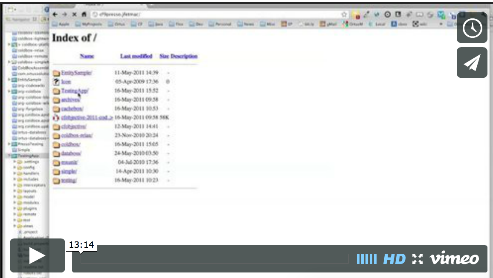

# Testing

One of the best things you can do when you develop software applications is TEST! I know nobody likes it, but hey, you need to do it right? With the advocation of frameworks today, you get all these great tools to build your software applications, but how do you test your framework code. ColdBox has revolutionized testing MVC and framework code, since you can unit test your event handlers, plugins, interceptors, model objects and even do integration testing and test your entire application with no browser at all. We have lots of testing enhancements via [MXUnit](http://mxunit.org/) and our very own Mocking and Stubbing library, [MockBox](http://wiki.coldbox.org/wiki/MockBox.cfm), which will be essential to testing more Object Oriented applications.

### Benefits
It might be that testing is tedious and takes time to get into the flow of Test Driven Development. However, there are incredible benefits to testing:

* Can improve code quality
* Quick error discovery
* Code confidence via immediate verification
* Can expose high coupling
* Encourages refactoring to produce testable code
* Testing is all about behavior and expectations

### Resources

* [Wikipedia](http://en.wikipedia.org/wiki/Unit_test)
* [MXUnit](http://mxunit.org/)
* [ColdBox CheatShee](http://www.coldbox.org/downloads/ColdboxCheatSheet.pdf)t

