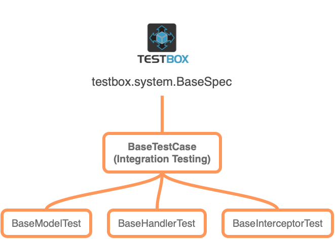

# ColdBox Testing Classes

Before we begin our adventures in testing, let's review what classes does ColdBox give you for testing and where you can find them. From the diagram you can see that our pivot class for testing is the TestBox `BaseSpec` class.

From that super class we have our own ColdBox `BaseTestCase` which is our base class for any testing in ColdBox and the class used for Integration Testing. We then spawn several child classes for targeted testing of different objects in your ColdBox applications:

* `BaseTestCase` - Used for **Integration Testing**
* `BaseModelTest` - Used for model object unit testing
* `BaseInterceptorTest` - Used for interceptor unit testing
* `BaseHandlerTest` - Used for isolated handler unit testing

We highly encourage you to check out the API Docs for this [package](https://apidocs.ortussolutions.com/coldbox/6.0.0/coldbox/system/testing/package-summary.html#)

* [https://apidocs.ortussolutions.com/coldbox/6.0.0/coldbox/system/testing/BaseTestCase.html](https://apidocs.ortussolutions.com/coldbox/6.0.0/coldbox/system/testing/BaseTestCase.html)

