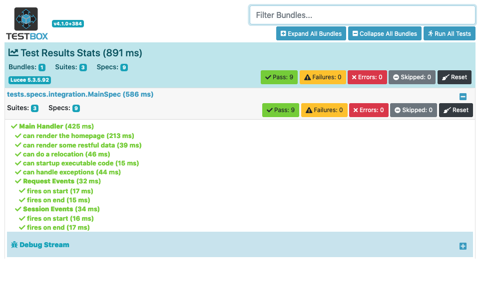
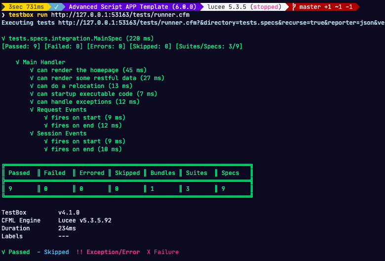

# Testing Quick Start

ColdBox tightly integrates with [TestBox](http://www.ortussolutions.com/products/testbox), the Behavior Driven Development Testing Framework for ColdFusion \(CFML\). We can easily do unit and integration testing for our application. To start, let's install TestBox via CommandBox

```bash
install testbox --saveDev
```

Please note the `--saveDev` flag we used. This tells CommandBox that this dependency is only for testing purposes and not for distribution or production usage. Check out the `box.json` under the `devDependencies`.

## Test Harness

Every ColdBox application template comes with a pre-set testing harness under the `/tests` folder:

```text
+ resources
+ results
+ specs
- Application.cfc
- runner.cfm
- test.xml
```

Every harness has its own unique `Application.cfc` which must mimic your application's settings. It also comes with an HTML runner called `runner.cfm` and an ANT runner called `test.xml`. All your test bundles and specifications will go under the `specs` directory and in the appropriate sub-directories:

```text
+ integration
+ modules
+ unit
```

Under the `integration` tests you will find the test bundles that come with the application template and the ones we generated:

```text
+ MainSpec.cfc
```

The `MainSpec` BDD test bundle can be show below:

```javascript
/*******************************************************************************
 *	Integration Test as BDD
 *
 *	Extends the integration class: coldbox.system.testing.BaseTestCase
 *
 *	so you can test your ColdBox application headlessly. The 'appMapping' points by default to
 *	the '/root' mapping created in the test folder Application.cfc.  Please note that this
 *	Application.cfc must mimic the real one in your root, including ORM settings if needed.
 *
 *	The 'execute()' method is used to execute a ColdBox event, with the following arguments
 *	* event : the name of the event
 *	* private : if the event is private or not
 *	* prePostExempt : if the event needs to be exempt of pre post interceptors
 *	* eventArguments : The struct of args to pass to the event
 *	* renderResults : Render back the results of the event
 *******************************************************************************/
component
	extends   ="coldbox.system.testing.BaseTestCase"
	appMapping="/root"
{

	/*********************************** LIFE CYCLE Methods ***********************************/

	function beforeAll() {
		super.beforeAll();
		// do your own stuff here
	}

	function afterAll() {
		// do your own stuff here
		super.afterAll();
	}

	/*********************************** BDD SUITES ***********************************/

	function run() {
		describe( "Main Handler", function() {
			beforeEach( function( currentSpec ) {
				// Setup as a new ColdBox request, VERY IMPORTANT. ELSE EVERYTHING LOOKS LIKE THE SAME REQUEST.
				setup();
			} );

			it( "can render the homepage", function() {
				var event = this.get( "main.index" );
				expect( event.getValue( name = "welcomemessage", private = true ) ).toBe( "Welcome to ColdBox!" );
			} );

			it( "can render some restful data", function() {
				var event = this.post( "main.data" );

				debug( event.getHandlerResults() );
				expect( event.getRenderedContent() ).toBeJSON();
			} );

			it( "can do a relocation", function() {
				var event = execute( event = "main.doSomething" );
				expect( event.getValue( "relocate_event", "" ) ).toBe( "main.index" );
			} );

			it( "can startup executable code", function() {
				var event = execute( "main.onAppInit" );
			} );

			it( "can handle exceptions", function() {
				// You need to create an exception bean first and place it on the request context FIRST as a setup.
				var exceptionBean = createMock( "coldbox.system.web.context.ExceptionBean" ).init(
					erroStruct   = structNew(),
					extramessage = "My unit test exception",
					extraInfo    = "Any extra info, simple or complex"
				);
				prepareMock( getRequestContext() ).setValue(
						name    = "exception",
						value   = exceptionBean,
						private = true
					)
					.$( "setHTTPHeader" );

				// TEST EVENT EXECUTION
				var event = execute( "main.onException" );
			} );

			describe( "Request Events", function() {
				it( "fires on start", function() {
					var event = execute( "main.onRequestStart" );
				} );

				it( "fires on end", function() {
					var event = execute( "main.onRequestEnd" );
				} );
			} );

			describe( "Session Events", function() {
				it( "fires on start", function() {
					var event = execute( "main.onSessionStart" );
				} );

				it( "fires on end", function() {
					// Place a fake session structure here, it mimics what the handler receives
					URL.sessionReference     = structNew();
					URL.applicationReference = structNew();
					var event                = execute( "main.onSessionEnd" );
				} );
			} );
		} );
	}

}

```

## Executing The Runner

To execute your application template tests and the generated tests just browse to the URL: `http://127.0.0.1:{port}/tests/runner.cfm` and you will get a full integration report:



Everything is already pre-wired for you and ready for you to do full life-cycle integration testing.  This means that upon first request to the spec, a virtual ColdBox application will load and setup your application from where you can test any part of it. From executing events just like from the browser, or execution API requests just like any application.

Sounds too good to be true?  Let's try this out.  Open the `handlers/Main.cfc` and look for the `index()` action.  Let's change it to this:

```javascript
function index( event, rc, prc ) {
		prc.welcomeMessage = "Welcome to ColdBox!";
		event.setFunkyView( "main/index" );
	}
```

Now execute the tests again? What do you see?

You will get an error now: **component \[coldbox.system.web.context.RequestContext\] has no function with name \[setFunkyView\]**. Fix it and re-run it. Ok, hold on to something..... You are now doing live integration testing my friend. Simple, but yet accomplishing.

## CommandBox Runner

You can also execute the runner via CommandBox. So let's tell CommandBox where your runner is located, just change the `{port}` to your port assigned.

```bash
package set testbox.runner=http://127.0.0.1:{port}/tests/runner.cfm
```

Then use the `testbox run` command:

```bash
testbox run
```



You will then execute your tests and get a text report from it. If you want CommandBox to watch for changes to your source code and THEN re-execute the tests, then start a watcher:

```bash
testbox watch
```

## What's Next

We have a fully dedicated section on [testing](testing-coldbox-applications/), please visit it for in-depth information.

