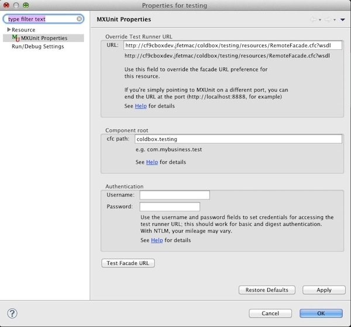

# Eclipse MXUnit Plugin Caveats

If you will be doing your testing from Eclipse then you must alter the location of the MXUnit Remote Facade via the MXUnit Eclipse Plugin. You can do this by reading our [Sample Chapter](https://ortus-public.s3.amazonaws.com/CBOX204-IntroToMXUnit.pdf) from our 204 training course, visiting the [MXUnit documentation](http://www.mxunit.org/) or by doing the following:

* Right Click on your project
* Click on MXunit Properties

Here you can place the location of the RemoteFacade.cfc according to where your application's Remote Facade is located in your */test/resources/RemoteFacade.cfc* folder. Also make sure to fill out the cfc path which is the dot notation path to the root of your project. If the project is the root, then this value is empty. This links Eclipse to your application and not the MXUnit application, which is by default. This is an extremely important step as you need for your tests to be executing within your testing harness.