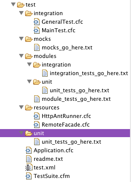

# Testing Templates



The ColdBox download comes with an application templates folder or the CF Builder tools also generate ColdBox applications with a test directory that includes all you need to begin your testing adventure. So let's start by how we have partitioned these templates so we can start testing.

```js
|Advanced
|--+test
    |--+ integration ( integration tests go here )   
    |--+ mocks ( Manual mock objects or data go here )
    |--+ modules ( Testing for modules goes here )
    |--+ resources
       |--+ RemoteFacade.cfc ( To connect Eclipse to your Application )
       |--+ HttpAntRunner.cfc ( To connect ANT to your Application )
    |--+ unit ( Unit tests for model objects go here )
    + Application.cfc (Your testing application file)
    + test.xml (ANT script to automate your tests)
    + TestSuite.cfm (A test suite to run all your tests)
```