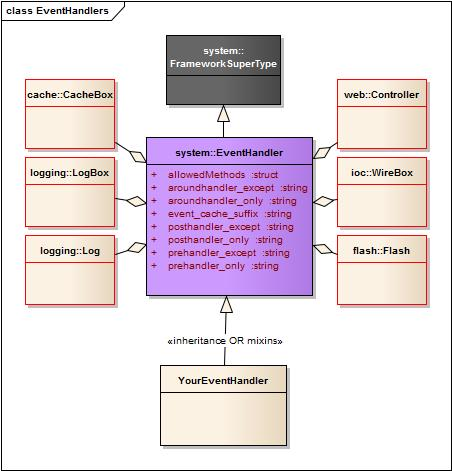

# Event Handlers

Event handlers are ColdBox's version of **controllers** in the MVC design pattern. So every time you hear "_event handler_", you are talking about a controller that can listen to external events or internal events in ColdBox. These event handlers carry the task of controlling your application flow, calling business logic, preparing a display to a user and much more.


## Locations

All your handlers will go in the **handlers** folder of your application template. If you get to the point where your application needs even more decoupling and separation, please consider building [ColdBox Modules](../../hmvc/modules/) instead.


**Tip:** You can create packages or sub-folders inside of the **handlers** directory. This is encouraged on large applications so you can section off or package handlers logically and get better maintenance and URL experience.


### External Location

You can also declare a `HandlersExternalLocation` directive in your [Configuration CFC](../../getting-started/configuration/). This will be a dot notation path or instantiation path where more external event handlers can be found.

```javascript
coldbox.handlersExternalLocation  = "shared.myapp.handlers";
```


If an external event handler has the same name as an internal conventions event, the internal conventions event will take precedence.


### Development Settings

By default, ColdBox will only scan for event handlers on startup. For development we highly encourage you leverage the following configuration directives:

```javascript
// Rescan handlers on each request, turn OFF in production please
coldbox.handlersIndexAutoReload = true;
// Deactivate singleton caching of the handlers, turn ON in production pleaese
coldbox.handlerCaching = false;
```

## Anatomy

Event handlers are CFCs that will respond to FORM posts, HTTP requests and/or remote requests \(like Flex,Air, SOAP, REST\) via an incoming variables called **event** or by [URL mappings](../routing/) \(Which we saw in the previous section\).

### Components



```javascript
component extends="coldbox.system.EventHandler"{

    /**
     * Default Action
     */
    function index( event, rc, prc ){
        prc.message = "Hello From ColdBox";
        event.setView( "main/index");
    }

    /**
     * Action returning complex data, converted to JSON automatically by ColdBox
     */
    function data( event, rc, prc ){
        var data = getInstance( "MyModel" ).getArray();
        return data; 
    }

}
```




You can also remove the inheritance from the CFC and WireBox will extend the `coldbox.system.EventHandler` for you using [Virtual Inheritance](https://wirebox.ortusbooks.com/advanced-topics/virtual-inheritance).



Event Handlers are treated as singletons by ColdBox, so make sure you make them thread-safe and properly scoped. Persistence is controlled by the `coldbox.handlerCaching` [directive](../../getting-started/configuration/coldbox.cfc/configuration-directives/)


### Actions

They are composed of functions which are called **actions** that will always have the following signature:

```javascript
function name( event, rc, prc )
```

Each action receives three arguments:

1. `event` - An object that models and is used to work with the current request
2. `rc` - A struct that contains both `URL/FORM` variables \(unsafe data\)
3. `prc` - A secondary struct that is **private** only settable from within your application \(safe data\)

An action will usually do the following:

* Set a view/layout to render
* Return HTML
* Return Complex Data which is converted to JSON by default
* Relocate to another event/URL Route

The **default action** for all event handlers is called `index()`. This means that when you execute an event, you can omit the index if you so desire.

```javascript
component extends="coldbox.system.EventHandler"{

    function index( event, rc, prc ){
        return "<h1> Hi from handler land!</h1>";
    }

    function save( event, rc, prc ){
        getInstance( "MyService" ).save( rc );
        relocate( "users/list" );
    }

    function myData( event, rc, prc ){
        return ['coldbox', 'wirebox', 'cachebox', 'logbox'];
    }
}
```

#### Private Actions

So what about `private` functions? Private functions are not executable from the outside world, but can be executed internally via a function available to all handlers called `runEvent()`, which we will explore later.

### Composed Properties

It is imperative that you realize that there is a great object model behind every event handler controller that will enable you to do your work more efficiently. The following are the composed properties every event handler has in their `variables` scope, you do not need to do anything to retrieve them, they are already there :\)



* **cachebox** : A reference to the [CacheBox ](https://cachebox.ortusbooks.com)library \(`coldbox.system.cache.CacheFactory`\)
* **controller** : A reference to the Application Controller \(`coldbox.system.web.Controller`\)
* **flash**: A flash memory object \(`coldbox.system.web.flash.AbstractFlashScope`\)
* **logbox**: A reference to the application [LogBox ](https://logbox.ortusbooks.com)\(`coldbox.system.logging.LogBox`\)
* **log**: A pre-configured logging[ logger object](https://logbox.ortusbooks.com/usage/using-a-logger-object) \(`coldbox.system.logging.Logger`\)
* **wirebox** : A reference to the application [WireBox Injector ](https://wirebox.ortusbooks.com)\(`coldbox.system.ioc.Injector`\)
* **$super**: A reference to the virtual super class if using non-inheritance approach.

