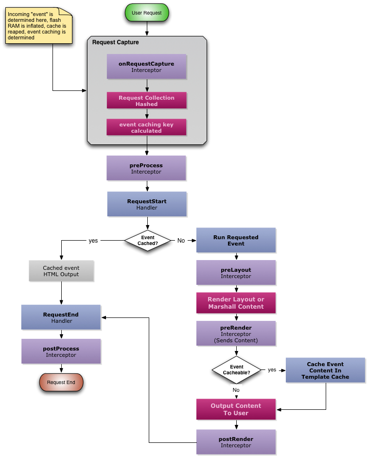

# Event Caching

Event caching is extremely useful and easy to use. ColdBox will act like a cache proxy between your events and the clients requesting the events, much like squid, nginx or HA Proxy. All you need to do is add several metadata arguments to the action methods and the framework will cache the **output** of the event in the **template** cache provider in CacheBox. In other words, the event executes and produces output that the framework then caches. Subsequent calls to the same event with the same incoming RC variables will not do any processing, but just output the content back to the user.

For example, you have an event called `blog.showEntry`. This event executes, gets an entry from the database and sets a view to be rendered. The framework then renders the view and if event caching is turned **on** for this event, the framework will cache the HTML produced. So the next incoming show entry event will just spit out the cached HTML. The cache key is created by hashing the incoming request collection.


Important to note also, that any combination of URL/FORM parameters on an event will produce a unique cacheable key. So `event=blog.showEntry&id=1` & `event=blog.showEntry&id=2` are two different cacheable events.




## Enabling Event Caching

To enable event caching, you will need to set a setting in your `ColdBox.cfc` called `coldbox.eventcaching` to `true`.

```javascript
 coldbox.eventCaching = true;
```


**Important** Enabling event caching does not mean that ALL events will be cached. It just means that you enable this feature.


## Setting Up Actions For Caching

The way to set up an event for caching is on the function declaration with the following annotations:

| **Annotation** | **Type** | **Description** |
| --- | --- | --- |
| `cache` | boolean | A true or false will let the framework know whether to cache this event or not. The default is FALSE. So setting to false makes no sense |
| `cachetimeout` | numeric | The timeout of the event's output in minutes. This is an optional attribute and if it is not used, the framework defaults to the default object timeout in the cache settings. You can place a 0 in order to tell the framework to cache the event's output for the entire application timeout controlled by coldfusion, NOT GOOD. Always set a decent timeout for content. |
| `cacheLastAccesstimeout` | numeric | The last access timeout of the event's output in minutes. This is an optional attribute and if it is not used, the framework defaults to the default last access object timeout in the cache settings. This tells the framework that if the object has not been accessed in X amount of minutes, then purge it. |
| `cacheProvider` | string | The cache provider to store the results in. By default it uses the **template** cache. |


**Important** Please be aware that you should not cache output with 0 timeouts \(forever\). Always use a timeout.


```javascript
// In Script
function showEntry(event,rc,prc) cache="true" cacheTimeout="30" cacheLastAccessTimeout="15"{
    //get Entry
    prc.entry = getEntryService().getEntry(event.getValue('entryID',0));

    //set view
    event.setView('blog/showEntry');
}
```


**Alert:** DO NOT cache events as unlimited timeouts. Also, all events can have an unlimited amount of permutations, so make sure they expire and you purge them constantly. Every event + URL/FORM variable combination will produce a new cacheable entry.


## Storage

All event and view caching are stored in a named cache called `template` which all ColdBox applications have by default. You can open or create a new [CacheBox](https://cachebox.ortusbooks.com) configuration object and decide where the storage is, timeouts, providers, etc. You have complete control of how event and view caching is stored.

## Purging

We also have a great way to purge these events programmatically via our cache provider interface.

```javascript
templateCache = cachebox.getCache( "template" );
```

Methods for event purging:

* `clearEvent( string eventSnippet, string querystring="" )`: Clears all the event permutations from the cache according to snippet and querystring. Be careful when using incomplete event name with query strings as partial event names are not guaranteed to match with query string permutations
* `clearEventMulti( eventsnippets,string querystring="" )`: Clears all the event permutations from the cache according to the list of snippets and querystrings. Be careful when using incomplete event name with query strings as partial event names are not guaranteed to match with query string permutations
* `clearAllEvents( [boolean async=true] )` : Can clear ALL cached events in one shot and can be run asynchronously.

```javascript
//Trigger to purge all Events
getCache( "template" ).clearAllEvents();

//Trigger to purge all events synchronously
getCache( "template" ).clearAllEvents(async=false);

//Purge all events from the blog handler
getCache( "template" ).clearEvent('blog');

//Purge all permutations of the blog.dspBlog event
getCache( "template" ).clearEvent('blog.dspBlog');

//Purge the blog.dspBlog event with entry of 12345
getCache( "template" ).clearEvent('blog.dspBlog','id=12345')
```

### this.event\_cache\_suffix

You can now leverage the cache suffix property in handlers to be declared as a closure so it can be evaluated at runtime so it can add dynamic suffixes to cache keys. This can allow you to incorporate elements into the cache key at runtime instead of statically. This is a great way to incorporate the user's language locale or session identifier to make unique entries.

```java
this.EVENT_CACHE_SUFFIX = function( eventHandlerBean ){
  return "a localized string, etc";
};
```

## `OnRequestCapture` - Influence Cache Keys

We have provided an interception point in ColdBox that allows you to add variables into the request collection before a snapshot is made so you can influence the cache key of a cacheable event. What this means is that you can use it to mix in variables into the request collection that can make this event cache unique for a user, a specific language, country, etc. This is a great way to leverage event caching on multi-lingual or session based sites.

```javascript
component{

    onRequestCapture(event,interceptData){
        var rc = event.getCollection();

        // Add user's locale to the request collection to influenze event caching
        rc._user_locale = getFWLocale();
    }

}
```

With the simple example above, the user's locale will be addded to all your event caching permutations and thus create entries for different languages.

## Life-Cycle Caveats


Several event interception points are NOT available during event caching.


When using event caching the framework will NOT execute ANY event at all. It will stream the content directly from the selected cache provider. This means that any interceptors or code that executes in the event is also NOT executed. The only interception points that will execute are:

* `preProcess`
* `postProcess`

So please make sure you take note of this when planning for event security.

## Monitoring

[CacheBox](http://cachebox.ortusbooks.com) has an intuitive and powerful monitor that can be used via the ColdBox Debugger Module. From the monitor you can purge, expire and view cache elements, etc.

```text
box install cbdebugger
```


