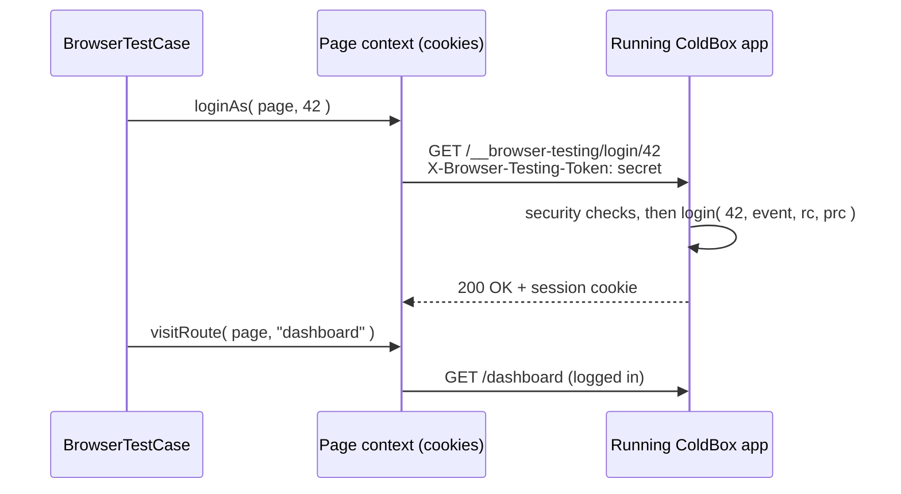

# Authentication

Most journeys worth testing happen behind a login. Filling the login form in every spec is slow and couples every test to your login page. `loginAs( page, id )` and `logout( page )` log a user in or out **directly**, through test-only endpoints of the `BrowserTesting` core module that call closures **you** provide.

```javascript
it( "lets an admin edit a user", () => {
	browse( ( page ) => {
		loginAs( page, 1 )
		visitRoute( page, "users.edit", { id : 5 } )
		expect( page ).toSee( "Edit User" )

		logout( page )
		visitRoute( page, "users.edit", { id : 5 } )
		assertRouteIs( page, "login" )
	} )
} )
```


**Never enable the BrowserTesting module outside the `testing` environment.** Its endpoints log anyone in as **any** user. ColdBox refuses every request unless the application runs in the `testing` environment, but you must still configure the module only for that environment, keep the token secret, and never expose a `testing` server to real users.


## How It Works



1. `loginAs()` builds the path of the module route `login@BrowserTesting` (`/__browser-testing/login/:id`) and reads the module `token` from the **virtual** application your spec loaded.
2. It sends a `GET` request with the token in the `X-Browser-Testing-Token` header, using the request API of the page's browser context, so the request **shares the cookies of the page**.
3. The running application checks the request and calls your `login` closure, which logs the user in your own way: a session variable, cbauth, cbsecurity, anything.
4. The session cookie lands in the page context, so every following visit of that page is logged in. Other pages of the same `browse()` call keep their own sessions.

`logout()` works the same way with `GET /__browser-testing/logout` and your `logout` closure.

## Configure the Module

`BrowserTesting` is a ColdBox core module: it is always registered, under the `__browser-testing` entry point, and **disabled** by default. Turn it on for the `testing` environment only, with the `moduleSettings.browserTesting` key of your ColdBox class. An environment method is the natural place, since ColdBox only calls it when that environment is detected:





```javascript
// config/ColdBox.bx
class {

	function configure() {
		// ...
		variables.moduleSettings = {}
	}

	/**
	 * Only called in the testing environment
	 */
	function testing() {
		variables.moduleSettings.browserTesting = {
			enabled : true,
			token   : getSystemSetting( "BROWSER_TESTING_TOKEN", "" ),
			login   : ( id, event, rc, prc ) => {
				session.userId = id
			},
			logout  : ( event, rc, prc ) => {
				session.delete( "userId" )
			}
		}
	}

}
```





```javascript
// config/ColdBox.cfc
component {

	function configure(){
		// ...
		variables.moduleSettings = {};
	}

	/**
	 * Only called in the testing environment
	 */
	function testing(){
		variables.moduleSettings.browserTesting = {
			enabled : true,
			token   : getSystemSetting( "BROWSER_TESTING_TOKEN", "" ),
			login   : function( id, event, rc, prc ){
				session.userId = arguments.id;
			},
			logout  : function( event, rc, prc ){
				structDelete( session, "userId" );
			}
		};
	}

}
```

The application under test can be configured in CFML, but `BrowserTestCase` itself, and so `loginAs()` and `logout()`, need BoxLang.





| Setting | Default | Description |
| --- | --- | --- |
| `enabled` | `false` | Turns the endpoints on. Anything but `true` answers `404` |
| `token` | `""` | The shared secret every request must send. An empty token disables the endpoints |
| `login` | `""` | Closure called as `login( id, event, rc, prc )`. `id` is the value passed to `loginAs()` |
| `logout` | `""` | Closure called as `logout( event, rc, prc )` |

The closures run inside a normal ColdBox request of the running application. To reach your services, ask WireBox through the request context, for example with [cbauth](https://forgebox.io/view/cbauth):

```javascript
login : ( id, event, rc, prc ) => {
	var wirebox = event.getController().getWireBox()
	var user    = wirebox.getInstance( "UserService" ).retrieveUserById( id )
	wirebox.getInstance( "authenticationService@cbauth" ).login( user )
},
logout : ( event, rc, prc ) => {
	event.getController().getWireBox().getInstance( "authenticationService@cbauth" ).logout()
}
```


The **same token** must reach both sides: the running application, which checks it, and the test runner, whose virtual application `loginAs()` reads it from. Export `BROWSER_TESTING_TOKEN` (and `ENVIRONMENT=testing`) in the environment of both processes. When the tests run through the HTML runner of the server under test, they already share it.


## Security Model

The endpoints are locked down by default. **Every** request must pass **all** of these checks, otherwise it gets a plain `404 Not Found`, exactly like a missing page, and no closure runs:

| Check | Requirement |
| --- | --- |
| Environment | The application `environment` setting is `testing` |
| Enabled | The `enabled` setting is `true` |
| Token configured | The `token` setting is not empty |
| Token sent | The request sends the same token in the `X-Browser-Testing-Token` header (or a `token` URL or FORM variable). Tokens are compared in constant time |
| Closure | The closure of the endpoint (`login` or `logout`) is set |
| Method | The request uses `GET` |

The checks run in the handler actions on **every** request, so they also cover the module convention routes and `event=` executions. Answering `404` instead of `401` or `403` means a probe cannot even tell the module is there.

Follow these rules:

* **Configure the module only in the `testing` environment**: in the `testing()` method of your ColdBox class, or in the `testing( settings )` method of a `config/modules/browserTesting.bx` override, never in `configure()` with `enabled : true`.
* **Generate a random token per environment** and keep it out of source control: read it from an environment variable or a secret store, for example `openssl rand -hex 32`, and a CI secret.
* **Never deploy a server running in the `testing` environment where real users can reach it**, and never set `ENVIRONMENT=testing` on staging or production.
* Prefer the header: `loginAs()` and `logout()` always send it, and headers do not end up in access logs like URL variables do.


If you detect environments by host name, a pattern such as `testing : "^127\.0\.0\.1"` makes **any** request to that host name a `testing` request. Use it only for servers bound to your machine or your CI job.


## Errors

When the endpoint does not answer with success, `loginAs()` and `logout()` throw `BrowserTestCase.BrowserTestingUnavailable` with the reason and the configuration to add:

| Message mentions | Cause |
| --- | --- |
| `needs the BrowserTesting core module, which is not loaded` | The module is not loaded in the virtual application of your spec |
| `moduleSettings.browserTesting.token is empty` | The virtual application has no token: check its environment and `BROWSER_TESTING_TOKEN` |
| `answered 404 Not Found` | The running application refused the request: the module is disabled, its token differs from the token of the test application, the closure is not set, or its environment is not `testing` |
| `answered HTTP 500` (or another status) | Your closure threw: the response text is included |

See [Troubleshooting](troubleshooting.md) for step-by-step fixes.

## See Also

* [Named Routes](named-routes.md)
* [Troubleshooting](troubleshooting.md)
* [Module Settings](../../../reference/configuration-directives/modules-and-settings.md)
* [bx-playwright Network & Saved Sessions](https://bxplaywright.boxlang.io/network/)
