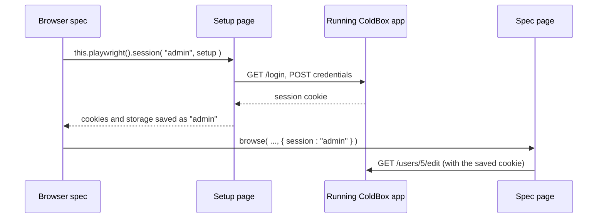

# Authentication

Most journeys worth testing happen behind a login. Filling the login form in every spec is slow, so log in **once** through your real login page, save the browser session (cookies and local storage), and start every spec that needs it already logged in. This is a feature of bx-playwright called **saved sessions**.

There are no test-only login endpoints and nothing to enable in your application: the browser logs in exactly like a user does, so your application ships no backdoor.

```javascript
@appMapping( "/root" )
@browser
@baseURL( "http://127.0.0.1:8080" )
class extends="coldbox.system.testing.BaseTestCase" {

	function beforeAll() {
		super.beforeAll()
		// Log in once through the login page and save the session as "admin"
		this.playwright().session( "admin", ( page ) => {
			visitRoute( page, "login" )
				.fill( "Email", "admin@example.com" )
				.fill( "Password", getSystemSetting( "TEST_ADMIN_PASSWORD" ) )
				.click( "Sign in" )
			expect( page ).toSee( "Dashboard" )
		} )
	}

	function run() {
		describe( "Users", () => {
			it( "lets an admin edit a user", () => {
				// Every page of this browse() call starts logged in as admin
				browse( ( page ) => {
					visitRoute( page, "users.edit", { id : 5 } )
					expect( page ).toSee( "Edit User" )
				}, { session : "admin" } )
			} )

			it( "sends guests to the login page", () => {
				// Without a session, pages start logged out
				browse( ( page ) => {
					visitRoute( page, "users.edit", { id : 5 } )
					assertRouteIs( page, "login" )
				} )
			} )
		} )
	}

}
```

## How It Works



1. `this.playwright().session( name, setup )` opens a fresh page and runs your `setup` closure, which logs in through your login page like a user would.
2. bx-playwright saves the cookies and local storage of that page under the session name.
3. `browse( callback, { session : name } )` starts every page of the call with that saved state, so it is already logged in. Pages of a `browse()` call without the option start logged out, and each page has its own cookies.

Sessions are stored in the bx-playwright home directory (`{home}/sessions`), **outside your project**, because they hold cookies. Never commit them.

## Reusing and Refreshing Sessions

`session()` creates the session the first time and **reuses** it afterwards, so the login runs once per session and not once per spec. Its third argument controls when it logs in again:

| Option | Default | Description |
| --- | --- | --- |
| `maxAge` | `0` | Minutes before a saved session is considered stale and recreated. `0` never expires |
| `refresh` | `false` | `true` always runs the setup again, for example in `beforeAll()` of a suite that changes passwords |
| `context` | `{}` | Context options for the setup page, such as a `viewport` or `locale` |

```javascript
// Always log in again for this bundle
this.playwright().session( "admin", ( page ) => { ... }, { refresh : true } )
```

Your application session also expires on the server. By default a saved session never expires, so set `maxAge` below your session timeout, or use `refresh : true`.

## Several Users

Create one session per role, then pick one per `browse()` call:

```javascript
function beforeAll() {
	super.beforeAll()
	this.playwright().session( "admin", ( page ) => logIn( page, "admin@example.com" ) )
	this.playwright().session( "editor", ( page ) => logIn( page, "editor@example.com" ) )
}

private function logIn( required page, required string email ) {
	visitRoute( arguments.page, "login" )
		.fill( "Email", arguments.email )
		.fill( "Password", getSystemSetting( "TEST_USER_PASSWORD" ) )
		.click( "Sign in" )
}
```

Every page of a `browse()` call gets the session you pass, and has its own cookies. A page that logs in by hand inside the call does not change the other pages.

## Test Users and Passwords

The setup logs in through your real login page, so it needs a real account in the database of the application under test:

* Seed your test users as part of preparing the test database, the same way your integration tests do.
* Read passwords from environment variables or CI secrets, never from source control.
* Use dedicated test accounts, and never run browser tests with credentials of real users.

## Logging Out

Test your logout like any other page: click the link or button your users click, then assert where it leads.

```javascript
browse( ( page ) => {
	visitRoute( page, "dashboard" )
	page.click( "Log out" )
	assertRouteIs( page, "login" )
}, { session : "admin" } )
```

A page that logs out only affects its own cookies: the saved session stays valid for the next specs, unless your application invalidates sessions on the server when a user logs out. Then log out with a page that does not use the shared session, or recreate the session with `refresh : true`.

## See Also

* [Named Routes](named-routes.md)
* [Troubleshooting](troubleshooting.md)
* [bx-playwright Network & Saved Sessions](https://bxplaywright.boxlang.io/network/)
