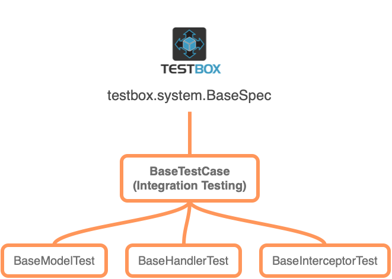

# ColdBox Testing Classes

Before we begin our adventures in testing, let's review what classes ColdBox gives you for testing and where you can find them. From the diagram, you can see that our pivot class for testing is the TestBox `BaseSpec` class.

From that superclass, we have our own ColdBox `BaseTestCase` , our base class for any testing in ColdBox, and the class used for Integration Testing. We then spawn several child classes for targeted testing of different objects in your ColdBox applications:

<table><thead><tr><th width="260">Test Class</th><th>Description</th></tr></thead><tbody><tr><td><code>BaseTestCase</code></td><td>Used for Integration Testing</td></tr><tr><td><code>BaseModelTest</code></td><td>Used for model object unit testing</td></tr><tr><td><code>BaseInterceptorTest</code></td><td>Used for interceptor unit testing</td></tr><tr><td><code>BaseHandlerTest</code></td><td>Used for isolated handler unit testing</td></tr><tr><td><code>BrowserTestCase</code></td><td>Extends <code>BaseTestCase</code> for real-browser testing of your running application with bx-playwright. BoxLang only. See <a href="browser-testing/README.md">Browser Testing</a></td></tr></tbody></table>


🚀 **BoxLang Exclusive**: `BrowserTestCase` is a BoxLang class (`coldbox/system/testing/BrowserTestCase.bx`) and requires the bx-playwright module. CFML engines cannot load it, so keep browser specs in their own folder and exclude it from the runner on those engines.

